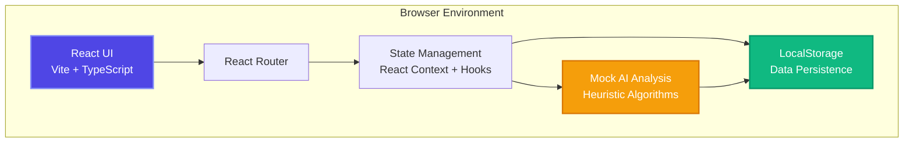
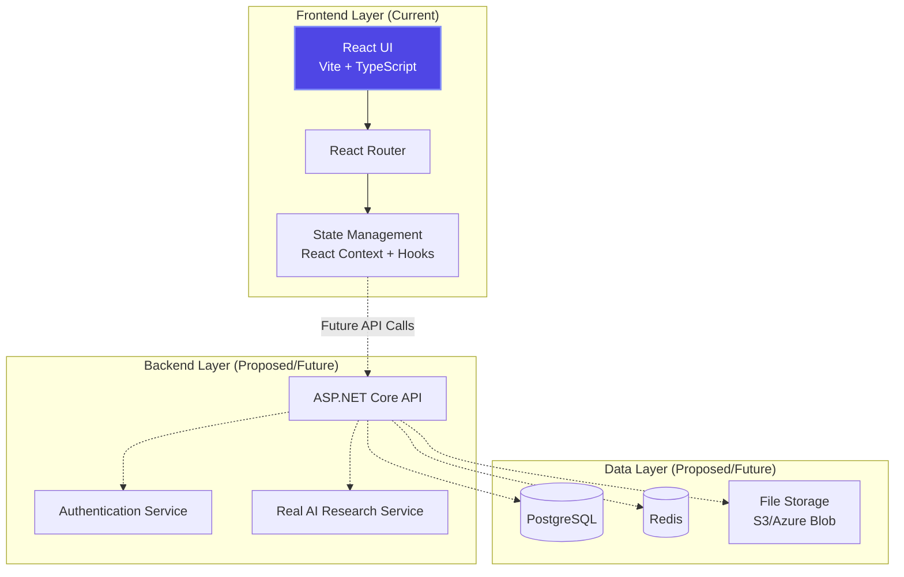

# Ideas Vault 🚀

> **Open Source** • **Frontend-Only** • **No Backend Required**
> 
> A secure, AI-enhanced repository for capturing, analyzing, and validating startup ideas with comprehensive market research and readiness scoring. Currently a frontend-only prototype using localStorage and simulated AI analysis.

[](https://react.dev)
[](https://www.typescriptlang.org)
[](https://vite.dev)
[](https://www.gnu.org/licenses/agpl-3.0)

## 📋 Table of Contents

- [Overview](#overview)
- [Key Features](#key-features)
- [Architecture](#architecture)
- [Technology Stack](#technology-stack)
- [Project Structure](#project-structure)
- [Getting Started](#getting-started)
- [Development Workflow](#development-workflow)
- [Documentation](#documentation)
- [Contributing](#contributing)
- [License](#license)

## 🎯 Overview

Ideas Vault is an **open-source, frontend-only web application** designed for entrepreneurs, innovators, and product teams to systematically capture, organize, and validate startup ideas. 

**Current State**: This is a fully functional prototype that demonstrates the concept using:
- **Frontend-only architecture** (React + TypeScript + Vite)
- **LocalStorage for data persistence** (no database)
- **Simulated AI analysis with mock data** (no real AI backend)
- **AGPL-3.0 open source license** (free and open to contributions)

The application provides a complete user experience showing how AI-powered market research could work, making it perfect for demonstrations, learning, or as a foundation for adding real backend services.

### The Problem

Entrepreneurs often have multiple ideas but struggle to:
- Systematically capture and organize thoughts
- Objectively assess market potential
- Prioritize which ideas to pursue
- Track validation progress over time

### The Solution

Ideas Vault provides:
- **Multi-modal Capture**: Text, voice notes, and image snapshots (frontend-only)
- **Simulated AI Research**: Mock market analysis and competitor research for demonstration
- **Readiness Scoring**: Heuristic assessment of idea viability (0-100 scale)
- **Visual Analytics**: Charts and metrics for quick decision-making
- **Local Storage**: All data stored in browser's localStorage (no backend required)

## ✨ Key Features

### 🎨 Modern User Experience
- Dark-themed design with deep slate/navy gradients
- Fully responsive (mobile, tablet, desktop)
- Smooth animations and transitions with Framer Motion
- Glassmorphism UI effects

### 💡 Idea Management
- **Capture Modal**: Three input methods (text, voice, image)
- **Dashboard**: Grid view with status indicators and tags
- **Detail View**: Comprehensive analysis with metrics and charts
- **Smart Tagging**: Organize by industry, technology, or custom categories

### 📊 AI-Powered Insights (Simulated)

> **Note**: All AI analysis is currently **simulated with mock data** for demonstration purposes. No real AI backend exists.

- **Readiness Score**: Overall viability assessment (0-100) using heuristic algorithms
- **Market Sizing**: Total Addressable Market (TAM) estimation from predefined data
- **Competitor Analysis**: Strengths and weaknesses from mock competitor database
- **Growth Projections**: 4-year market forecast charts with simulated data
- **Action Plans**: Template-based next steps for validation

### 🔒 Security & Privacy
- Local-only data storage (browser's localStorage)
- No data sent to external servers
- No user authentication required
- All data stays on your device
- Export/backup capability (planned)

## 🏗️ Architecture

Ideas Vault is currently a **frontend-only application** with no backend. All features run entirely in the browser.



### Future Architecture (Community Contributions Welcome)

When/if a backend is added, the architecture could expand to:



See [docs/architecture/](./docs/architecture/) for proposed future architectural patterns.

> **Want to contribute a backend?** See [Contributing](#contributing) section!

## 🛠️ Technology Stack

### Frontend (Current - Fully Functional)
- **React 19**: Modern functional components with hooks
- **TypeScript 5**: Type-safe development with strict mode
- **Vite 7**: Lightning-fast dev server and optimized builds
- **Tailwind CSS 4**: Utility-first styling with custom design system
- **Framer Motion**: Declarative animations
- **Lucide React**: Icon library
- **Recharts**: Data visualization
- **LocalStorage API**: Client-side data persistence

### Backend (Proposed/Future - Community Contributions Welcome)
> These technologies are **not currently implemented**. Documentation exists as design proposals for future development.

- **ASP.NET Core 8+**: RESTful API framework (proposed)
- **Entity Framework Core**: ORM for database access (proposed)
- **PostgreSQL/SQL Server**: Database (proposed)
- **JWT Authentication**: Secure user sessions (proposed)

### Infrastructure (Proposed/Future)
> Not required for current frontend-only deployment

- **Docker**: Containerization (future)
- **Kubernetes**: Orchestration (future)
- **GitHub Actions**: CI/CD for static site deployment (current)

### Testing
- **Vitest**: Unit and integration tests (Frontend)
- **React Testing Library**: Component testing
- **Playwright**: End-to-end testing

## 📁 Project Structure

```
ideasvault/
├── .github/                      # GitHub configuration
│   ├── workflows/                # CI/CD for static site deployment
│   └── instructions/             # Copilot instructions
├── .opencode/                    # Development agents configuration
│   ├── agent/                    # Specialist agents
│   └── README.md                 # Agent usage documentation
├── docs/                         # Comprehensive documentation
│   ├── architecture/             # Architecture (current + proposed future)
│   ├── product/                  # Product specifications
│   ├── api/                      # API documentation (PROPOSED/FUTURE)
│   ├── deployment/               # Deployment guides (static hosting)
│   └── development/              # Developer guides
├── ideasvault-ui/                # React frontend application (CURRENT)
│   ├── src/
│   │   ├── components/           # React components
│   │   ├── hooks/                # Custom React hooks
│   │   ├── types/                # TypeScript type definitions
│   │   ├── utils/                # Utility functions
│   │   └── storage/              # LocalStorage persistence layer
│   ├── public/                   # Static assets
│   └── package.json
├── tests/                        # Test suites
│   └── e2e/                      # Playwright E2E tests
├── AGENTS.md                     # Development squad documentation
├── LICENSE                       # AGPL-3.0 License
└── README.md                     # This file

Note: No backend or infrastructure directories exist yet.
```

## 🚀 Getting Started

### Prerequisites

- **Node.js 20+** and npm/pnpm
- **Git**
- **Modern web browser** (Chrome, Firefox, Safari, Edge)

That's it! No backend, database, or complex setup required.

### Quick Start (Frontend Only)

```bash
# Clone the repository
git clone https://github.com/kinncj/ideasvault.git
cd ideasvault

# Navigate to frontend
cd ideasvault-ui

# Install dependencies
npm install

# Start development server
npm run dev

# Open http://localhost:5173
```

### Build for Production

```bash
# Frontend static build
cd ideasvault-ui
npm run build

# Preview production build locally
npm run preview

# Deploy: Copy dist/ folder to any static hosting
# (GitHub Pages, Netlify, Vercel, AWS S3, etc.)
```

### Deployment Options

Since this is a frontend-only app, you can deploy the built files to any static hosting:

- **GitHub Pages**: Free hosting for GitHub repositories
- **Netlify**: Drag-and-drop deployment with preview URLs
- **Vercel**: Optimized for frontend frameworks
- **AWS S3 + CloudFront**: Scalable cloud hosting
- **Azure Static Web Apps**: Microsoft cloud option
- **Cloudflare Pages**: Fast global CDN

See [deployment documentation](./docs/deployment/) for detailed guides.

## 🔄 Development Workflow

### Local Development
1. Fork the repository and clone locally
2. Create a feature branch for your changes
3. Make changes and test locally
4. Submit a pull request with clear description

### Code Standards
- Follow existing code style and patterns
- Run linters before committing (`npm run lint`)
- Write tests for new functionality
- Update documentation as needed

For detailed development guidelines, see [AGENTS.md](./AGENTS.md).

## 📚 Documentation

Comprehensive documentation is available in the `docs/` directory:

### Product Documentation
- [Product Overview](./docs/product/README.md)
- [Features & Capabilities](./docs/product/features.md)
- [User Stories](./docs/product/user-stories.md)
- [Domain Model](./docs/product/domain-model.md)

### Architecture Documentation
- [Architecture Overview](./docs/architecture/README.md)
- [System Architecture](./docs/architecture/system-architecture.md)
- [Frontend Architecture](./docs/architecture/frontend-architecture.md)
- [Backend Architecture](./docs/architecture/backend-architecture.md)
- [Data Architecture](./docs/architecture/data-architecture.md)
- [Architecture Decision Records](./docs/architecture/adr/)

### Developer Documentation
- [Development Guide](./docs/development/README.md)
- [Frontend Development](./docs/development/frontend-guide.md)
- [Backend Development](./docs/development/backend-guide.md)
- [Testing Guide](./docs/development/testing-guide.md)
- [Code Style Guide](./docs/development/code-style.md)

### API Documentation (Proposed/Future)
> **Note**: No backend currently exists. API documentation represents **proposed future architecture**.

- [API Overview](./docs/api/README.md) - Proposed REST API design
- [REST API Reference](./docs/api/rest-api.md) - Proposed endpoint specifications
- [Authentication](./docs/api/authentication.md) - Proposed auth approach
- [Error Handling](./docs/api/error-handling.md) - Proposed error patterns

### Deployment Documentation
> Current deployment focuses on static site hosting. Kubernetes/Docker docs are for future backend implementation.

- [Deployment Overview](./docs/deployment/README.md) - Static hosting guide
- [Static Site Deployment](./docs/deployment/docker.md) - GitHub Pages, Netlify, Vercel
- [CI/CD Pipeline](./docs/deployment/cicd.md) - Automated static site deployment
- [Kubernetes Deployment](./docs/deployment/kubernetes.md) - Proposed/Future
- [Docker Deployment](./docs/deployment/docker.md) - Proposed/Future

## 🤝 Contributing

**Ideas Vault is open source (AGPL-3.0) and welcomes contributions!**

### Ways to Contribute

#### 1. Frontend Enhancements (Current Focus)
- Improve UI/UX components
- Add new features (search, filtering, export)
- Enhance accessibility
- Optimize performance
- Fix bugs

#### 2. Backend Implementation (Major Contribution Opportunity!)
> **Backend does not currently exist.** This is a great opportunity to contribute!

We welcome contributions to build a real backend with:
- User authentication (OAuth, JWT)
- Database persistence (PostgreSQL, MongoDB)
- Real AI integration (OpenAI, Anthropic, local models)
- RESTful API (ASP.NET Core, Node.js, Python FastAPI, etc.)

See [docs/architecture/backend-architecture.md](./docs/architecture/backend-architecture.md) for proposed design patterns.

#### 3. Testing & Quality
- Write E2E tests with Playwright
- Add unit tests for components
- Improve test coverage
- Performance testing

#### 4. Documentation
- Improve existing docs
- Add tutorials
- Create video guides
- Translate to other languages

### Contribution Process

1. **Fork the repository**
2. **Create a feature branch**: `git checkout -b feature/amazing-feature`
3. **Follow code standards**: Use appropriate linters and formatters
4. **Write tests**: Maintain test coverage
5. **Update documentation**: Keep docs in sync with changes
6. **Commit changes**: Use conventional commits format
7. **Push to branch**: `git push origin feature/amazing-feature`
8. **Open a Pull Request**: Describe your changes clearly

### Conventional Commits

We follow the [Conventional Commits](https://www.conventionalcommits.org/) specification:

```
feat: add voice note transcription
fix: resolve readiness score calculation bug
docs: update API documentation
test: add E2E tests for idea capture flow
refactor: extract chart component logic
style: format code with prettier
chore: update dependencies
```

## 🎯 Roadmap

### ✅ Phase 1: MVP (Current - Completed)
- ✅ Frontend UI with mock data
- ✅ Multi-modal idea capture (text, voice, image)
- ✅ Dashboard and detail views
- ✅ Responsive design
- ✅ LocalStorage persistence
- ✅ Simulated AI analysis with heuristic algorithms

### 🚧 Phase 2: Frontend Enhancements (Q1 2026)
- ⏳ Export/Import functionality (JSON, CSV, PDF)
- ⏳ Search and filtering
- ⏳ Tag management
- ⏳ Theme toggle (Light/Dark)
- ⏳ Keyboard shortcuts
- ⏳ Improved mobile experience

### 🎯 Phase 3: Backend Integration (Community Contributions Welcome!)
> **Note**: Backend does not currently exist. Open to community contributions!

- ⏳ ASP.NET Core API (or Node.js, Python, etc.)
- ⏳ PostgreSQL/MongoDB database
- ⏳ User authentication and authorization
- ⏳ Real AI agent integration (OpenAI, Anthropic, local LLMs)
- ⏳ Cloud synchronization
- ⏳ API for third-party integrations

### 🚀 Phase 4: Advanced Features (TBD)
- ⏳ Collaboration features (team workspaces)
- ⏳ Advanced analytics
- ⏳ Email digests
- ⏳ Mobile apps (iOS, Android)
- ⏳ Browser extension

## 📄 License

**AGPL-3.0 License** - This project is free and open source software.

You are free to:
- ✅ Use the software for any purpose
- ✅ Study how the software works and modify it
- ✅ Distribute copies of the software
- ✅ Distribute modified versions

Under the conditions that:
- 📋 You must disclose the source code when you distribute
- 📋 You must license your modifications under AGPL-3.0
- 📋 You must include the original copyright notice

See [LICENSE](./LICENSE) file for full details.

### Why AGPL-3.0?

We chose AGPL-3.0 to ensure:
1. **Freedom**: Anyone can use, study, and modify the code
2. **Community Growth**: Improvements benefit everyone
3. **Network Copyleft**: If you run a modified version as a web service, you must share the source code
4. **Transparency**: No proprietary closed-source versions, even for hosted services

## 📞 Support

- **Issues**: [GitHub Issues](https://github.com/kinncj/ideasvault/issues)
- **Discussions**: [GitHub Discussions](https://github.com/kinncj/ideasvault/discussions)
- **Documentation**: [docs/](./docs/)
- **Email**: [Open an issue instead]

## 🙏 Acknowledgments

- **Design Inspiration**: Modern SaaS applications with dark themes
- **Technology Stack**: React, Vite, Tailwind CSS communities
- **Open Source**: All the amazing open-source projects this relies on
- **Contributors**: Everyone who helps improve Ideas Vault

---

**Built with ❤️ as an open-source project**

*Empowering entrepreneurs to validate ideas with simulated AI insights. Backend contributions welcome!*
