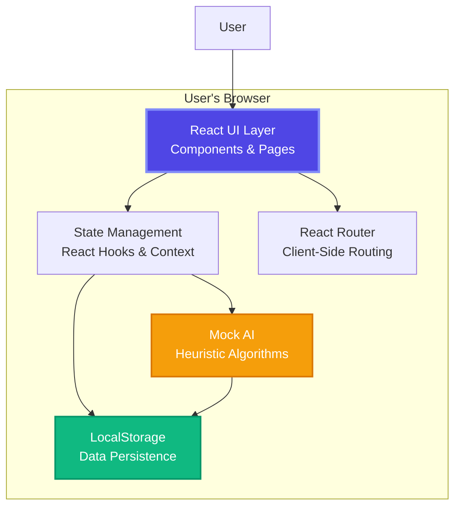
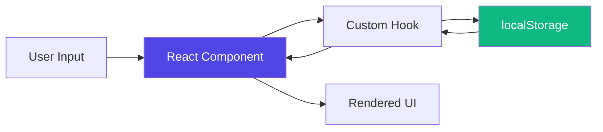

# Ideas Vault - Architecture Overview

## 🚨 CRITICAL: Frontend-Only Single Page Application

**Ideas Vault is a browser-based SPA with ZERO backend infrastructure.**

### Current Reality ✅
- **React 19** single-page application
- **localStorage** for all data persistence
- **Mock AI** analysis using heuristic algorithms
- **100% browser-based** - no server required
- **Static file deployment** - GitHub Pages, Netlify, Vercel

### What Absolutely DOES NOT Exist ❌
- ❌ **NO backend server** of any kind
- ❌ **NO API endpoints** (REST, GraphQL, or otherwise)
- ❌ **NO database** (PostgreSQL, MongoDB, SQL Server, etc.)
- ❌ **NO Docker containers**
- ❌ **NO Kubernetes clusters**
- ❌ **NO .NET/Node.js/Python server code**
- ❌ **NO authentication system** (no JWT, OAuth, etc.)
- ❌ **NO Redis, message queues, or caching servers**
- ❌ **NO cloud infrastructure** (AWS, Azure, GCP)
- ❌ **NO real AI/ML services** (all AI is simulated)

### Purpose of This Document

This document describes the **ACTUAL** architecture of Ideas Vault as a Single Page Application.

**For hypothetical backend/infrastructure designs**, see [`docs/future/`](../future/README.md).

---

## Introduction

Ideas Vault is an open-source Single Page Application that helps entrepreneurs capture, store, and validate startup ideas entirely in the browser. 

**Key Design Decision**: Ideas Vault is **intentionally frontend-only** to:
- Demonstrate modern React and browser API capabilities
- Eliminate server costs (free static hosting!)
- Remain accessible to frontend developers
- Serve as an educational prototype
- Avoid infrastructure complexity

**For potential future backend architecture**, see [`docs/future/architecture/`](../future/architecture/).

---

## Current Architecture (SPA Only)



**Everything runs in the browser. Zero server infrastructure required.**

### Component Breakdown

- **React UI Layer**: All UI components (Dashboard, Capture Modal, Detail View)
- **State Management**: React hooks (`useState`, `useEffect`) and Context API
- **React Router**: Client-side navigation between pages
- **LocalStorage**: Browser API for persisting ideas data
- **Mock AI Analyzer**: Heuristic algorithms simulating AI analysis

---

## Why No Backend?

### ✅ Advantages of SPA-Only Architecture

1. **Zero Cost**: Free hosting on GitHub Pages, Netlify, Vercel
2. **Zero Maintenance**: No servers to monitor or maintain
3. **Privacy**: User data never leaves their browser
4. **Speed**: No network latency for CRUD operations
5. **Offline**: Works without internet after initial load
6. **Simple**: No authentication, authorization, or security layers needed
7. **Educational**: Demonstrates what's possible with modern browser APIs

### ⚠️ Limitations of Current Architecture

1. **Single-User**: No shared data between devices or users
2. **Storage Limits**: localStorage typically limited to 5-10MB
3. **No Real AI**: AI analysis is simulated with heuristics
4. **No Sync**: Data doesn't sync across browsers/devices
5. **No Backup**: Data loss if browser storage is cleared
6. **No Collaboration**: Can't share ideas with others

### 🔮 When a Backend Might Be Added

A backend could be considered if:
- Strong community demand with contributors willing to build it
- Need for real user authentication and multi-user support
- Integration with real AI APIs (OpenAI, Anthropic, etc.)
- Requirements exceed localStorage capabilities
- Collaboration features become essential

**See [`docs/future/`](../future/README.md) for hypothetical backend designs.**

---

## SPA Component Architecture

### Core Principles

**Simplicity First**: As a browser-only SPA, the architecture prioritizes:
- **Component Reusability**: Shared UI components across pages
- **State Isolation**: Local state in components, shared state in Context
- **Type Safety**: TypeScript interfaces for all data models
- **Browser APIs**: Leverage native browser capabilities (localStorage, speech recognition)

### Application Structure

```
src/
├── components/          # Reusable UI components
│   ├── Dashboard/      # Main ideas dashboard
│   ├── CaptureModal/   # Idea input modal
│   ├── DetailView/     # Idea details & analysis
│   └── common/         # Shared components (buttons, cards, etc.)
├── lib/
│   ├── storage.ts      # localStorage wrapper
│   ├── aiAnalyzer.ts   # Mock AI heuristics
│   └── types.ts        # TypeScript interfaces
├── hooks/              # Custom React hooks
├── context/            # React Context for shared state
└── pages/              # Route pages

```

### Data Flow



### Key Concepts

**Ubiquitous Language** (domain terminology):
- **Idea**: Core entity representing a startup concept
- **Vault**: Collection of user's ideas in localStorage
- **Readiness Score**: Heuristic metric indicating viability (0-100)
- **Analysis**: Mock AI-generated insights
- **Capture**: Process of adding new ideas via text, voice, or image

## Technology Stack (Current SPA)

| Layer | Technology | Version | Purpose |
|-------|-----------|---------|---------|
| **UI Framework** | React | 19.2.0 | Component-based UI |
| **Language** | TypeScript | 5.9.3 | Type-safe development |
| **Build Tool** | Vite | 7.2.4 | Fast development & bundling |
| **Styling** | Tailwind CSS | 4.1.18 | Utility-first CSS |
| **Routing** | React Router | 7.12.0 | SPA navigation |
| **Animations** | Framer Motion | 12.25.0 | Smooth transitions |
| **Icons** | Lucide React | 0.562.0 | Icon library |
| **Charts** | Recharts | 3.6.0 | Data visualization |
| **AI** | @mlc-ai/web-llm | 0.2.80 | Local AI processing |
| **Storage** | LocalStorage | Native Browser API | Client-side persistence |
| **Hosting** | Static | GitHub Pages / Netlify / Vercel | Free hosting |

**For hypothetical backend stack**, see [`docs/future/architecture/backend-architecture.md`](../future/architecture/backend-architecture.md).

---

## Technology Decisions

### Why React + TypeScript?
- **Component Model**: Reusable, composable UI components
- **Type Safety**: Catch errors at compile time
- **Rich Ecosystem**: Extensive libraries and community support
- **Performance**: Virtual DOM for efficient rendering

### Why Vite?
- **Speed**: 10-100x faster than webpack for dev server
- **Modern**: Native ES modules, instant HMR
- **Zero Config**: TypeScript support out-of-the-box

### Why Tailwind CSS?
- **Rapid Development**: Utility-first approach
- **Consistency**: Design system enforcement
- **Performance**: Minimal CSS bundle with tree-shaking
- **Responsive**: Mobile-first by default

## Performance & Quality Standards

### Current Performance Metrics
- **Bundle Size**: ~214KB gzipped (target: < 500KB)
- **Page Load**: < 2 seconds on 3G connection
- **Time to Interactive**: < 3 seconds
- **Lighthouse Score**: 90+ (Performance, Accessibility, Best Practices, SEO)

### Browser Support
- Chrome/Edge (last 2 versions)
- Firefox (last 2 versions)
- Safari (last 2 versions)
- Mobile browsers (iOS Safari, Chrome Android)

### Accessibility
- WCAG 2.1 AA compliance target
- Keyboard navigation support
- Screen reader compatibility
- Color contrast ratios meet AA standards

### Code Quality
- TypeScript strict mode enabled
- ESLint for code linting
- Prettier for code formatting
- Vitest for unit testing
- Playwright for E2E testing

## Related Documentation

### Current SPA Documentation
- [Frontend Architecture](./frontend-architecture.md) - React component details
- [Architecture Decision Records](./adr/) - Key architectural decisions
  - [ADR-001: React and TypeScript](./adr/001-react-typescript.md)
  - [ADR-003: Clean Architecture (SPA Context)](./adr/003-clean-architecture.md)

### Hypothetical Backend Documentation
- [Future Backend Architecture](../future/architecture/backend-architecture.md) - Proposed .NET backend
- [Future Data Architecture](../future/architecture/data-architecture.md) - Proposed database design
- [Future API Documentation](../future/api/) - Proposed REST API endpoints
- [ADR-002: .NET Backend (Hypothetical)](../future/architecture/adr/002-dotnet-backend.md)

## References

- [React Documentation](https://react.dev/)
- [TypeScript Documentation](https://www.typescriptlang.org/)
- [Vite Documentation](https://vite.dev/)
- [Tailwind CSS Documentation](https://tailwindcss.com/)
- [LocalStorage API](https://developer.mozilla.org/en-US/docs/Web/API/Window/localStorage)
