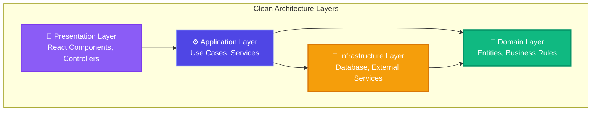
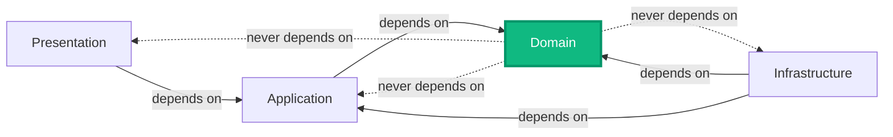

# ADR-003: Adopt Clean Architecture Pattern

## Status
Accepted

## Date
2025-01-12

## Context

Ideas Vault is a growing application that will evolve over time with:

- **Multiple developers** contributing to the codebase
- **Complex business logic** for idea analysis and validation
- **External dependencies** (databases, AI services, email, storage)
- **Long-term maintenance** requirements (5+ years)
- **Testability** requirements for high code quality
- **Scalability** needs as user base grows
- **Technology changes** (databases, frameworks, services)

Without a clear architectural pattern, we risk:
- Tight coupling between layers
- Difficulty testing business logic
- Hard to change or replace external dependencies
- Spaghetti code as application grows
- Poor separation of concerns
- High technical debt

We need an architectural pattern that provides:
1. **Independence**: Business logic independent of UI, database, frameworks
2. **Testability**: Easy to test business rules without external dependencies
3. **Flexibility**: Easy to swap databases, frameworks, or UI
4. **Maintainability**: Clear structure that developers can understand
5. **Scalability**: Architecture that supports growth

## Decision

We will adopt **Clean Architecture** (also known as Hexagonal Architecture or Ports and Adapters) as our primary architectural pattern for both frontend and backend.

### Core Principles

1. **Dependency Rule**: Dependencies point inward, never outward
2. **Business Logic at the Center**: Domain layer has no external dependencies
3. **Layers with Clear Responsibilities**: Each layer has a single, well-defined purpose
4. **Interface-Based Design**: Depend on abstractions, not concretions (Dependency Inversion)

### Layer Structure



### Backend Project Structure

```
ideasvault-backend/
├── IdeasVault.Domain/           # Core business logic (no dependencies)
│   ├── Entities/                # Business entities
│   ├── ValueObjects/            # Immutable value objects
│   ├── Interfaces/              # Repository contracts
│   ├── Events/                  # Domain events
│   └── Services/                # Domain services
│
├── IdeasVault.Application/      # Use cases (depends on Domain)
│   ├── Services/                # Application services
│   ├── Commands/                # Write operations (CQRS)
│   ├── Queries/                 # Read operations (CQRS)
│   ├── Validators/              # Input validation
│   ├── Interfaces/              # External service contracts
│   └── DTOs/                    # Data transfer objects
│
├── IdeasVault.Infrastructure/   # External concerns (depends on Domain & Application)
│   ├── Data/                    # EF Core context
│   ├── Repositories/            # Repository implementations
│   ├── Services/                # External service implementations
│   └── ExternalClients/         # API clients
│
└── IdeasVault.Api/             # Presentation (depends on Application)
    ├── Controllers/             # HTTP endpoints
    ├── Middleware/              # Request pipeline
    ├── Filters/                 # Cross-cutting concerns
    └── DTOs/                    # API request/response models
```

### Frontend Structure

```
ideasvault-ui/src/
├── domain/                      # Domain layer (pure logic)
│   ├── entities/                # Business entities
│   ├── interfaces/              # Type definitions
│   └── validators/              # Validation rules
│
├── application/                 # Application layer (use cases)
│   ├── hooks/                   # Custom React hooks
│   ├── services/                # Business logic services
│   └── contexts/                # State management
│
├── infrastructure/              # Infrastructure layer
│   ├── api/                     # API client
│   ├── storage/                 # LocalStorage wrapper
│   └── external/                # External services
│
└── presentation/                # Presentation layer
    ├── components/              # React components
    ├── pages/                   # Page components
    └── layouts/                 # Layout components
```

## Consequences

### Positive Consequences

1. **Testability**:
   - Business logic (Domain layer) has zero external dependencies
   - Easy to unit test with no mocking required
   - Application layer can be tested with interface mocks
   - High test coverage achievable
   ```csharp
   // Easy to test - no dependencies
   [Fact]
   public void Idea_Create_Should_Set_Status_To_Analyzing()
   {
       var idea = Idea.Create("Title", "Description", tags, InputType.Text, "userId");
       Assert.Equal(IdeaStatus.Analyzing, idea.Status);
   }
   ```

2. **Maintainability**:
   - Clear separation of concerns
   - New developers can quickly understand structure
   - Each layer has a single responsibility
   - Reduced cognitive load when working on features

3. **Flexibility**:
   - Can swap PostgreSQL for MongoDB with minimal changes
   - Can replace React with Vue without touching business logic
   - Can switch AI providers without changing domain code
   - Technology decisions become easier to reverse

4. **Domain-Centric**:
   - Business rules are centralized and explicit
   - Domain Driven Design (DDD) patterns fit naturally
   - Business logic is framework-agnostic
   - Domain experts can read and validate business rules

5. **SOLID Compliance**:
   - **S**ingle Responsibility: Each layer has one reason to change
   - **O**pen/Closed: Open for extension, closed for modification
   - **L**iskov Substitution: Interfaces allow substitution
   - **I**nterface Segregation: Small, focused interfaces
   - **D**ependency Inversion: Depend on abstractions

6. **Scalability**:
   - Clear boundaries enable microservices extraction
   - Layers can scale independently
   - Easy to add new features without breaking existing code
   - Supports team growth (different teams per layer)

7. **Reusability**:
   - Domain layer can be shared across projects
   - Application services reusable in different contexts
   - Infrastructure implementations swappable

8. **Documentation**:
   - Architecture is self-documenting
   - Clear dependencies between layers
   - Easy to explain to stakeholders

### Negative Consequences

1. **Initial Complexity**:
   - More files and folders than simpler architectures
   - Steeper learning curve for junior developers
   - More upfront design decisions
   - **Mitigation**: Comprehensive documentation, pair programming

2. **Boilerplate Code**:
   - More interfaces and abstractions
   - DTOs for each layer
   - Mapping between layers (AutoMapper helps)
   - **Mitigation**: Code generators, templates, AutoMapper

3. **Development Speed** (Initial):
   - Slower to build initial features
   - Need to think about layer boundaries
   - More files to create per feature
   - **Mitigation**: Templates, CLI tools, experience over time

4. **Over-Engineering Risk** (Small Projects):
   - May be overkill for tiny applications
   - Simple CRUD apps don't need this complexity
   - **Why It's Okay**: Ideas Vault will grow, worth the investment

5. **Performance Overhead**:
   - Additional abstraction layers
   - Mapping between DTOs
   - **Mitigation**: Minimal impact, optimizations possible

6. **Testing Overhead**:
   - Need to test each layer separately
   - More test files to maintain
   - **Mitigation**: Higher quality, fewer bugs in production

### Neutral Consequences

1. **Team Alignment Required**: Everyone must understand and follow the architecture
2. **Code Review Focus**: More emphasis on reviewing layer boundaries
3. **Tooling Needs**: May need tools like AutoMapper, MediatR for patterns

## Alternatives Considered

### Alternative 1: Three-Tier Architecture (Traditional Layered)

**Structure**: UI → Business Logic → Data Access

**Pros**:
- Simple to understand
- Less abstraction
- Faster initial development
- Familiar to most developers

**Cons**:
- Tight coupling to database
- Business logic often leaks into UI and data layers
- Hard to test without database
- Database-centric rather than domain-centric
- Difficult to change technologies

**Why Not Chosen**: Tight coupling makes testing difficult and technology changes expensive. We want business logic independent of infrastructure.

### Alternative 2: MVC/MVVM (Model-View-Controller/ViewModel)

**Structure**: Models ↔ Views ↔ Controllers

**Pros**:
- Well-understood pattern
- Built into many frameworks
- Good for CRUD applications
- Fast development

**Cons**:
- Models often tied to database
- Business logic scattered across controllers
- Not designed for complex domains
- Hard to enforce layer boundaries
- Controllers become bloated

**Why Not Chosen**: MVC works for simple CRUD but doesn't scale well for complex business logic. We need better separation.

### Alternative 3: Vertical Slice Architecture

**Structure**: Features organized by slice, not layer

**Pros**:
- All code for a feature in one place
- Fast to add new features
- No cross-cutting layers
- Easy to understand feature scope

**Cons**:
- Code duplication across slices
- Harder to enforce consistency
- Business rules scattered
- Reusability challenges
- Not ideal for complex domains

**Why Not Chosen**: While great for feature teams, it's harder to enforce consistent business rules and share domain logic across features.

### Alternative 4: Microkernel (Plugin) Architecture

**Structure**: Core system + Plugins

**Pros**:
- Highly extensible
- Plugins can be added/removed
- Good for product platforms

**Cons**:
- Overkill for most applications
- Complex plugin management
- Versioning challenges
- Not needed for our use case

**Why Not Chosen**: We don't need plugin architecture. Clean Architecture provides sufficient extensibility.

### Alternative 5: Event-Driven Architecture

**Structure**: Services communicate via events

**Pros**:
- Loose coupling
- Scalability
- Asynchronous processing
- Good for distributed systems

**Cons**:
- More complex
- Eventual consistency challenges
- Harder to debug
- Overkill for initial version

**Why Not Chosen**: While we'll use domain events within Clean Architecture, full event-driven architecture is premature. We can evolve to it later.

## Comparison Matrix

| Criteria | Clean Arch | 3-Tier | MVC | Vertical Slice | Microkernel | Event-Driven |
|----------|-----------|--------|-----|----------------|-------------|--------------|
| **Testability** | ⭐⭐⭐⭐⭐ | ⭐⭐ | ⭐⭐ | ⭐⭐⭐ | ⭐⭐⭐ | ⭐⭐⭐⭐ |
| **Maintainability** | ⭐⭐⭐⭐⭐ | ⭐⭐ | ⭐⭐⭐ | ⭐⭐⭐ | ⭐⭐⭐ | ⭐⭐⭐ |
| **Flexibility** | ⭐⭐⭐⭐⭐ | ⭐⭐ | ⭐⭐ | ⭐⭐⭐⭐ | ⭐⭐⭐⭐⭐ | ⭐⭐⭐⭐ |
| **Learning Curve** | ⭐⭐ | ⭐⭐⭐⭐⭐ | ⭐⭐⭐⭐ | ⭐⭐⭐ | ⭐⭐ | ⭐⭐ |
| **Dev Speed** | ⭐⭐⭐ | ⭐⭐⭐⭐ | ⭐⭐⭐⭐⭐ | ⭐⭐⭐⭐⭐ | ⭐⭐ | ⭐⭐ |
| **Scalability** | ⭐⭐⭐⭐⭐ | ⭐⭐⭐ | ⭐⭐⭐ | ⭐⭐⭐⭐ | ⭐⭐⭐⭐ | ⭐⭐⭐⭐⭐ |
| **Best For** | Complex domains | Simple CRUD | Web apps | Feature teams | Platforms | Distributed |

## Implementation Guidelines

### Dependency Rules



**Rules**:
1. Domain layer has **zero** external dependencies
2. Application layer depends only on Domain
3. Infrastructure depends on Domain and Application (implements interfaces)
4. Presentation depends only on Application
5. Outer layers can depend on inner layers, never reverse

### Example: Creating an Idea

```csharp
// 1. DOMAIN LAYER - Pure business logic
public class Idea : BaseEntity
{
    public static Idea Create(string title, string description, List<string> tags, string userId)
    {
        // Business rule: Title is required
        if (string.IsNullOrWhiteSpace(title))
            throw new DomainException("Title is required");
            
        var idea = new Idea
        {
            Id = Guid.NewGuid().ToString(),
            Title = title,
            Status = IdeaStatus.Analyzing // Business rule: New ideas start analyzing
        };
        
        idea.AddDomainEvent(new IdeaCreatedEvent(idea));
        return idea;
    }
}

// 2. APPLICATION LAYER - Use case orchestration
public class CreateIdeaCommandHandler
{
    private readonly IIdeaRepository _repository; // Interface from Domain
    private readonly IUnitOfWork _unitOfWork; // Interface from Domain
    
    public async Task<Idea> HandleAsync(CreateIdeaCommand command)
    {
        var idea = Idea.Create(command.Title, command.Description, command.Tags, command.UserId);
        await _repository.AddAsync(idea);
        await _unitOfWork.SaveChangesAsync();
        return idea;
    }
}

// 3. INFRASTRUCTURE LAYER - Implementation details
public class IdeaRepository : IIdeaRepository // Implements domain interface
{
    private readonly DbContext _context;
    
    public async Task AddAsync(Idea idea)
    {
        await _context.Ideas.AddAsync(idea);
    }
}

// 4. PRESENTATION LAYER - HTTP endpoint
[HttpPost]
public async Task<IActionResult> CreateIdea([FromBody] CreateIdeaRequest request)
{
    var command = new CreateIdeaCommand { Title = request.Title, ... };
    var idea = await _handler.HandleAsync(command);
    return CreatedAtAction(nameof(GetIdea), new { id = idea.Id }, idea);
}
```

## Success Metrics

- ✅ Domain layer has zero external dependencies
- ✅ > 80% code coverage on Domain layer
- ✅ Business logic testable without mocking
- ✅ Can swap database with < 1 day effort
- ✅ New features follow Clean Architecture
- ✅ Team understands and applies pattern correctly
- ✅ Code reviews enforce layer boundaries
- ✅ Technical debt stays < 10%

## References

- [Clean Architecture by Robert C. Martin](https://blog.cleancoder.com/uncle-bob/2012/08/13/the-clean-architecture.html)
- [Domain-Driven Design by Eric Evans](https://www.domainlanguage.com/ddd/)
- [Hexagonal Architecture by Alistair Cockburn](https://alistair.cockburn.us/hexagonal-architecture/)
- [Clean Architecture in .NET](https://github.com/jasontaylordev/CleanArchitecture)
- [SOLID Principles](https://en.wikipedia.org/wiki/SOLID)
- [Microsoft Architecture Guide](https://docs.microsoft.com/en-us/dotnet/architecture/)

## Related ADRs

- [ADR-001: React Frontend](./001-react-frontend.md) - Frontend follows Clean Architecture
- [ADR-002: .NET Backend](./002-dotnet-backend.md) - Backend implements Clean Architecture layers
