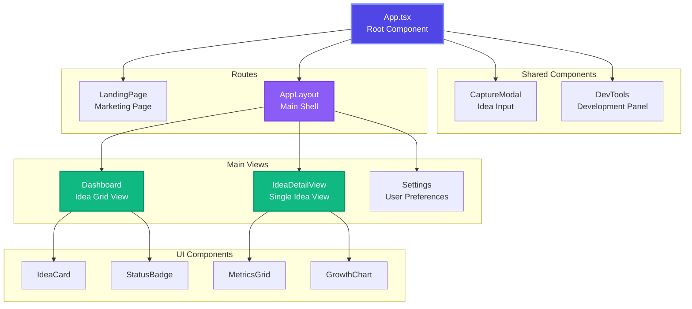
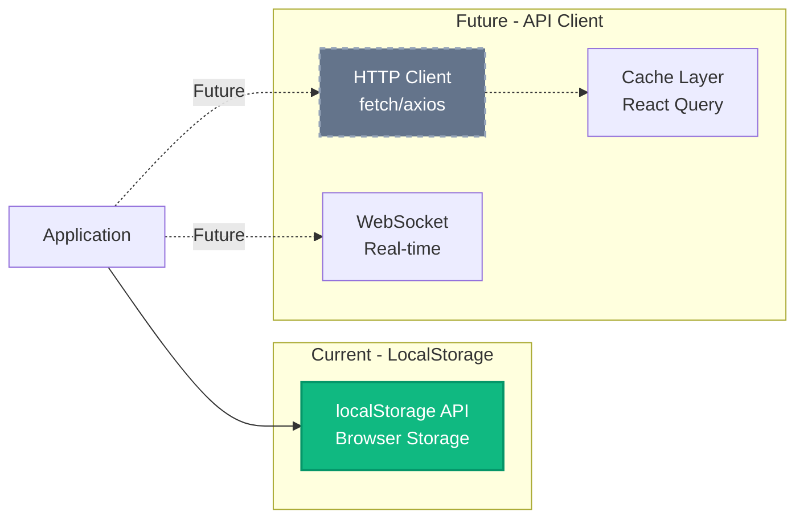
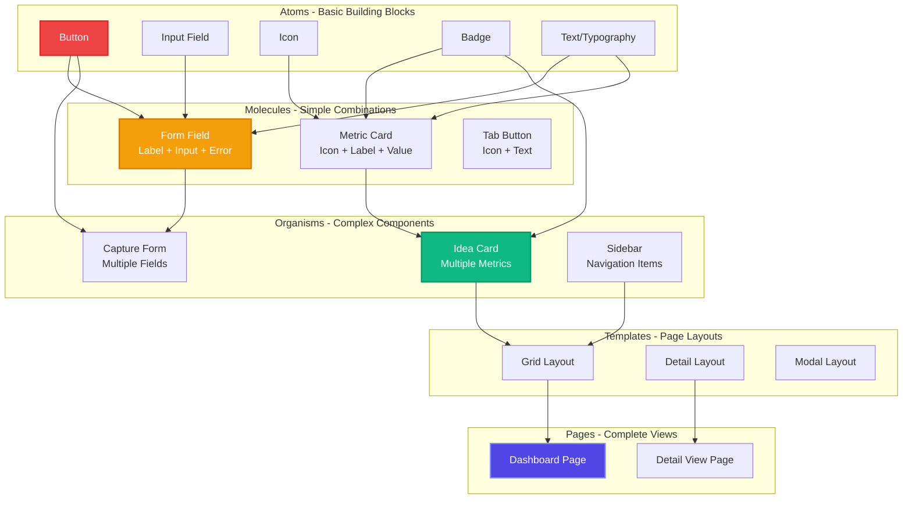
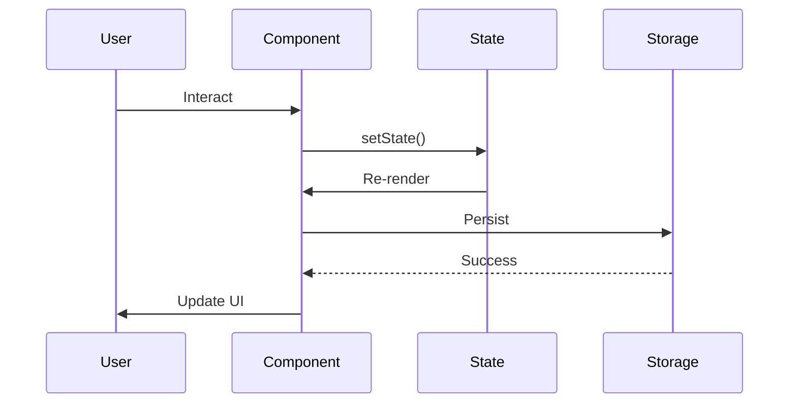
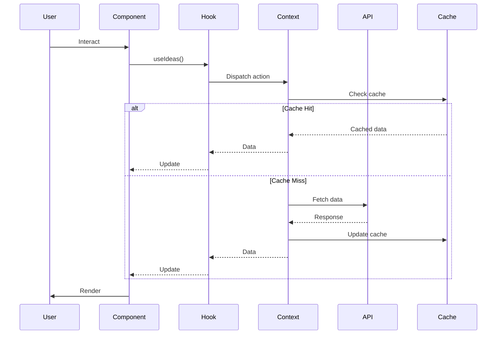
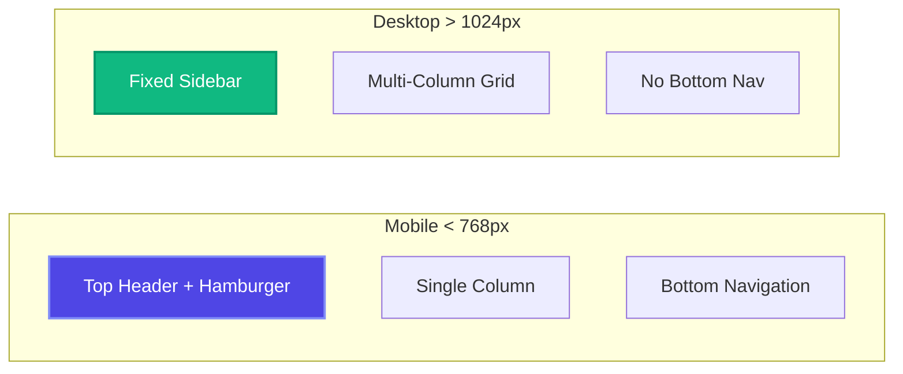
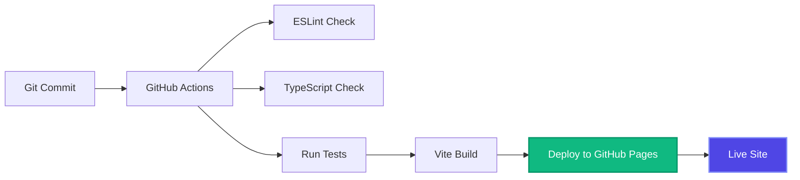

# Ideas Vault - Frontend Architecture

## Overview

The Ideas Vault frontend is a modern React single-page application built with TypeScript, Vite, and Tailwind CSS. It follows Clean Architecture principles with clear separation of concerns and SOLID design patterns.

## Technology Stack

| Technology | Version | Purpose |
|------------|---------|---------|
| React | 19.2.0 | UI framework with hooks |
| TypeScript | 5.9.3 | Type-safe development |
| Vite | 7.2.4 | Build tool and dev server |
| Tailwind CSS | 4.1.18 | Utility-first styling |
| React Router | 7.12.0 | Client-side routing |
| Framer Motion | 12.25.0 | Animations and transitions |
| Lucide React | 0.562.0 | Icon library |
| Recharts | 3.6.0 | Data visualization |
| @mlc-ai/web-llm | 0.2.80 | Local AI processing |

## Component Architecture

### High-Level Component Hierarchy



### Detailed Component Structure

```mermaid
graph TB
    subgraph "Pages - View Layer"
        LP[LandingPage.tsx<br/>Hero, Features, CTA]
        DB[Dashboard.tsx<br/>Idea Grid, Empty State]
        ID[IdeaDetailView.tsx<br/>Full Analysis View]
        ST[Settings.tsx<br/>User Preferences]
    end
    
    subgraph "Layout Components"
        AL[AppLayout.tsx<br/>Sidebar, Header, Footer]
        SB[Sidebar Navigation]
        MN[Mobile Navigation]
    end
    
    subgraph "Feature Components"
        CM[CaptureModal.tsx<br/>Text/Voice/Image Input]
        TI[TextInput Tab]
        VI[VoiceInput Tab]
        II[ImageInput Tab]
    end
    
    subgraph "UI Components"
        IC[IdeaCard<br/>Idea Preview]
        MG[MetricsGrid<br/>Key Stats Display]
        GC[GrowthChart<br/>Recharts Visualization]
        CA[CompetitorAnalysis<br/>Competitor List]
        AP[ActionPlan<br/>Step List]
        SB2[StatusBadge<br/>Ready/Analyzing]
        AI[AILoadingIndicator<br/>Loading State]
    end
    
    subgraph "Utilities"
        Storage[storage.ts<br/>LocalStorage API]
        AIAnalyzer[aiAnalyzer.ts<br/>Mock AI Logic]
        Speech[speechRecognition.ts<br/>Voice Input API]
        Onboarding[onboarding.ts<br/>First-Time Logic]
    end
    
    LP --> AL
    DB --> AL
    ID --> AL
    ST --> AL
    
    AL --> SB
    AL --> MN
    
    DB --> IC
    DB --> SB2
    ID --> MG
    ID --> GC
    ID --> CA
    ID --> AP
    
    CM --> TI
    CM --> VI
    CM --> II
    
    VI --> Speech
    II --> Storage
    CM --> AIAnalyzer
    DB --> Storage
    ID --> Storage
    
    style LP fill:#4f46e5,stroke:#818cf8,stroke-width:2px,color:#fff
    style AL fill:#8b5cf6,stroke:#7c3aed,stroke-width:2px,color:#fff
    style CM fill:#10b981,stroke:#059669,stroke-width:2px,color:#fff
    style Storage fill:#f59e0b,stroke:#d97706,stroke-width:2px,color:#fff
```



## Layer Architecture

### Presentation Layer

**Responsibility**: Render UI and handle user interactions

```typescript
// Page Components
src/components/
├── LandingPage.tsx       // Marketing homepage
├── Dashboard.tsx         // Main idea grid view
├── IdeaDetailView.tsx    // Single idea analysis
├── Settings.tsx          // User preferences
├── AppLayout.tsx         // Main application shell
└── CaptureModal.tsx      // Idea capture form
```

**Design Principles**:
- **Single Responsibility**: Each component has one clear purpose
- **Composition**: Complex UIs built from small, reusable components
- **Props Down, Events Up**: Unidirectional data flow
- **Presentational vs Container**: Separation of logic and display

### State Management Layer

**Current Implementation**: React State + LocalStorage

```mermaid
graph TB
    subgraph "State Sources"
        LS[LocalStorage<br/>Persistent State]
        RS[React State<br/>Component State]
        RR[React Router<br/>URL State]
    end
    
    subgraph "State Consumers"
        App[App Component<br/>ideas: Idea[]]
        Dashboard[Dashboard<br/>Display Ideas]
        Detail[IdeaDetailView<br/>Single Idea]
        Modal[CaptureModal<br/>Form State]
    end
    
    LS -->|Initial Load| App
    App -->|Prop Drilling| Dashboard
    App -->|Prop Drilling| Detail
    RS --> Modal
    RR --> Detail
    
    App -->|Save| LS
    
    style App fill:#4f46e5,stroke:#818cf8,stroke-width:2px,color:#fff
    style LS fill:#10b981,stroke:#059669,stroke-width:2px,color:#fff
```

**Future State Management**: Context API + Hooks

```typescript
// Future Context-Based Architecture
interface IdeasContextType {
  ideas: Idea[];
  loading: boolean;
  error: Error | null;
  addIdea: (idea: Omit<Idea, 'id'>) => Promise<void>;
  updateIdea: (id: string, updates: Partial<Idea>) => Promise<void>;
  deleteIdea: (id: string) => Promise<void>;
  refreshIdeas: () => Promise<void>;
}

const IdeasContext = createContext<IdeasContextType | undefined>(undefined);

// Custom Hook
export const useIdeas = () => {
  const context = useContext(IdeasContext);
  if (!context) throw new Error('useIdeas must be used within IdeasProvider');
  return context;
};
```

### Business Logic Layer

**Responsibility**: Application-specific logic and data transformations

```typescript
// utils/aiAnalyzer.ts
export class IdeaAnalyzer {
  async analyzeIdea(
    title: string,
    description: string,
    tags: string[]
  ): Promise<AnalysisResult> {
    // 1. Initialize AI model
    // 2. Prepare prompt with context
    // 3. Call AI service
    // 4. Parse and structure response
    // 5. Return typed analysis
  }
}

// utils/storage.ts
export const storage = {
  getIdeas(): Idea[],
  saveIdeas(ideas: Idea[]): void,
  addIdea(idea: Idea): void,
  updateIdea(id: string, updates: Partial<Idea>): void,
  deleteIdea(id: string): void,
  clearAll(): void
};
```

### Data Layer

**Responsibility**: Data access and persistence



## Routing Architecture

### Route Structure

```mermaid
graph TB
    Root[/ - Root]
    
    Landing[/ - LandingPage<br/>Public Route]
    Vault[/vault - AppLayout<br/>Protected Route]
    
    Dashboard[/vault - Dashboard<br/>Main View]
    Detail[/vault/idea/:id - IdeaDetailView<br/>Single Idea]
    Settings[/vault/settings - Settings<br/>Preferences]
    
    NotFound[* - Redirect to /]
    
    Root --> Landing
    Root --> Vault
    
    Vault --> Dashboard
    Vault --> Detail
    Vault --> Settings
    
    Root --> NotFound
    
    style Landing fill:#4f46e5,stroke:#818cf8,stroke-width:2px,color:#fff
    style Vault fill:#8b5cf6,stroke:#7c3aed,stroke-width:2px,color:#fff
    style Dashboard fill:#10b981,stroke:#059669,stroke-width:2px,color:#fff
```

### Route Configuration

```typescript
// App.tsx
<Routes>
  {/* Public Routes */}
  <Route path="/" element={<LandingPage onEnterApp={handleEnterApp} />} />
  
  {/* Protected Routes - AppLayout Wrapper */}
  <Route path="/vault" element={<AppLayout onLogout={handleLogout}>
    <Dashboard
      ideas={ideas}
      onOpenCapture={() => setIsCaptureModalOpen(true)}
      onSelectIdea={handleSelectIdea}
    />
  </AppLayout>} />
  
  <Route path="/vault/settings" element={<AppLayout onLogout={handleLogout}>
    <Settings onShowDevTools={() => setDevToolsVisible(true)} />
  </AppLayout>} />
  
  <Route path="/vault/idea/:id" element={<AppLayout onLogout={handleLogout}>
    <IdeaDetailViewRoute
      ideas={ideas}
      onBack={handleBackToDashboard}
      onDelete={handleDeleteIdea}
    />
  </AppLayout>} />
  
  {/* Catch-all Redirect */}
  <Route path="*" element={<Navigate to="/" replace />} />
</Routes>
```

## Component Design Patterns

### Composition Pattern

```typescript
// AppLayout as a Container Component
export const AppLayout: React.FC<{ children: React.ReactNode }> = ({ children }) => {
  return (
    <div className="min-h-screen bg-gradient-to-br from-slate-950 to-slate-900">
      <Sidebar />
      <main className="lg:ml-64 min-h-screen">
        <Header />
        <div className="p-8">
          {children}
        </div>
      </main>
      <MobileNav />
    </div>
  );
};

// Usage: Flexible content injection
<AppLayout>
  <Dashboard ideas={ideas} />
</AppLayout>
```

### Render Props Pattern

```typescript
// Future: List component with render props
interface ListProps<T> {
  items: T[];
  renderItem: (item: T, index: number) => React.ReactNode;
  emptyState?: React.ReactNode;
}

export function List<T>({ items, renderItem, emptyState }: ListProps<T>) {
  if (items.length === 0) return <>{emptyState}</>;
  return <div>{items.map(renderItem)}</div>;
}

// Usage
<List
  items={ideas}
  renderItem={(idea) => <IdeaCard key={idea.id} idea={idea} />}
  emptyState={<EmptyState />}
/>
```

### Custom Hooks Pattern

```typescript
// Future: Custom hook for idea management
export const useIdea = (id: string) => {
  const [idea, setIdea] = useState<Idea | null>(null);
  const [loading, setLoading] = useState(true);
  const [error, setError] = useState<Error | null>(null);

  useEffect(() => {
    const loadIdea = async () => {
      try {
        const data = await storage.getIdeas().find(i => i.id === id);
        setIdea(data || null);
      } catch (err) {
        setError(err as Error);
      } finally {
        setLoading(false);
      }
    };
    loadIdea();
  }, [id]);

  return { idea, loading, error };
};
```

## UI Component Hierarchy

### Atomic Design Structure



## Design System

### Color Palette

```typescript
// Tailwind Configuration
const colors = {
  // Primary: Indigo to Violet gradient
  primary: {
    from: '#4f46e5', // indigo-600
    to: '#7c3aed',   // violet-600
  },
  
  // Success: Emerald
  success: '#10b981', // emerald-500
  
  // Warning: Amber
  warning: '#f59e0b', // amber-500
  
  // Background: Slate gradients
  background: {
    dark: '#0f172a',  // slate-950
    base: '#1e293b',  // slate-900
    light: '#334155', // slate-700
  },
  
  // Text
  text: {
    primary: '#ffffff',   // white
    secondary: '#e2e8f0', // slate-200
    muted: '#94a3b8',     // slate-400
  },
  
  // Borders
  border: '#334155', // slate-700
};
```

### Typography

```typescript
// Font: Inter from Google Fonts
const typography = {
  fontFamily: 'Inter, system-ui, sans-serif',
  
  sizes: {
    xs: '0.75rem',    // 12px
    sm: '0.875rem',   // 14px
    base: '1rem',     // 16px
    lg: '1.125rem',   // 18px
    xl: '1.25rem',    // 20px
    '2xl': '1.5rem',  // 24px
    '3xl': '1.875rem', // 30px
    '4xl': '2.25rem',  // 36px
  },
  
  weights: {
    normal: 400,
    medium: 500,
    semibold: 600,
    bold: 700,
  },
};
```

### Spacing & Layout

```typescript
const spacing = {
  // Tailwind spacing scale (rem)
  1: '0.25rem',  // 4px
  2: '0.5rem',   // 8px
  3: '0.75rem',  // 12px
  4: '1rem',     // 16px
  6: '1.5rem',   // 24px
  8: '2rem',     // 32px
  12: '3rem',    // 48px
  16: '4rem',    // 64px
  
  // Border radius
  radius: {
    sm: '0.375rem',  // rounded-md
    md: '0.5rem',    // rounded-lg
    lg: '0.75rem',   // rounded-xl
    xl: '1rem',      // rounded-2xl
  },
};
```

## State Management Flow

### Current Flow - Local State



### Future Flow - Context + API



## Performance Optimization

### Code Splitting

```typescript
// Future: Lazy load heavy components
const Dashboard = lazy(() => import('./components/Dashboard'));
const IdeaDetailView = lazy(() => import('./components/IdeaDetailView'));

<Suspense fallback={<LoadingSpinner />}>
  <Routes>
    <Route path="/vault" element={<Dashboard />} />
    <Route path="/vault/idea/:id" element={<IdeaDetailView />} />
  </Routes>
</Suspense>
```

### Memoization

```typescript
// Memoize expensive computations
const sortedIdeas = useMemo(() => {
  return ideas.sort((a, b) => 
    b.createdAt.getTime() - a.createdAt.getTime()
  );
}, [ideas]);

// Memoize callbacks
const handleSelectIdea = useCallback((idea: Idea) => {
  navigate(`/vault/idea/${idea.id}`);
}, [navigate]);

// Memoize components
const IdeaCard = memo(({ idea }: { idea: Idea }) => {
  return <div>{idea.title}</div>;
});
```

### Virtual Scrolling

```typescript
// Future: For large lists of ideas
import { VirtualList } from 'react-window';

<VirtualList
  height={600}
  itemCount={ideas.length}
  itemSize={200}
>
  {({ index, style }) => (
    <IdeaCard key={ideas[index].id} idea={ideas[index]} style={style} />
  )}
</VirtualList>
```

## Responsive Design

### Breakpoints

```typescript
const breakpoints = {
  sm: '640px',   // Mobile landscape
  md: '768px',   // Tablet portrait
  lg: '1024px',  // Tablet landscape / Desktop
  xl: '1280px',  // Desktop
  '2xl': '1536px', // Large desktop
};
```

### Responsive Patterns



## Testing Strategy

### Unit Tests (Vitest)

```typescript
// Future: Component unit tests
describe('IdeaCard', () => {
  it('renders idea title and description', () => {
    const idea = createMockIdea();
    render(<IdeaCard idea={idea} />);
    
    expect(screen.getByText(idea.title)).toBeInTheDocument();
    expect(screen.getByText(idea.description)).toBeInTheDocument();
  });
  
  it('displays correct status badge', () => {
    const analyzingIdea = createMockIdea({ status: 'analyzing' });
    render(<IdeaCard idea={analyzingIdea} />);
    
    expect(screen.getByText(/analyzing/i)).toBeInTheDocument();
  });
});
```

### Integration Tests (React Testing Library)

```typescript
// Future: User flow tests
describe('Idea Capture Flow', () => {
  it('allows user to create a new idea', async () => {
    render(<App />);
    
    const addButton = screen.getByText(/add new idea/i);
    fireEvent.click(addButton);
    
    const titleInput = screen.getByLabelText(/title/i);
    const descInput = screen.getByLabelText(/description/i);
    
    fireEvent.change(titleInput, { target: { value: 'Test Idea' } });
    fireEvent.change(descInput, { target: { value: 'Test Description' } });
    
    const submitButton = screen.getByText(/submit/i);
    fireEvent.click(submitButton);
    
    await waitFor(() => {
      expect(screen.getByText('Test Idea')).toBeInTheDocument();
    });
  });
});
```

### E2E Tests (Playwright)

```typescript
// Future: End-to-end tests
test('complete idea management workflow', async ({ page }) => {
  await page.goto('/');
  await page.click('text=Open Your Vault');
  
  await page.click('text=Add New Idea');
  await page.fill('[placeholder="Title"]', 'My Startup Idea');
  await page.fill('[placeholder="Description"]', 'A revolutionary app');
  await page.click('button:has-text("Submit")');
  
  await expect(page.locator('text=My Startup Idea')).toBeVisible();
  
  await page.click('text=My Startup Idea');
  await expect(page.locator('text=Readiness Score')).toBeVisible();
});
```

## Build & Deployment

### Build Configuration

```typescript
// vite.config.ts
export default defineConfig({
  plugins: [react()],
  build: {
    target: 'esnext',
    outDir: 'dist',
    sourcemap: true,
    rollupOptions: {
      output: {
        manualChunks: {
          'react-vendor': ['react', 'react-dom', 'react-router-dom'],
          'ui-vendor': ['framer-motion', 'lucide-react'],
          'chart-vendor': ['recharts'],
        },
      },
    },
  },
});
```

### Deployment Pipeline



## Related Documentation

- [Architecture Overview](./README.md)
- [System Architecture](./system-architecture.md)
- [Backend Architecture](./backend-architecture.md)
- [Data Architecture](./data-architecture.md)
