# Ideas Vault - System Architecture

## ⚠️ Important Notice

**Current State: Frontend-Only Application**

Ideas Vault is currently a **frontend-only prototype** with no backend implementation. This document describes:
1. **Current Architecture** (what exists now - browser-based only)
2. **Proposed Future Architecture** (design for when/if backend is added)

All references to backend services, databases, APIs, and infrastructure are **proposed designs** for potential future implementation.

## Overview

This document provides a detailed view of Ideas Vault's system architecture using the C4 model (Context, Containers, Components, and Code).

**Current Implementation**: Single-page React application using browser APIs for all functionality.  
**Proposed Expansion**: Full-stack architecture with backend services (community contributions welcome).

## C4 Model

### Level 1: System Context Diagram

#### Current State (Frontend-Only)

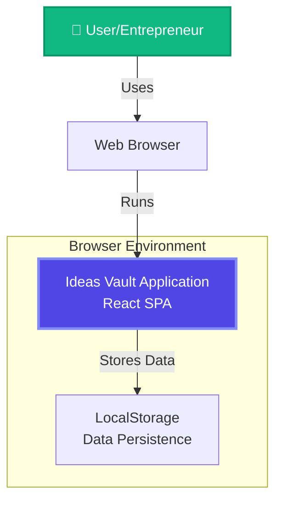

**Current Interactions:**
- Users interact through modern web browsers
- All data stored in browser's localStorage
- No external services or APIs
- Fully offline-capable after initial load

#### Proposed Future State (With Backend)

The proposed view showing how Ideas Vault could fit into a broader ecosystem.

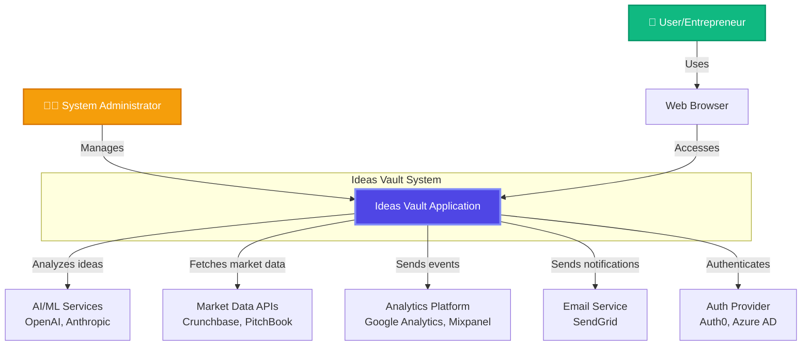

**Key Interactions:**
- Users interact with the system through modern web browsers
- System authenticates users via OAuth2 providers
- AI services analyze ideas and generate insights
- Market data APIs provide competitive intelligence
- Email service sends notifications and digests
- Analytics platform tracks usage and performance

### Level 2: Container Diagram

Shows the high-level technical building blocks of the system.

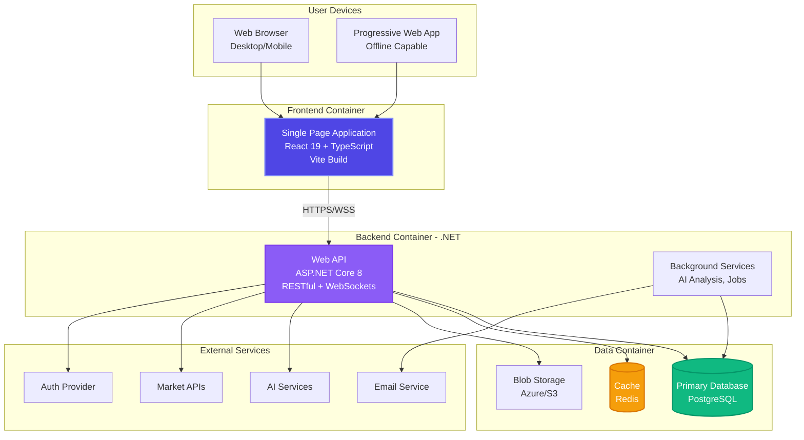

**Container Responsibilities:**

| Container | Technology | Purpose |
|-----------|-----------|---------|
| **SPA** | React + TypeScript | User interface and interaction |
| **Web API** | ASP.NET Core | Business logic and data access |
| **Background Services** | .NET Hosted Services | Async processing and scheduled jobs |
| **Database** | PostgreSQL | Persistent data storage |
| **Cache** | Redis | Performance optimization |
| **Blob Storage** | Azure/S3 | Image and file storage |

### Level 3: Component Diagram - Frontend

Detailed view of the React SPA components and their interactions.

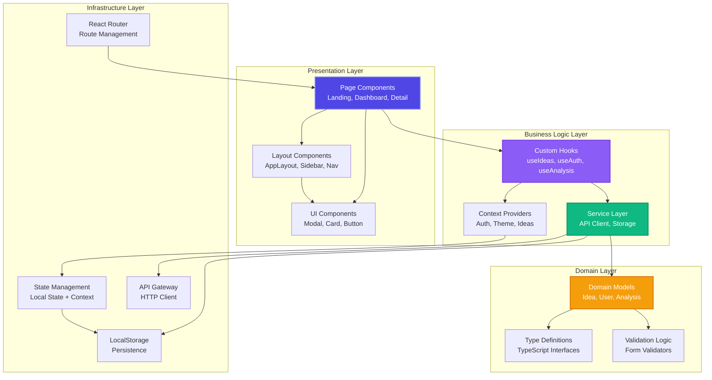

### Level 3: Component Diagram - Backend API

Detailed view of the .NET backend components (planned architecture).

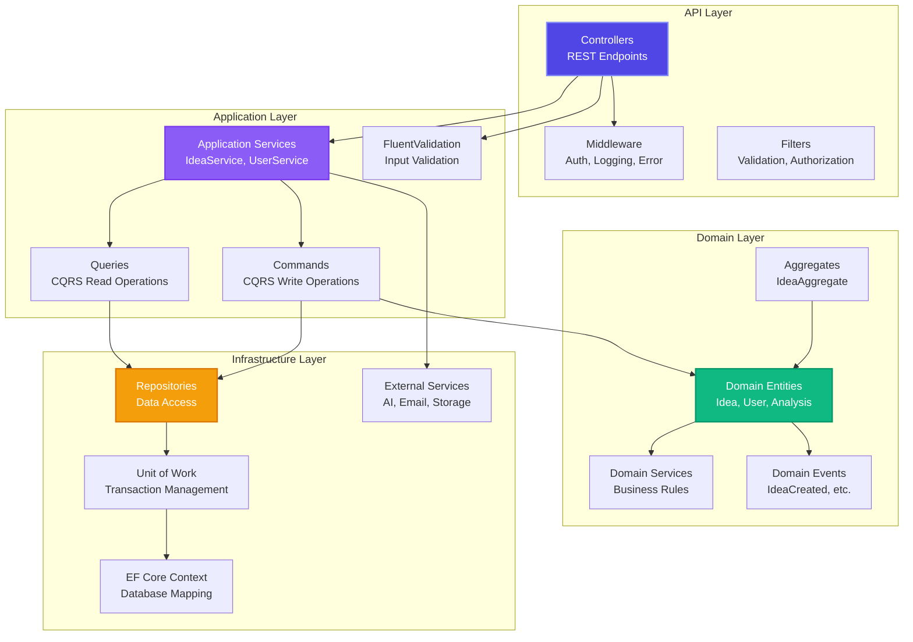

## Data Flow Diagrams

### Idea Capture Flow

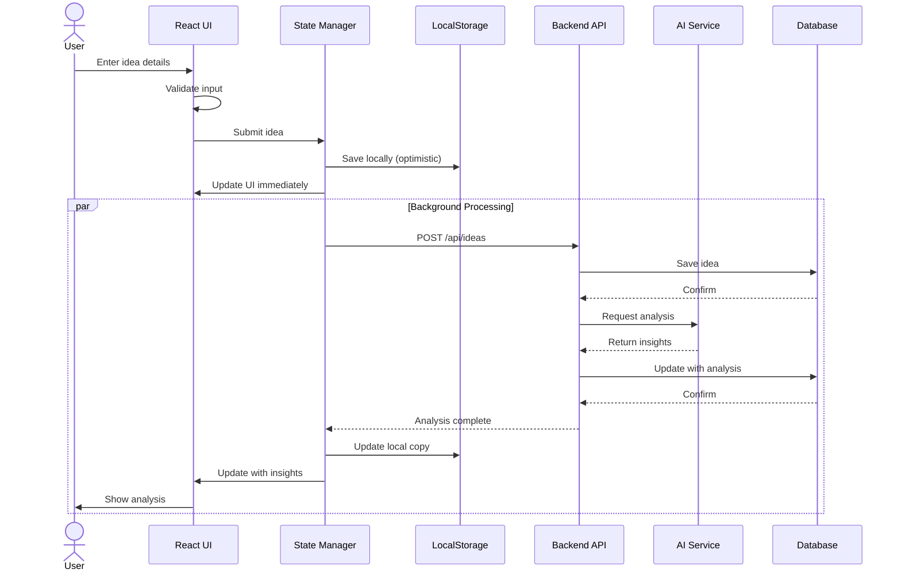

### Authentication Flow

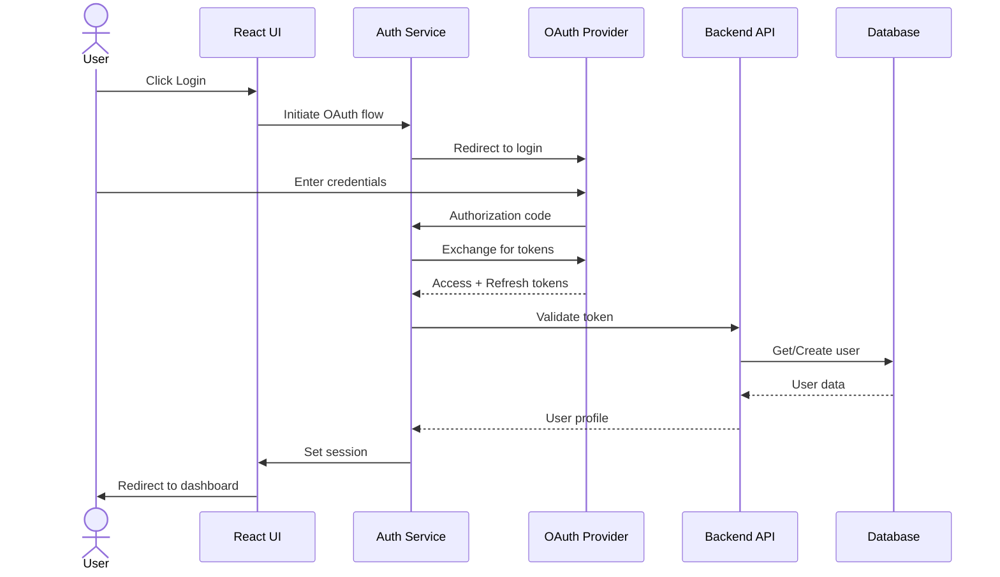

### Real-Time Analysis Flow

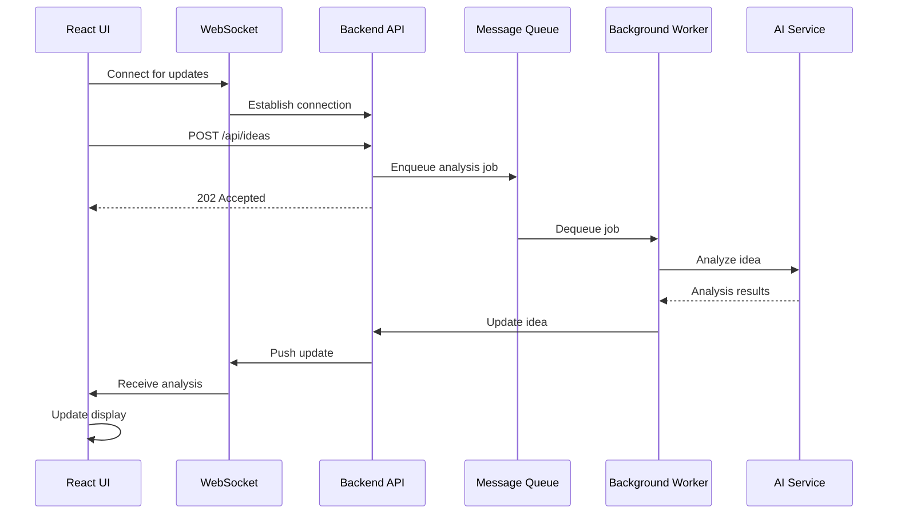

## Integration Points

### Frontend → Backend API

**Endpoints:**

| Method | Endpoint | Purpose |
|--------|----------|---------|
| POST | `/api/auth/login` | Authenticate user |
| POST | `/api/auth/refresh` | Refresh access token |
| GET | `/api/ideas` | List user's ideas |
| POST | `/api/ideas` | Create new idea |
| GET | `/api/ideas/{id}` | Get idea details |
| PUT | `/api/ideas/{id}` | Update idea |
| DELETE | `/api/ideas/{id}` | Delete idea |
| GET | `/api/ideas/{id}/analysis` | Get AI analysis |
| POST | `/api/ideas/{id}/share` | Share idea |
| GET | `/api/users/profile` | Get user profile |
| PUT | `/api/users/settings` | Update settings |

**WebSocket Connections:**

| Endpoint | Purpose |
|----------|---------|
| `/ws/ideas` | Real-time idea updates |
| `/ws/analysis` | Real-time analysis progress |
| `/ws/notifications` | System notifications |

### Backend → External Services

**AI Service Integration:**
```typescript
interface AIServiceClient {
  analyzeIdea(idea: Idea): Promise<AnalysisResult>;
  generateTags(text: string): Promise<string[]>;
  summarize(text: string): Promise<string>;
  sentiment(text: string): Promise<SentimentScore>;
}
```

**Market Data Integration:**
```typescript
interface MarketDataClient {
  searchCompetitors(query: string): Promise<Competitor[]>;
  getMarketSize(industry: string): Promise<MarketMetrics>;
  getTrends(industry: string): Promise<Trend[]>;
}
```

## Deployment Architecture

### Current Deployment (Frontend Only)

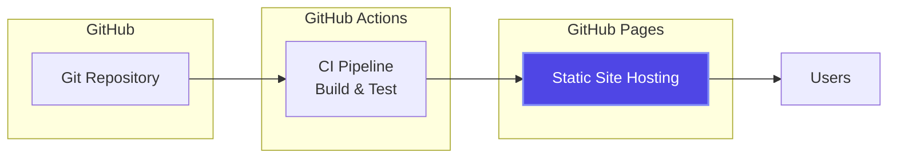

### Future Deployment (Full Stack)

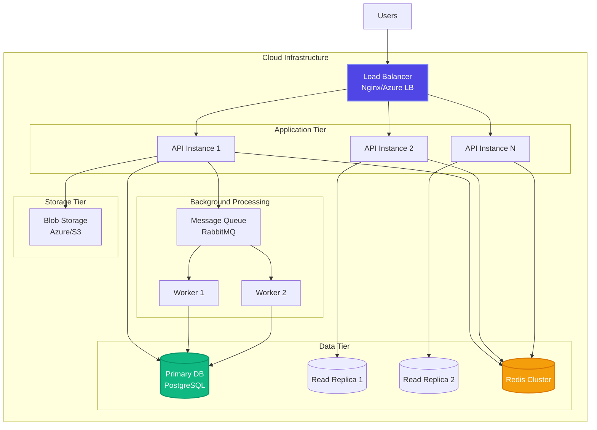

## Scalability Patterns

### Horizontal Scaling

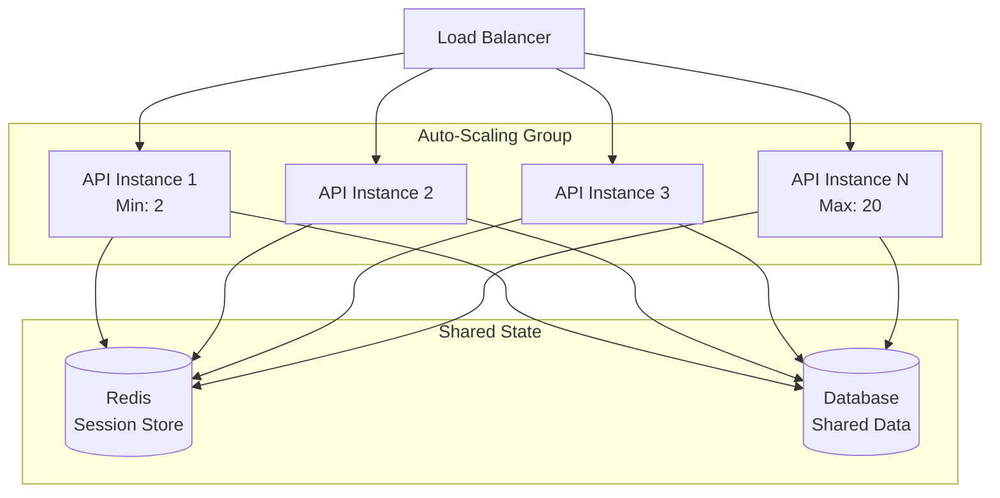

### Caching Strategy

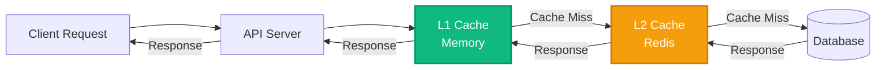

## Security Architecture

### Authentication & Authorization

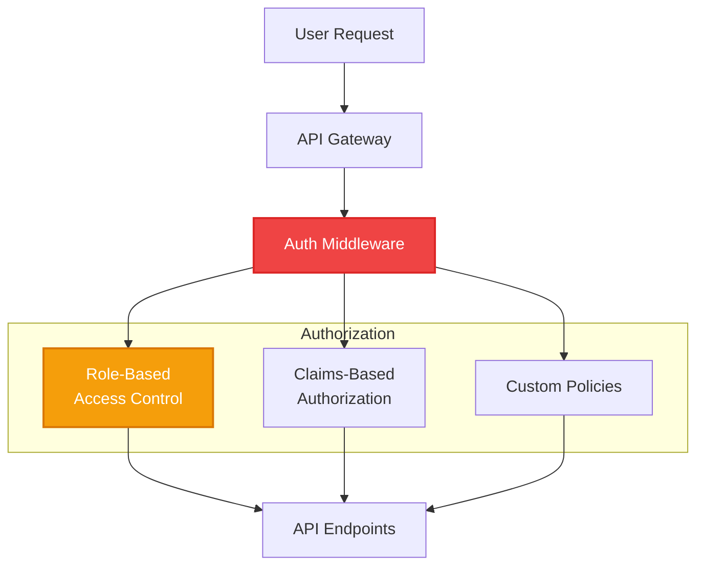

### Data Protection

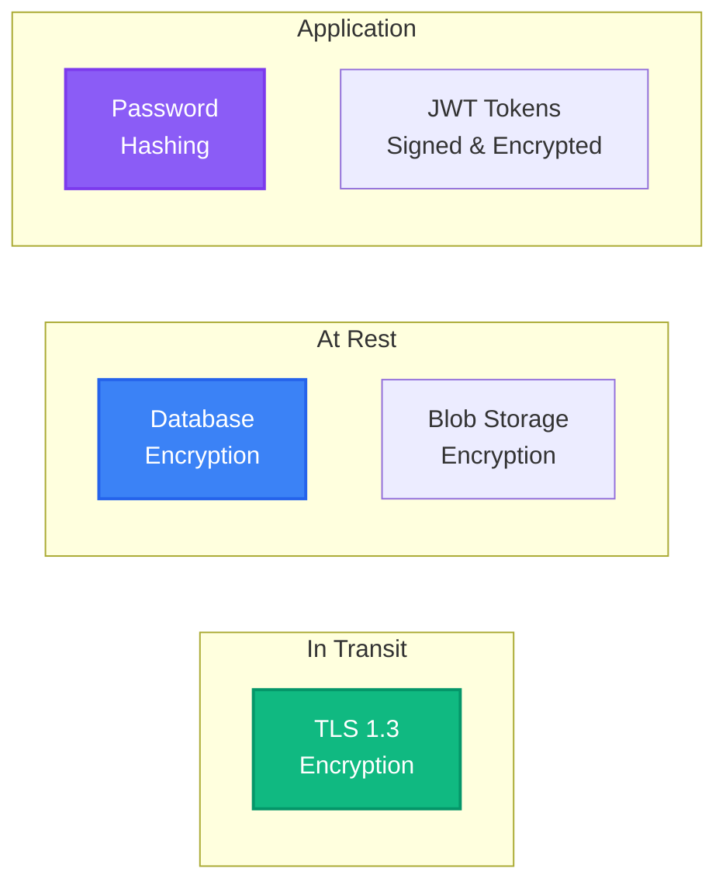

## Monitoring & Observability

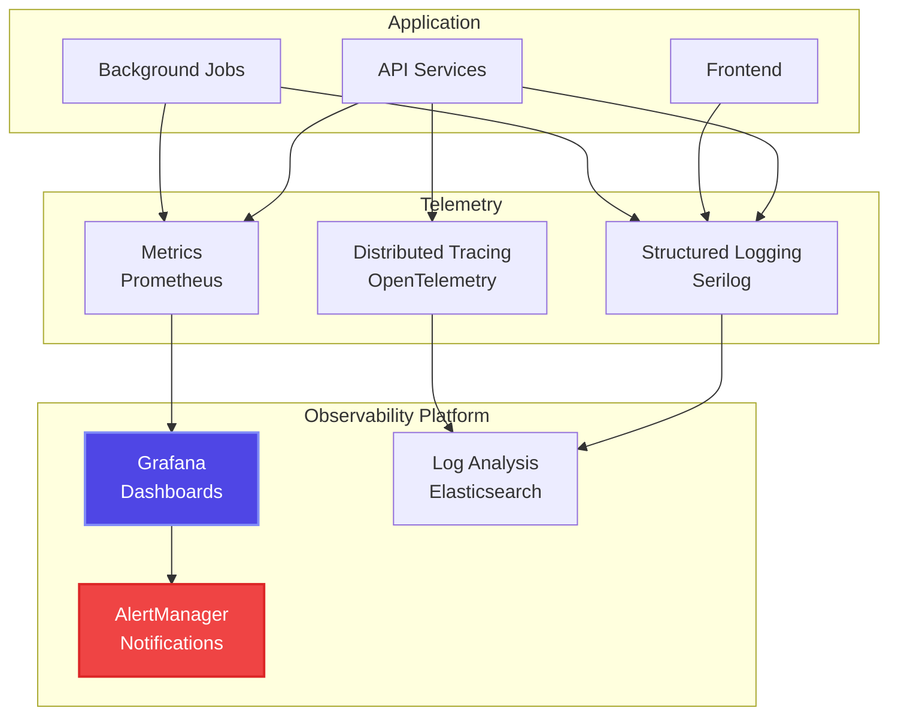

## Related Documentation

- [Architecture Overview](./README.md)
- [Frontend Architecture](./frontend-architecture.md)
- [Backend Architecture](./backend-architecture.md)
- [Data Architecture](./data-architecture.md)
- [Architecture Decision Records](./adr/README.md)
