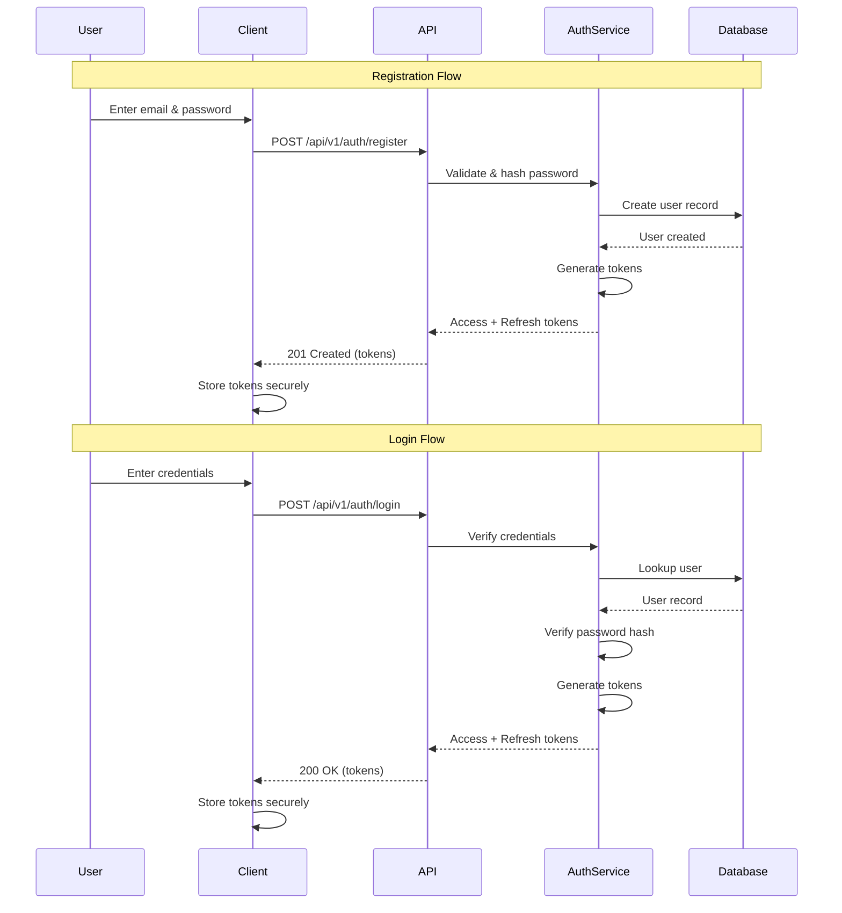
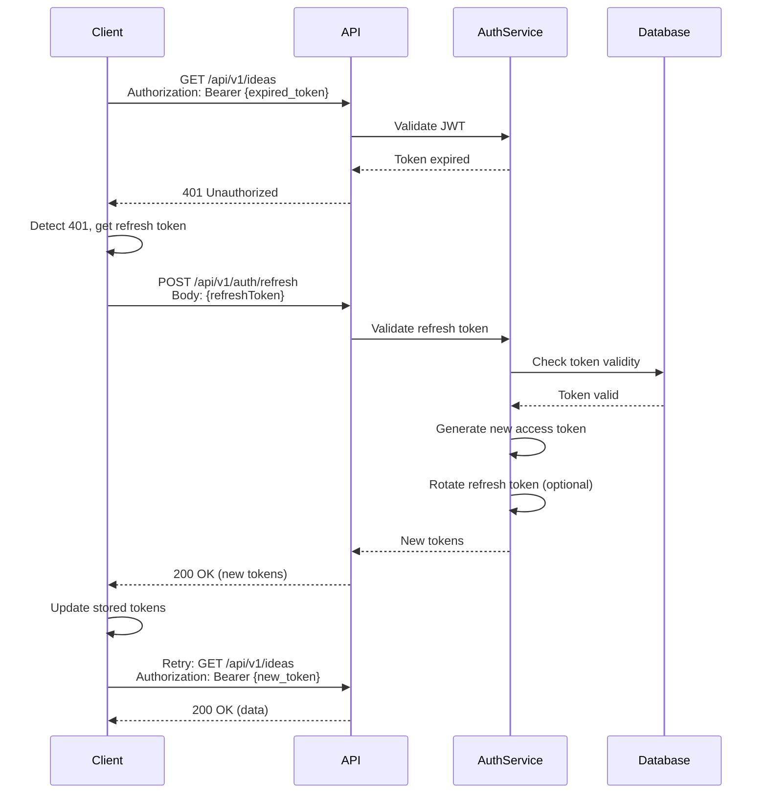
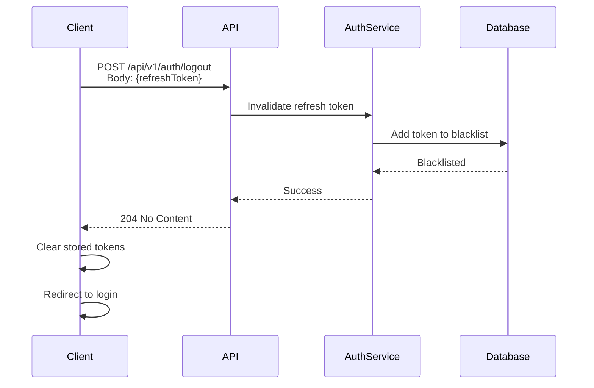
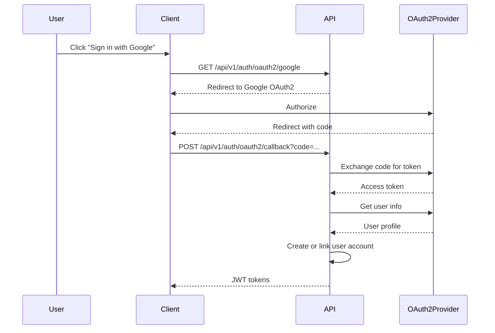

# Authentication & Authorization

Complete guide to authenticating with the Ideas Vault API, managing tokens, and understanding authorization.

## 📋 Table of Contents

- [Overview](#overview)
- [Authentication Flow](#authentication-flow)
- [JWT Token Structure](#jwt-token-structure)
- [Endpoints](#endpoints)
- [Token Management](#token-management)
- [Security Best Practices](#security-best-practices)
- [OAuth2 Integration](#oauth2-integration-future)
- [Common Scenarios](#common-scenarios)

---

## Overview

Ideas Vault API uses **JWT (JSON Web Token)** based authentication with a refresh token mechanism for secure, stateless authentication.

### Key Features

- **JWT Access Tokens**: Short-lived tokens (1 hour) for API requests
- **Refresh Tokens**: Long-lived tokens (30 days) for obtaining new access tokens
- **Stateless**: No server-side session storage required
- **Secure**: HTTPS-only, HttpOnly cookies (optional), token rotation
- **Role-Based Access Control (RBAC)**: User roles and permissions

### Token Types

| Token Type | Purpose | Lifetime | Storage |
|------------|---------|----------|---------|
| Access Token | API authentication | 1 hour | Memory/LocalStorage |
| Refresh Token | Renew access token | 30 days | HttpOnly cookie (recommended) |
| API Key | Server-to-server (future) | No expiration | Secure vault |

---

## Authentication Flow

### Registration and Login Flow



### Token Refresh Flow



### Logout Flow



---

## JWT Token Structure

### Access Token

Access tokens contain claims about the authenticated user and their permissions.

#### Token Example

```
eyJhbGciOiJIUzI1NiIsInR5cCI6IkpXVCJ9.eyJzdWIiOiI3NzBmYTYyMi1nNGJkLTYzZjYtYzkzOC02Njg4Nzc2NjIyMjIiLCJlbWFpbCI6InVzZXJAZXhhbXBsZS5jb20iLCJuYW1lIjoiSmFuZSBEb2UiLCJyb2xlIjoidXNlciIsInRpZXIiOiJwcm8iLCJpYXQiOjE3MzY2NzM4MDAsImV4cCI6MTczNjY3NzQwMCwiaXNzIjoiaHR0cHM6Ly9hcGkuaWRlYXN2YXVsdC5jb20iLCJhdWQiOiJpZGVhc3ZhdWx0LWNsaWVudCJ9.signature
```

#### Decoded Header

```json
{
  "alg": "HS256",
  "typ": "JWT"
}
```

#### Decoded Payload

```json
{
  "sub": "770fa622-g4bd-63f6-c938-668877662222",
  "email": "user@example.com",
  "name": "Jane Doe",
  "role": "user",
  "tier": "pro",
  "permissions": ["ideas:read", "ideas:write", "ideas:delete"],
  "iat": 1736673800,
  "exp": 1736677400,
  "iss": "https://api.ideasvault.com",
  "aud": "ideasvault-client"
}
```

#### Claims Reference

| Claim | Type | Description |
|-------|------|-------------|
| `sub` | string | Subject (user ID) |
| `email` | string | User's email address |
| `name` | string | User's display name |
| `role` | string | User role: `user`, `admin`, `enterprise` |
| `tier` | string | Subscription tier: `free`, `pro`, `enterprise` |
| `permissions` | array | Specific permissions granted |
| `iat` | integer | Issued at (Unix timestamp) |
| `exp` | integer | Expiration time (Unix timestamp) |
| `iss` | string | Issuer (API URL) |
| `aud` | string | Audience (client identifier) |

### Refresh Token

Refresh tokens are opaque strings stored in the database and used only for obtaining new access tokens.

```json
{
  "jti": "refresh-12345-67890",
  "sub": "770fa622-g4bd-63f6-c938-668877662222",
  "iat": 1736673800,
  "exp": 1739265800,
  "iss": "https://api.ideasvault.com"
}
```

---

## Endpoints

### Register

Create a new user account.

**Endpoint**: `POST /api/v1/auth/register`

**Authentication**: Not required

#### Request Body

```json
{
  "email": "newuser@example.com",
  "password": "SecurePassword123!",
  "firstName": "John",
  "lastName": "Doe"
}
```

#### Request Schema

| Field | Type | Required | Constraints |
|-------|------|----------|-------------|
| `email` | string | Yes | Valid email format, unique |
| `password` | string | Yes | Min 8 chars, 1 uppercase, 1 lowercase, 1 number, 1 special char |
| `firstName` | string | Yes | 1-50 chars |
| `lastName` | string | Yes | 1-50 chars |

#### Example Request

```bash
curl -X POST "https://api.ideasvault.com/api/v1/auth/register" \
  -H "Content-Type: application/json" \
  -d '{
    "email": "newuser@example.com",
    "password": "SecurePassword123!",
    "firstName": "John",
    "lastName": "Doe"
  }'
```

#### Success Response (201 Created)

```json
{
  "user": {
    "id": "880gb733-h5ce-74g7-d049-779988773333",
    "email": "newuser@example.com",
    "firstName": "John",
    "lastName": "Doe",
    "displayName": "John Doe",
    "tier": "free",
    "emailVerified": false,
    "createdAt": "2026-01-12T10:30:00Z"
  },
  "accessToken": "eyJhbGciOiJIUzI1NiIsInR5cCI6IkpXVCJ9...",
  "refreshToken": "eyJhbGciOiJIUzI1NiIsInR5cCI6IkpXVCJ9...",
  "expiresIn": 3600,
  "tokenType": "Bearer"
}
```

#### Error Responses

**400 Bad Request** (Validation Error)
```json
{
  "type": "https://api.ideasvault.com/errors/validation-error",
  "title": "Validation Error",
  "status": 400,
  "detail": "One or more validation errors occurred.",
  "errors": [
    {
      "field": "password",
      "message": "Password must contain at least one uppercase letter, one lowercase letter, one number, and one special character",
      "code": "passwordComplexity"
    }
  ]
}
```

**409 Conflict** (Email Already Exists)
```json
{
  "type": "https://api.ideasvault.com/errors/conflict",
  "title": "Email Already Registered",
  "status": 409,
  "detail": "An account with this email address already exists."
}
```

---

### Login

Authenticate with email and password.

**Endpoint**: `POST /api/v1/auth/login`

**Authentication**: Not required

#### Request Body

```json
{
  "email": "user@example.com",
  "password": "SecurePassword123!"
}
```

#### Example Request

```bash
curl -X POST "https://api.ideasvault.com/api/v1/auth/login" \
  -H "Content-Type: application/json" \
  -d '{
    "email": "user@example.com",
    "password": "SecurePassword123!"
  }'
```

#### Success Response (200 OK)

```json
{
  "user": {
    "id": "770fa622-g4bd-63f6-c938-668877662222",
    "email": "user@example.com",
    "firstName": "Jane",
    "lastName": "Doe",
    "displayName": "Jane Doe",
    "tier": "pro",
    "emailVerified": true
  },
  "accessToken": "eyJhbGciOiJIUzI1NiIsInR5cCI6IkpXVCJ9...",
  "refreshToken": "eyJhbGciOiJIUzI1NiIsInR5cCI6IkpXVCJ9...",
  "expiresIn": 3600,
  "tokenType": "Bearer"
}
```

#### Error Responses

**401 Unauthorized** (Invalid Credentials)
```json
{
  "type": "https://api.ideasvault.com/errors/unauthorized",
  "title": "Invalid Credentials",
  "status": 401,
  "detail": "Email or password is incorrect."
}
```

**429 Too Many Requests** (Rate Limited)
```json
{
  "type": "https://api.ideasvault.com/errors/rate-limit-exceeded",
  "title": "Too Many Login Attempts",
  "status": 429,
  "detail": "Too many failed login attempts. Please try again in 15 minutes.",
  "retryAfter": 900
}
```

---

### Refresh Token

Obtain a new access token using a refresh token.

**Endpoint**: `POST /api/v1/auth/refresh`

**Authentication**: Not required (uses refresh token)

#### Request Body

```json
{
  "refreshToken": "eyJhbGciOiJIUzI1NiIsInR5cCI6IkpXVCJ9..."
}
```

#### Example Request

```bash
curl -X POST "https://api.ideasvault.com/api/v1/auth/refresh" \
  -H "Content-Type: application/json" \
  -d '{
    "refreshToken": "eyJhbGciOiJIUzI1NiIsInR5cCI6IkpXVCJ9..."
  }'
```

#### Success Response (200 OK)

```json
{
  "accessToken": "eyJhbGciOiJIUzI1NiIsInR5cCI6IkpXVCJ9...",
  "refreshToken": "eyJhbGciOiJIUzI1NiIsInR5cCI6IkpXVCJ9...",
  "expiresIn": 3600,
  "tokenType": "Bearer"
}
```

**Note**: The refresh token is rotated (a new one is issued) for security.

#### Error Responses

**401 Unauthorized** (Invalid or Expired Refresh Token)
```json
{
  "type": "https://api.ideasvault.com/errors/unauthorized",
  "title": "Invalid Refresh Token",
  "status": 401,
  "detail": "Refresh token is invalid or has expired. Please log in again."
}
```

---

### Logout

Invalidate refresh token and end session.

**Endpoint**: `POST /api/v1/auth/logout`

**Authentication**: Required (access token) or refresh token

#### Request Body

```json
{
  "refreshToken": "eyJhbGciOiJIUzI1NiIsInR5cCI6IkpXVCJ9..."
}
```

#### Example Request

```bash
curl -X POST "https://api.ideasvault.com/api/v1/auth/logout" \
  -H "Authorization: Bearer YOUR_ACCESS_TOKEN" \
  -H "Content-Type: application/json" \
  -d '{
    "refreshToken": "eyJhbGciOiJIUzI1NiIsInR5cCI6IkpXVCJ9..."
  }'
```

#### Success Response (204 No Content)

No response body.

---

### Verify Email

Verify user's email address with verification token.

**Endpoint**: `POST /api/v1/auth/verify-email`

**Authentication**: Not required

#### Request Body

```json
{
  "token": "verify-email-token-12345"
}
```

#### Example Request

```bash
curl -X POST "https://api.ideasvault.com/api/v1/auth/verify-email" \
  -H "Content-Type: application/json" \
  -d '{
    "token": "verify-email-token-12345"
  }'
```

#### Success Response (200 OK)

```json
{
  "message": "Email verified successfully",
  "emailVerified": true
}
```

---

### Request Password Reset

Request a password reset email.

**Endpoint**: `POST /api/v1/auth/forgot-password`

**Authentication**: Not required

#### Request Body

```json
{
  "email": "user@example.com"
}
```

#### Example Request

```bash
curl -X POST "https://api.ideasvault.com/api/v1/auth/forgot-password" \
  -H "Content-Type: application/json" \
  -d '{
    "email": "user@example.com"
  }'
```

#### Success Response (200 OK)

```json
{
  "message": "If an account with that email exists, a password reset link has been sent."
}
```

**Note**: Always returns success to prevent email enumeration attacks.

---

### Reset Password

Reset password using reset token.

**Endpoint**: `POST /api/v1/auth/reset-password`

**Authentication**: Not required

#### Request Body

```json
{
  "token": "reset-password-token-12345",
  "newPassword": "NewSecurePassword123!"
}
```

#### Example Request

```bash
curl -X POST "https://api.ideasvault.com/api/v1/auth/reset-password" \
  -H "Content-Type: application/json" \
  -d '{
    "token": "reset-password-token-12345",
    "newPassword": "NewSecurePassword123!"
  }'
```

#### Success Response (200 OK)

```json
{
  "message": "Password reset successfully"
}
```

---

### Change Password

Change password for authenticated user.

**Endpoint**: `POST /api/v1/auth/change-password`

**Authentication**: Required

#### Request Body

```json
{
  "currentPassword": "CurrentPassword123!",
  "newPassword": "NewSecurePassword123!"
}
```

#### Example Request

```bash
curl -X POST "https://api.ideasvault.com/api/v1/auth/change-password" \
  -H "Authorization: Bearer YOUR_TOKEN" \
  -H "Content-Type: application/json" \
  -d '{
    "currentPassword": "CurrentPassword123!",
    "newPassword": "NewSecurePassword123!"
  }'
```

#### Success Response (200 OK)

```json
{
  "message": "Password changed successfully"
}
```

---

## Token Management

### Storing Tokens

#### Frontend (Web)

**Recommended**: Store refresh token in HttpOnly cookie, access token in memory

```javascript
// After login
const response = await fetch('/api/v1/auth/login', {
  method: 'POST',
  credentials: 'include', // Include cookies
  body: JSON.stringify({ email, password })
});

const { accessToken } = await response.json();

// Store access token in memory (React state, Zustand, etc.)
setAccessToken(accessToken);

// Refresh token automatically stored in HttpOnly cookie by server
```

**Alternative**: Store both tokens in localStorage (less secure)

```javascript
localStorage.setItem('accessToken', accessToken);
localStorage.setItem('refreshToken', refreshToken);
```

#### Mobile Apps

Store tokens in secure storage:
- **iOS**: Keychain
- **Android**: KeyStore
- **React Native**: react-native-keychain

```javascript
import * as Keychain from 'react-native-keychain';

// Store tokens
await Keychain.setGenericPassword('accessToken', accessToken);
await Keychain.setGenericPassword('refreshToken', refreshToken);

// Retrieve tokens
const credentials = await Keychain.getGenericPassword();
```

### Automatic Token Refresh

Implement automatic token refresh before expiration:

```javascript
let accessToken = '';
let refreshToken = '';
let tokenExpiresAt = 0;

// Check if token needs refresh before each request
async function fetchWithAuth(url, options = {}) {
  // Refresh if token expires in less than 5 minutes
  if (Date.now() >= tokenExpiresAt - 5 * 60 * 1000) {
    await refreshAccessToken();
  }

  return fetch(url, {
    ...options,
    headers: {
      ...options.headers,
      'Authorization': `Bearer ${accessToken}`
    }
  });
}

async function refreshAccessToken() {
  const response = await fetch('/api/v1/auth/refresh', {
    method: 'POST',
    headers: { 'Content-Type': 'application/json' },
    body: JSON.stringify({ refreshToken })
  });

  if (!response.ok) {
    // Refresh failed, redirect to login
    window.location.href = '/login';
    return;
  }

  const data = await response.json();
  accessToken = data.accessToken;
  refreshToken = data.refreshToken;
  tokenExpiresAt = Date.now() + data.expiresIn * 1000;
}
```

### Handling Token Expiration

Implement 401 response handling with automatic retry:

```javascript
import axios from 'axios';

const client = axios.create({
  baseURL: 'https://api.ideasvault.com/api/v1'
});

client.interceptors.response.use(
  (response) => response,
  async (error) => {
    const originalRequest = error.config;

    // If 401 and haven't retried yet
    if (error.response?.status === 401 && !originalRequest._retry) {
      originalRequest._retry = true;

      try {
        // Refresh token
        const { data } = await axios.post('/api/v1/auth/refresh', {
          refreshToken: getRefreshToken()
        });

        setAccessToken(data.accessToken);
        setRefreshToken(data.refreshToken);

        // Retry original request with new token
        originalRequest.headers.Authorization = `Bearer ${data.accessToken}`;
        return client(originalRequest);
      } catch (refreshError) {
        // Refresh failed, redirect to login
        redirectToLogin();
        return Promise.reject(refreshError);
      }
    }

    return Promise.reject(error);
  }
);
```

---

## Security Best Practices

### Token Security

1. **Use HTTPS Only**: Never send tokens over HTTP
2. **Short-lived Access Tokens**: 1 hour maximum lifetime
3. **HttpOnly Cookies for Refresh Tokens**: Prevents XSS attacks
4. **Token Rotation**: Issue new refresh token on each refresh
5. **Token Blacklisting**: Maintain blacklist for logged-out tokens

### Password Security

1. **Strong Password Requirements**:
   - Minimum 8 characters
   - At least one uppercase letter
   - At least one lowercase letter
   - At least one number
   - At least one special character

2. **Password Hashing**: Use bcrypt with salt rounds ≥ 10

3. **Rate Limiting**:
   - Login attempts: 5 per 15 minutes per IP
   - Password reset: 3 per hour per email

### CORS Configuration

Configure CORS to allow only trusted origins:

```csharp
services.AddCors(options =>
{
    options.AddPolicy("AllowFrontend", builder =>
    {
        builder
            .WithOrigins("https://app.ideasvault.com")
            .AllowCredentials()
            .AllowAnyMethod()
            .AllowAnyHeader();
    });
});
```

### Security Headers

Always include security headers in responses:

```
Strict-Transport-Security: max-age=31536000; includeSubDomains
X-Content-Type-Options: nosniff
X-Frame-Options: DENY
X-XSS-Protection: 1; mode=block
Content-Security-Policy: default-src 'self'
```

---

## OAuth2 Integration (Future)

OAuth2 support for third-party authentication is planned for future releases.

### Planned Providers

- Google
- GitHub
- Microsoft
- Apple

### OAuth2 Flow (Planned)



---

## Common Scenarios

### Scenario 1: Login and Store Tokens

```javascript
async function login(email, password) {
  const response = await fetch('https://api.ideasvault.com/api/v1/auth/login', {
    method: 'POST',
    headers: { 'Content-Type': 'application/json' },
    body: JSON.stringify({ email, password })
  });

  if (!response.ok) {
    throw new Error('Login failed');
  }

  const { accessToken, refreshToken, expiresIn } = await response.json();

  // Store tokens
  sessionStorage.setItem('accessToken', accessToken);
  localStorage.setItem('refreshToken', refreshToken);
  
  // Calculate expiration time
  const expiresAt = Date.now() + expiresIn * 1000;
  sessionStorage.setItem('tokenExpiresAt', expiresAt.toString());

  return accessToken;
}
```

### Scenario 2: Make Authenticated Request

```javascript
async function getIdeas() {
  const accessToken = sessionStorage.getItem('accessToken');

  const response = await fetch('https://api.ideasvault.com/api/v1/ideas', {
    headers: {
      'Authorization': `Bearer ${accessToken}`
    }
  });

  if (response.status === 401) {
    // Token expired, refresh it
    await refreshToken();
    return getIdeas(); // Retry
  }

  return response.json();
}
```

### Scenario 3: Refresh Token Before Expiration

```javascript
function scheduleTokenRefresh() {
  const expiresAt = parseInt(sessionStorage.getItem('tokenExpiresAt'));
  const now = Date.now();
  
  // Refresh 5 minutes before expiration
  const refreshAt = expiresAt - 5 * 60 * 1000;
  const delay = refreshAt - now;

  if (delay > 0) {
    setTimeout(async () => {
      await refreshToken();
      scheduleTokenRefresh(); // Schedule next refresh
    }, delay);
  }
}

async function refreshToken() {
  const refreshToken = localStorage.getItem('refreshToken');

  const response = await fetch('https://api.ideasvault.com/api/v1/auth/refresh', {
    method: 'POST',
    headers: { 'Content-Type': 'application/json' },
    body: JSON.stringify({ refreshToken })
  });

  if (!response.ok) {
    // Refresh failed, logout user
    logout();
    return;
  }

  const { accessToken, refreshToken: newRefreshToken, expiresIn } = await response.json();

  // Update tokens
  sessionStorage.setItem('accessToken', accessToken);
  localStorage.setItem('refreshToken', newRefreshToken);
  
  const expiresAt = Date.now() + expiresIn * 1000;
  sessionStorage.setItem('tokenExpiresAt', expiresAt.toString());
}
```

### Scenario 4: Logout and Clear Tokens

```javascript
async function logout() {
  const accessToken = sessionStorage.getItem('accessToken');
  const refreshToken = localStorage.getItem('refreshToken');

  // Invalidate tokens on server
  await fetch('https://api.ideasvault.com/api/v1/auth/logout', {
    method: 'POST',
    headers: {
      'Authorization': `Bearer ${accessToken}`,
      'Content-Type': 'application/json'
    },
    body: JSON.stringify({ refreshToken })
  });

  // Clear local storage
  sessionStorage.removeItem('accessToken');
  sessionStorage.removeItem('tokenExpiresAt');
  localStorage.removeItem('refreshToken');

  // Redirect to login
  window.location.href = '/login';
}
```

---

**Last Updated**: January 12, 2026  
**API Version**: v1
