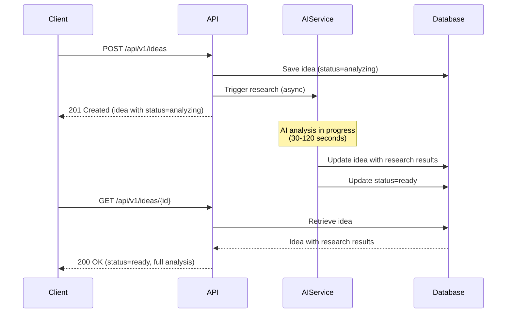
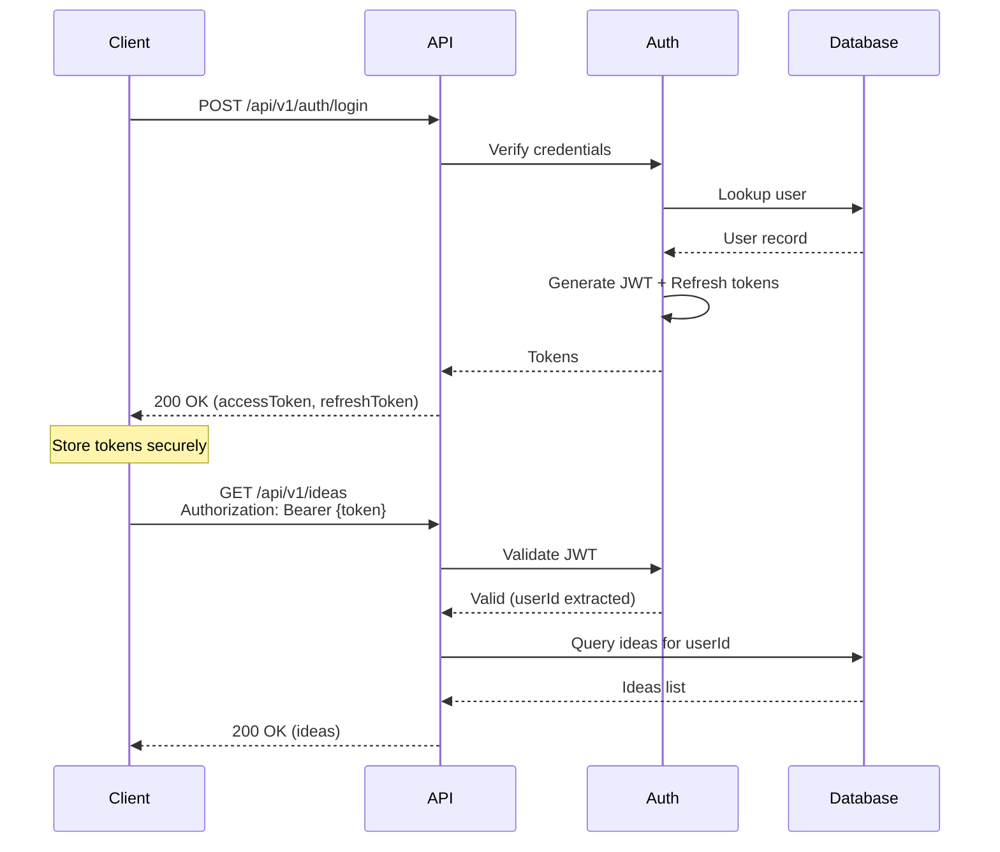
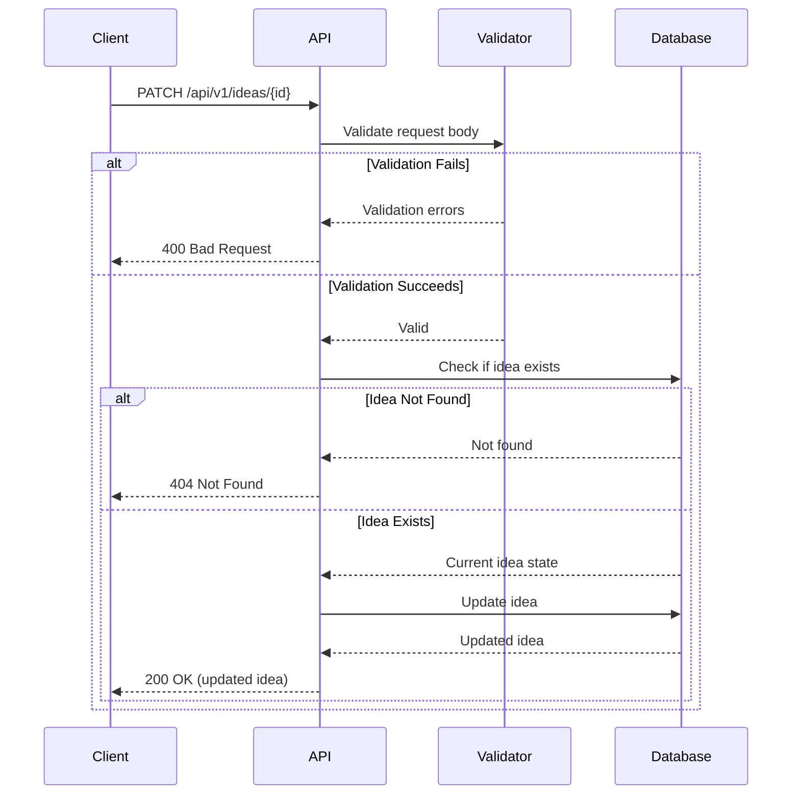
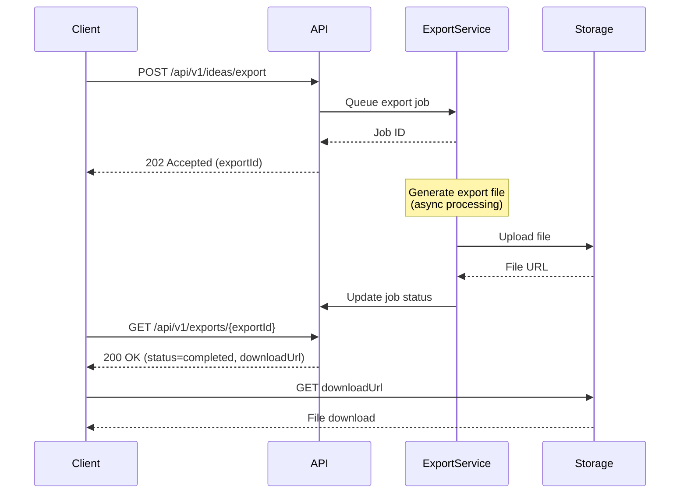

# REST API Reference

Complete reference for all Ideas Vault API endpoints, organized by resource.

## 📋 Table of Contents

- [Ideas](#ideas)
- [Research](#research)
- [Users](#users)
- [Tags](#tags)
- [Competitors](#competitors)
- [Exports](#exports)
- [Common Flows](#common-flows)

---

## Ideas

Manage startup ideas including creation, retrieval, updates, and deletion.

### List Ideas

Retrieve a paginated list of ideas with optional filtering and sorting.

**Endpoint**: `GET /api/v1/ideas`

**Authentication**: Required

#### Query Parameters

| Parameter | Type | Required | Description |
|-----------|------|----------|-------------|
| `limit` | integer | No | Number of items per page (1-100, default: 20) |
| `cursor` | string | No | Cursor for pagination |
| `status` | string | No | Filter by status: `ready`, `analyzing` |
| `inputType` | string | No | Filter by input type: `text`, `voice`, `image` |
| `tags` | string | No | Comma-separated list of tags |
| `search` | string | No | Search in title and description |
| `readinessScore[gte]` | integer | No | Minimum readiness score (0-100) |
| `readinessScore[lte]` | integer | No | Maximum readiness score (0-100) |
| `createdAt[gte]` | string | No | Created after date (ISO 8601) |
| `createdAt[lte]` | string | No | Created before date (ISO 8601) |
| `sort` | string | No | Sort field(s): `createdAt`, `-createdAt`, `readinessScore`, etc. |
| `fields` | string | No | Comma-separated fields to include |
| `expand` | string | No | Expand related resources: `research`, `competitors` |

#### Example Request

```bash
curl -X GET "https://api.ideasvault.com/api/v1/ideas?status=ready&readinessScore[gte]=75&sort=-readinessScore&limit=10" \
  -H "Authorization: Bearer YOUR_TOKEN"
```

#### Success Response (200 OK)

```json
{
  "data": [
    {
      "id": "550e8400-e29b-41d4-a716-446655440000",
      "title": "AI-Powered Email Assistant",
      "description": "An intelligent email assistant that uses AI to draft responses, schedule meetings, and prioritize messages based on importance and urgency.",
      "tags": ["#SaaS", "#AI", "#Productivity"],
      "status": "ready",
      "inputType": "text",
      "readinessScore": 85,
      "marketSize": "$12.5B",
      "targetAudience": "Enterprise organizations (500+ employees) and Fortune 1000 companies",
      "topCompetitor": "Superhuman",
      "competitorStrength": "Market leader with extensive enterprise customer base and $180M ARR",
      "keyTrend": "AI adoption in enterprise grew 67% in 2026, GenAI tools reaching 82% market penetration",
      "createdAt": "2026-01-10T14:30:00Z",
      "updatedAt": "2026-01-10T14:32:15Z"
    },
    {
      "id": "660f9511-f3ac-52e5-b827-557766551111",
      "title": "Sustainable Urban Farming Platform",
      "description": "A platform connecting urban farmers with consumers, providing tools for inventory management, delivery logistics, and community building.",
      "tags": ["#Sustainability", "#AgTech", "#Marketplace"],
      "status": "ready",
      "inputType": "text",
      "readinessScore": 78,
      "marketSize": "$8.3B",
      "targetAudience": "Urban farmers, community gardens, and local food cooperatives",
      "topCompetitor": "FarmLogs",
      "competitorStrength": "Comprehensive feature set with robust API and integration ecosystem",
      "keyTrend": "Climate tech funding reached $70B in 2026, 3x growth in corporate ESG mandates",
      "createdAt": "2026-01-09T09:15:00Z",
      "updatedAt": "2026-01-09T09:18:30Z"
    }
  ],
  "pagination": {
    "limit": 10,
    "hasMore": true,
    "nextCursor": "eyJpZCI6IjY2MGY5NTExLWYzYWMtNTJlNS1iODI3LTU1Nzc2NjU1MTExMSJ9",
    "totalCount": 47
  }
}
```

---

### Get Idea by ID

Retrieve detailed information about a specific idea.

**Endpoint**: `GET /api/v1/ideas/{id}`

**Authentication**: Required

#### Path Parameters

| Parameter | Type | Required | Description |
|-----------|------|----------|-------------|
| `id` | string (UUID) | Yes | Idea identifier |

#### Query Parameters

| Parameter | Type | Required | Description |
|-----------|------|----------|-------------|
| `expand` | string | No | Expand related resources: `research`, `competitors`, `growthMetrics`, `actionPlan` |

#### Example Request

```bash
curl -X GET "https://api.ideasvault.com/api/v1/ideas/550e8400-e29b-41d4-a716-446655440000?expand=competitors,growthMetrics" \
  -H "Authorization: Bearer YOUR_TOKEN"
```

#### Success Response (200 OK)

```json
{
  "id": "550e8400-e29b-41d4-a716-446655440000",
  "title": "AI-Powered Email Assistant",
  "description": "An intelligent email assistant that uses AI to draft responses, schedule meetings, and prioritize messages based on importance and urgency.",
  "tags": ["#SaaS", "#AI", "#Productivity"],
  "status": "ready",
  "inputType": "text",
  "imageData": null,
  "readinessScore": 85,
  "marketSize": "$12.5B",
  "targetAudience": "Enterprise organizations (500+ employees) and Fortune 1000 companies",
  "topCompetitor": "Superhuman",
  "competitorStrength": "Market leader with extensive enterprise customer base and $180M ARR",
  "keyTrend": "AI adoption in enterprise grew 67% in 2026, GenAI tools reaching 82% market penetration",
  "competitors": [
    {
      "name": "Superhuman",
      "strength": "Market leader with extensive enterprise customer base and $180M ARR",
      "weakness": "Premium pricing ($30+/month) excludes small businesses and startups"
    },
    {
      "name": "Hey",
      "strength": "Excellent user experience and high customer satisfaction (4.5+ rating)",
      "weakness": "Limited customization options and rigid workflow structure"
    },
    {
      "name": "Spark",
      "strength": "Strong brand recognition and 7-year track record in the market",
      "weakness": "Slow to innovate, relying on legacy architecture and acquisition strategy"
    }
  ],
  "growthMetrics": [
    {
      "year": 2026,
      "value": 1250
    },
    {
      "year": 2027,
      "value": 1875
    },
    {
      "year": 2028,
      "value": 2813
    },
    {
      "year": 2029,
      "value": 4219
    }
  ],
  "actionPlan": [
    "Conduct 30+ customer discovery interviews to validate problem-solution fit",
    "Build AI-powered MVP focusing on core automation workflow, target 3-month timeline",
    "Execute targeted LinkedIn outreach to 100+ decision makers in target verticals",
    "Build proof of concept with 3 design partners, negotiate pilot contracts",
    "Prepare investor pitch deck and warm introductions to 10+ seed funds"
  ],
  "createdAt": "2026-01-10T14:30:00Z",
  "updatedAt": "2026-01-10T14:32:15Z"
}
```

#### Error Responses

**404 Not Found**
```json
{
  "type": "https://api.ideasvault.com/errors/not-found",
  "title": "Not Found",
  "status": 404,
  "detail": "Idea with ID '550e8400-e29b-41d4-a716-446655440000' was not found.",
  "instance": "/api/v1/ideas/550e8400-e29b-41d4-a716-446655440000",
  "traceId": "00-4bf92f3577b34da6a3ce929d0e0e4736-00"
}
```

---

### Create Idea

Create a new idea and trigger AI analysis.

**Endpoint**: `POST /api/v1/ideas`

**Authentication**: Required

#### Request Body

```json
{
  "title": "AI-Powered Email Assistant",
  "description": "An intelligent email assistant that uses AI to draft responses, schedule meetings, and prioritize messages based on importance and urgency.",
  "tags": ["#SaaS", "#AI", "#Productivity"],
  "inputType": "text",
  "imageData": null
}
```

#### Request Schema

| Field | Type | Required | Constraints | Description |
|-------|------|----------|-------------|-------------|
| `title` | string | Yes | 5-200 chars | Idea title |
| `description` | string | Yes | 10-10000 chars | Detailed description |
| `tags` | array[string] | Yes | 1-10 tags | Categorization tags (must start with #) |
| `inputType` | string | Yes | enum: text, voice, image | Input method |
| `imageData` | string | No | Base64 encoded | Image data for image input type |

#### Example Request

```bash
curl -X POST "https://api.ideasvault.com/api/v1/ideas" \
  -H "Authorization: Bearer YOUR_TOKEN" \
  -H "Content-Type: application/json" \
  -d '{
    "title": "AI-Powered Email Assistant",
    "description": "An intelligent email assistant that uses AI to draft responses, schedule meetings, and prioritize messages based on importance and urgency.",
    "tags": ["#SaaS", "#AI", "#Productivity"],
    "inputType": "text"
  }'
```

#### Success Response (201 Created)

```json
{
  "id": "550e8400-e29b-41d4-a716-446655440000",
  "title": "AI-Powered Email Assistant",
  "description": "An intelligent email assistant that uses AI to draft responses, schedule meetings, and prioritize messages based on importance and urgency.",
  "tags": ["#SaaS", "#AI", "#Productivity"],
  "status": "analyzing",
  "inputType": "text",
  "imageData": null,
  "readinessScore": 0,
  "marketSize": null,
  "targetAudience": null,
  "topCompetitor": null,
  "competitorStrength": null,
  "keyTrend": null,
  "competitors": [],
  "growthMetrics": [],
  "actionPlan": [],
  "createdAt": "2026-01-12T10:30:00Z",
  "updatedAt": "2026-01-12T10:30:00Z"
}
```

**Headers**:
```
Location: /api/v1/ideas/550e8400-e29b-41d4-a716-446655440000
```

#### Error Responses

**400 Bad Request** (Validation Error)
```json
{
  "type": "https://api.ideasvault.com/errors/validation-error",
  "title": "Validation Error",
  "status": 400,
  "detail": "One or more validation errors occurred.",
  "instance": "/api/v1/ideas",
  "traceId": "00-4bf92f3577b34da6a3ce929d0e0e4736-00",
  "errors": [
    {
      "field": "title",
      "message": "Title must be between 5 and 200 characters",
      "code": "length"
    },
    {
      "field": "tags",
      "message": "At least one tag is required",
      "code": "required"
    }
  ]
}
```

---

### Update Idea

Update an existing idea (partial or full update).

**Endpoint**: `PATCH /api/v1/ideas/{id}`

**Authentication**: Required

#### Path Parameters

| Parameter | Type | Required | Description |
|-----------|------|----------|-------------|
| `id` | string (UUID) | Yes | Idea identifier |

#### Request Body

```json
{
  "title": "AI-Powered Email & Calendar Assistant",
  "tags": ["#SaaS", "#AI", "#Productivity", "#Calendar"]
}
```

#### Example Request

```bash
curl -X PATCH "https://api.ideasvault.com/api/v1/ideas/550e8400-e29b-41d4-a716-446655440000" \
  -H "Authorization: Bearer YOUR_TOKEN" \
  -H "Content-Type: application/json" \
  -d '{
    "title": "AI-Powered Email & Calendar Assistant",
    "tags": ["#SaaS", "#AI", "#Productivity", "#Calendar"]
  }'
```

#### Success Response (200 OK)

Returns the updated idea object (same structure as GET endpoint).

#### Error Responses

**404 Not Found**: Idea doesn't exist  
**409 Conflict**: Concurrent modification detected

---

### Delete Idea

Permanently delete an idea.

**Endpoint**: `DELETE /api/v1/ideas/{id}`

**Authentication**: Required

#### Path Parameters

| Parameter | Type | Required | Description |
|-----------|------|----------|-------------|
| `id` | string (UUID) | Yes | Idea identifier |

#### Example Request

```bash
curl -X DELETE "https://api.ideasvault.com/api/v1/ideas/550e8400-e29b-41d4-a716-446655440000" \
  -H "Authorization: Bearer YOUR_TOKEN"
```

#### Success Response (204 No Content)

No response body.

#### Error Responses

**404 Not Found**: Idea doesn't exist

---

## Research

Manage AI-powered market research for ideas.

### Get Research Status

Check the status of AI research for an idea.

**Endpoint**: `GET /api/v1/ideas/{id}/research`

**Authentication**: Required

#### Path Parameters

| Parameter | Type | Required | Description |
|-----------|------|----------|-------------|
| `id` | string (UUID) | Yes | Idea identifier |

#### Example Request

```bash
curl -X GET "https://api.ideasvault.com/api/v1/ideas/550e8400-e29b-41d4-a716-446655440000/research" \
  -H "Authorization: Bearer YOUR_TOKEN"
```

#### Success Response (200 OK)

```json
{
  "ideaId": "550e8400-e29b-41d4-a716-446655440000",
  "status": "completed",
  "progress": 100,
  "startedAt": "2026-01-10T14:30:00Z",
  "completedAt": "2026-01-10T14:32:15Z",
  "results": {
    "readinessScore": 85,
    "marketSize": "$12.5B",
    "targetAudience": "Enterprise organizations (500+ employees) and Fortune 1000 companies",
    "topCompetitor": "Superhuman",
    "competitorStrength": "Market leader with extensive enterprise customer base and $180M ARR",
    "keyTrend": "AI adoption in enterprise grew 67% in 2026, GenAI tools reaching 82% market penetration",
    "confidence": 0.87
  }
}
```

#### Status Values

| Status | Description |
|--------|-------------|
| `pending` | Research queued but not started |
| `analyzing` | AI analysis in progress |
| `completed` | Research completed successfully |
| `failed` | Research failed (see error details) |

---

### Trigger Research

Manually trigger or re-trigger AI research for an idea.

**Endpoint**: `POST /api/v1/ideas/{id}/research`

**Authentication**: Required

#### Path Parameters

| Parameter | Type | Required | Description |
|-----------|------|----------|-------------|
| `id` | string (UUID) | Yes | Idea identifier |

#### Request Body

```json
{
  "priority": "high",
  "focusAreas": ["competitors", "market-sizing", "trends"]
}
```

#### Example Request

```bash
curl -X POST "https://api.ideasvault.com/api/v1/ideas/550e8400-e29b-41d4-a716-446655440000/research" \
  -H "Authorization: Bearer YOUR_TOKEN" \
  -H "Content-Type: application/json" \
  -d '{
    "priority": "high",
    "focusAreas": ["competitors", "market-sizing", "trends"]
  }'
```

#### Success Response (202 Accepted)

```json
{
  "ideaId": "550e8400-e29b-41d4-a716-446655440000",
  "status": "pending",
  "progress": 0,
  "estimatedCompletionTime": "2026-01-12T10:35:00Z",
  "queuePosition": 3
}
```

---

## Users

Manage user accounts and profiles.

### Get Current User

Retrieve the authenticated user's profile.

**Endpoint**: `GET /api/v1/users/me`

**Authentication**: Required

#### Example Request

```bash
curl -X GET "https://api.ideasvault.com/api/v1/users/me" \
  -H "Authorization: Bearer YOUR_TOKEN"
```

#### Success Response (200 OK)

```json
{
  "id": "770fa622-g4bd-63f6-c938-668877662222",
  "email": "user@example.com",
  "firstName": "Jane",
  "lastName": "Doe",
  "displayName": "Jane Doe",
  "avatarUrl": "https://storage.ideasvault.com/avatars/770fa622.jpg",
  "tier": "pro",
  "emailVerified": true,
  "createdAt": "2025-12-01T08:00:00Z",
  "lastLoginAt": "2026-01-12T09:15:00Z",
  "settings": {
    "theme": "dark",
    "emailNotifications": true,
    "weeklyDigest": true,
    "timezone": "America/New_York"
  }
}
```

---

### Update User Profile

Update the authenticated user's profile information.

**Endpoint**: `PATCH /api/v1/users/me`

**Authentication**: Required

#### Request Body

```json
{
  "firstName": "Jane",
  "lastName": "Smith",
  "settings": {
    "emailNotifications": false,
    "timezone": "Europe/London"
  }
}
```

#### Example Request

```bash
curl -X PATCH "https://api.ideasvault.com/api/v1/users/me" \
  -H "Authorization: Bearer YOUR_TOKEN" \
  -H "Content-Type: application/json" \
  -d '{
    "firstName": "Jane",
    "lastName": "Smith"
  }'
```

#### Success Response (200 OK)

Returns the updated user object.

---

### Get User Statistics

Retrieve statistics about the user's ideas and activity.

**Endpoint**: `GET /api/v1/users/me/stats`

**Authentication**: Required

#### Example Request

```bash
curl -X GET "https://api.ideasvault.com/api/v1/users/me/stats" \
  -H "Authorization: Bearer YOUR_TOKEN"
```

#### Success Response (200 OK)

```json
{
  "totalIdeas": 47,
  "readyIdeas": 35,
  "analyzingIdeas": 12,
  "averageReadinessScore": 78.4,
  "topCategories": [
    { "tag": "#SaaS", "count": 18 },
    { "tag": "#AI", "count": 15 },
    { "tag": "#Productivity", "count": 12 }
  ],
  "recentActivity": {
    "ideasCreatedLast7Days": 5,
    "ideasCreatedLast30Days": 18
  },
  "storageUsed": 245760,
  "storageLimit": 10737418240
}
```

---

## Tags

Manage and retrieve tags for idea categorization.

### List All Tags

Retrieve all available tags with usage statistics.

**Endpoint**: `GET /api/v1/tags`

**Authentication**: Required

#### Query Parameters

| Parameter | Type | Required | Description |
|-----------|------|----------|-------------|
| `sort` | string | No | Sort by: `name`, `-name`, `count`, `-count` |
| `search` | string | No | Search tags by name |

#### Example Request

```bash
curl -X GET "https://api.ideasvault.com/api/v1/tags?sort=-count" \
  -H "Authorization: Bearer YOUR_TOKEN"
```

#### Success Response (200 OK)

```json
{
  "data": [
    {
      "name": "#SaaS",
      "count": 18,
      "color": "#6366f1"
    },
    {
      "name": "#AI",
      "count": 15,
      "color": "#8b5cf6"
    },
    {
      "name": "#Productivity",
      "count": 12,
      "color": "#06b6d4"
    }
  ]
}
```

---

## Competitors

Manage competitor analysis data.

### Get Competitors for Idea

Retrieve detailed competitor analysis for a specific idea.

**Endpoint**: `GET /api/v1/ideas/{id}/competitors`

**Authentication**: Required

#### Path Parameters

| Parameter | Type | Required | Description |
|-----------|------|----------|-------------|
| `id` | string (UUID) | Yes | Idea identifier |

#### Example Request

```bash
curl -X GET "https://api.ideasvault.com/api/v1/ideas/550e8400-e29b-41d4-a716-446655440000/competitors" \
  -H "Authorization: Bearer YOUR_TOKEN"
```

#### Success Response (200 OK)

```json
{
  "ideaId": "550e8400-e29b-41d4-a716-446655440000",
  "competitors": [
    {
      "id": "comp-001",
      "name": "Superhuman",
      "website": "https://superhuman.com",
      "description": "Blazingly fast email client for professionals",
      "strength": "Market leader with extensive enterprise customer base and $180M ARR",
      "weakness": "Premium pricing ($30+/month) excludes small businesses and startups",
      "marketShare": 12.5,
      "funding": "$108M",
      "employees": "75-150",
      "foundedYear": 2015,
      "headquarters": "San Francisco, CA"
    },
    {
      "id": "comp-002",
      "name": "Hey",
      "website": "https://hey.com",
      "description": "Email service built on modern principles",
      "strength": "Excellent user experience and high customer satisfaction (4.5+ rating)",
      "weakness": "Limited customization options and rigid workflow structure",
      "marketShare": 5.2,
      "funding": "Bootstrapped",
      "employees": "50-75",
      "foundedYear": 2020,
      "headquarters": "Chicago, IL"
    }
  ],
  "lastUpdated": "2026-01-10T14:32:00Z"
}
```

---

## Exports

Export ideas and research data in various formats.

### Export Ideas

Export ideas to JSON or PDF format.

**Endpoint**: `POST /api/v1/ideas/export`

**Authentication**: Required

#### Request Body

```json
{
  "format": "json",
  "ideaIds": ["550e8400-e29b-41d4-a716-446655440000", "660f9511-f3ac-52e5-b827-557766551111"],
  "includeResearch": true,
  "includeCompetitors": true
}
```

#### Request Schema

| Field | Type | Required | Description |
|-------|------|----------|-------------|
| `format` | string | Yes | Export format: `json`, `pdf` |
| `ideaIds` | array[string] | No | Specific ideas to export (empty = all) |
| `includeResearch` | boolean | No | Include research data (default: true) |
| `includeCompetitors` | boolean | No | Include competitor analysis (default: true) |

#### Example Request

```bash
curl -X POST "https://api.ideasvault.com/api/v1/ideas/export" \
  -H "Authorization: Bearer YOUR_TOKEN" \
  -H "Content-Type: application/json" \
  -d '{
    "format": "pdf",
    "includeResearch": true,
    "includeCompetitors": true
  }'
```

#### Success Response (200 OK)

For JSON format:
```json
{
  "exportId": "export-12345",
  "format": "json",
  "downloadUrl": "https://storage.ideasvault.com/exports/export-12345.json",
  "expiresAt": "2026-01-13T10:30:00Z",
  "fileSize": 524288,
  "createdAt": "2026-01-12T10:30:00Z"
}
```

For PDF format (binary response):
```
Content-Type: application/pdf
Content-Disposition: attachment; filename="ideas-export-2026-01-12.pdf"
```

---

## Common Flows

### Complete Idea Creation and Research Flow



### User Authentication and Idea Retrieval Flow



### Idea Update with Validation Flow



### Export Flow with Progress Tracking



---

## Rate Limiting Examples

### Handling Rate Limits

```javascript
async function fetchWithRetry(url, options, maxRetries = 3) {
  for (let i = 0; i < maxRetries; i++) {
    const response = await fetch(url, options);
    
    // Check rate limit headers
    const remaining = parseInt(response.headers.get('X-RateLimit-Remaining'));
    const resetTime = parseInt(response.headers.get('X-RateLimit-Reset'));
    
    if (response.status === 429) {
      const retryAfter = parseInt(response.headers.get('Retry-After'));
      console.log(`Rate limited. Waiting ${retryAfter}s before retry...`);
      await new Promise(resolve => setTimeout(resolve, retryAfter * 1000));
      continue;
    }
    
    // Warn if approaching rate limit
    if (remaining < 10) {
      console.warn(`Only ${remaining} requests remaining. Resets at ${new Date(resetTime * 1000)}`);
    }
    
    return response;
  }
  
  throw new Error('Max retries exceeded');
}
```

### Batch Processing with Rate Limit Awareness

```javascript
async function batchProcessIdeas(ideas, batchSize = 5) {
  const results = [];
  
  for (let i = 0; i < ideas.length; i += batchSize) {
    const batch = ideas.slice(i, i + batchSize);
    
    // Process batch in parallel
    const batchResults = await Promise.all(
      batch.map(idea => 
        fetch(`/api/v1/ideas/${idea.id}`, {
          headers: { 'Authorization': `Bearer ${token}` }
        })
      )
    );
    
    results.push(...batchResults);
    
    // Add delay between batches to respect rate limits
    if (i + batchSize < ideas.length) {
      await new Promise(resolve => setTimeout(resolve, 1000));
    }
  }
  
  return results;
}
```

---

## Code Examples

### JavaScript/TypeScript

```typescript
import axios from 'axios';

const client = axios.create({
  baseURL: 'https://api.ideasvault.com/api/v1',
  headers: {
    'Content-Type': 'application/json',
  },
});

// Add JWT token to all requests
client.interceptors.request.use((config) => {
  const token = localStorage.getItem('accessToken');
  if (token) {
    config.headers.Authorization = `Bearer ${token}`;
  }
  return config;
});

// Handle token refresh on 401
client.interceptors.response.use(
  (response) => response,
  async (error) => {
    if (error.response?.status === 401) {
      const newToken = await refreshAccessToken();
      error.config.headers.Authorization = `Bearer ${newToken}`;
      return client.request(error.config);
    }
    return Promise.reject(error);
  }
);

// Create an idea
async function createIdea(data) {
  const response = await client.post('/ideas', data);
  return response.data;
}

// Get ideas with filters
async function getIdeas(filters) {
  const params = new URLSearchParams(filters);
  const response = await client.get(`/ideas?${params}`);
  return response.data;
}
```

### C#

```csharp
using System.Net.Http;
using System.Net.Http.Json;
using System.Threading.Tasks;

public class IdeasVaultClient
{
    private readonly HttpClient _httpClient;
    private string _accessToken;

    public IdeasVaultClient(string baseUrl)
    {
        _httpClient = new HttpClient
        {
            BaseAddress = new Uri(baseUrl)
        };
    }

    public void SetAccessToken(string token)
    {
        _accessToken = token;
        _httpClient.DefaultRequestHeaders.Authorization = 
            new AuthenticationHeaderValue("Bearer", token);
    }

    public async Task<IdeaResponse> CreateIdeaAsync(CreateIdeaRequest request)
    {
        var response = await _httpClient.PostAsJsonAsync("/api/v1/ideas", request);
        response.EnsureSuccessStatusCode();
        return await response.Content.ReadFromJsonAsync<IdeaResponse>();
    }

    public async Task<IdeasListResponse> GetIdeasAsync(IdeaFilters filters)
    {
        var query = BuildQueryString(filters);
        var response = await _httpClient.GetAsync($"/api/v1/ideas?{query}");
        response.EnsureSuccessStatusCode();
        return await response.Content.ReadFromJsonAsync<IdeasListResponse>();
    }

    private string BuildQueryString(object filters)
    {
        // Implementation to build query string from object
        return QueryString.Create(filters).ToString();
    }
}
```

### Python

```python
import requests
from typing import Optional, Dict, Any

class IdeasVaultClient:
    def __init__(self, base_url: str, access_token: Optional[str] = None):
        self.base_url = base_url
        self.access_token = access_token
        self.session = requests.Session()
        if access_token:
            self.set_access_token(access_token)
    
    def set_access_token(self, token: str):
        self.access_token = token
        self.session.headers.update({
            'Authorization': f'Bearer {token}'
        })
    
    def create_idea(self, data: Dict[str, Any]) -> Dict[str, Any]:
        response = self.session.post(
            f'{self.base_url}/api/v1/ideas',
            json=data
        )
        response.raise_for_status()
        return response.json()
    
    def get_ideas(self, filters: Optional[Dict[str, Any]] = None) -> Dict[str, Any]:
        response = self.session.get(
            f'{self.base_url}/api/v1/ideas',
            params=filters
        )
        response.raise_for_status()
        return response.json()
    
    def get_idea(self, idea_id: str, expand: Optional[str] = None) -> Dict[str, Any]:
        params = {'expand': expand} if expand else {}
        response = self.session.get(
            f'{self.base_url}/api/v1/ideas/{idea_id}',
            params=params
        )
        response.raise_for_status()
        return response.json()
```

---

## Testing with cURL

### Complete Workflow Example

```bash
# 1. Login
TOKEN=$(curl -s -X POST "https://api.ideasvault.com/api/v1/auth/login" \
  -H "Content-Type: application/json" \
  -d '{"email":"user@example.com","password":"SecurePass123!"}' \
  | jq -r '.accessToken')

# 2. Create an idea
IDEA_ID=$(curl -s -X POST "https://api.ideasvault.com/api/v1/ideas" \
  -H "Authorization: Bearer $TOKEN" \
  -H "Content-Type: application/json" \
  -d '{
    "title": "Smart Home Energy Optimizer",
    "description": "An AI-powered platform that optimizes home energy consumption by learning usage patterns and automatically adjusting smart devices for maximum efficiency and cost savings.",
    "tags": ["#IoT", "#AI", "#GreenTech"],
    "inputType": "text"
  }' | jq -r '.id')

echo "Created idea: $IDEA_ID"

# 3. Poll until research is complete
while true; do
  STATUS=$(curl -s -X GET "https://api.ideasvault.com/api/v1/ideas/$IDEA_ID" \
    -H "Authorization: Bearer $TOKEN" \
    | jq -r '.status')
  
  echo "Status: $STATUS"
  
  if [ "$STATUS" = "ready" ]; then
    break
  fi
  
  sleep 5
done

# 4. Get full idea details with research
curl -X GET "https://api.ideasvault.com/api/v1/ideas/$IDEA_ID?expand=competitors,growthMetrics,actionPlan" \
  -H "Authorization: Bearer $TOKEN" \
  | jq '.'

# 5. Get user statistics
curl -X GET "https://api.ideasvault.com/api/v1/users/me/stats" \
  -H "Authorization: Bearer $TOKEN" \
  | jq '.'

# 6. Export ideas to PDF
curl -X POST "https://api.ideasvault.com/api/v1/ideas/export" \
  -H "Authorization: Bearer $TOKEN" \
  -H "Content-Type: application/json" \
  -d '{
    "format": "pdf",
    "includeResearch": true,
    "includeCompetitors": true
  }' \
  -o "ideas-export.pdf"
```

---

**Last Updated**: January 12, 2026  
**API Version**: v1
