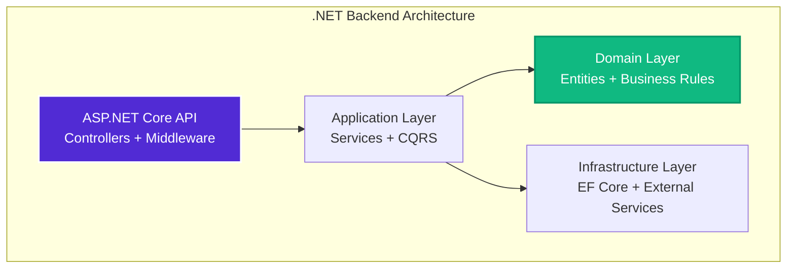

# ADR-002: Use .NET for Backend Framework

## Status
Accepted

## Date
2025-01-12

## Context

Ideas Vault requires a robust, scalable backend API to support:

- **RESTful API**: Standard HTTP endpoints for CRUD operations
- **Real-time Communication**: WebSocket support for live updates
- **Background Processing**: Async analysis of ideas via AI services
- **Authentication & Authorization**: Secure user management with JWT tokens
- **Database Integration**: ORM for PostgreSQL with migrations
- **External Service Integration**: AI APIs, market data APIs, email services
- **High Performance**: Low latency, high throughput for growing user base
- **Type Safety**: Strong typing to prevent runtime errors
- **Enterprise Features**: Logging, monitoring, error handling
- **Scalability**: Horizontal scaling with containerization

Key Requirements:
1. **Performance**: Sub-200ms API response times
2. **Reliability**: 99.9% uptime, robust error handling
3. **Maintainability**: Clean architecture, testable code
4. **Developer Experience**: Strong tooling, good documentation
5. **Cost**: Open-source with good cloud hosting options
6. **Team Skills**: Leverage existing .NET expertise
7. **Future-Proof**: Long-term support and active development

## Decision

We will use **.NET 8** (ASP.NET Core) as the backend framework for Ideas Vault.

Specifically:
- ASP.NET Core 8.0+ for Web API
- C# 12 with latest language features
- Entity Framework Core 8.0 for data access
- Clean Architecture project structure
- xUnit + Moq + FluentAssertions for testing
- SignalR for real-time communication
- Hangfire for background jobs
- Serilog for structured logging

## Consequences

### Positive Consequences

1. **Exceptional Performance**:
   - [TechEmpower benchmarks](https://www.techempower.com/benchmarks/) rank ASP.NET Core in top 10
   - High-throughput (millions of requests/second)
   - Low latency (microsecond response times)
   - Efficient memory usage with minimal garbage collection
   - Native async/await support throughout framework

2. **Strong Type Safety**:
   - C# static typing catches errors at compile time
   - Excellent IDE support (IntelliSense, refactoring)
   - Reduced runtime errors
   - Better maintainability with explicit contracts
   - Nullable reference types prevent null reference exceptions

3. **Clean Architecture Support**:
   - Natural fit for layered architecture
   - Dependency injection built into framework
   - SOLID principles easily applied
   - Interface-based design patterns
   - Clear separation of concerns

4. **Excellent ORM**:
   - Entity Framework Core is mature and feature-rich
   - Code-first or database-first approaches
   - Automatic migrations
   - LINQ for type-safe queries
   - Connection pooling and query optimization

5. **Comprehensive Ecosystem**:
   - NuGet package manager with 350,000+ packages
   - Authentication: ASP.NET Core Identity, IdentityServer
   - Validation: FluentValidation
   - Mapping: AutoMapper
   - Testing: xUnit, NUnit, MSTest
   - API Docs: Swagger/OpenAPI built-in

6. **Cross-Platform**:
   - Runs on Linux, Windows, macOS
   - Docker containerization support
   - Kubernetes deployment support
   - Cost savings with Linux hosting

7. **Developer Experience**:
   - Visual Studio (best-in-class IDE)
   - Rider (excellent alternative)
   - VS Code with C# DevKit
   - Hot reload for rapid development
   - Integrated debugging tools

8. **Enterprise-Ready**:
   - Used by Stack Overflow, Bing, Microsoft 365
   - Proven at massive scale
   - Excellent documentation
   - Long-term support (LTS) releases
   - Regular security updates

9. **Cost-Effective**:
   - Completely open-source (MIT license)
   - No licensing fees
   - Free tooling options available
   - Lower hosting costs than some alternatives

10. **Testing Support**:
    - Built-in dependency injection simplifies testing
    - Rich testing frameworks (xUnit, NUnit, MSTest)
    - Mocking libraries (Moq, NSubstitute)
    - TestServer for integration tests
    - WebApplicationFactory for E2E tests

11. **Background Processing**:
    - Hangfire for scheduled and background jobs
    - IHostedService for long-running tasks
    - Channels for concurrent processing
    - Excellent async/await support

12. **Real-Time Features**:
    - SignalR for WebSocket connections
    - Built-in connection management
    - Automatic reconnection
    - Scales horizontally with Redis backplane

### Negative Consequences

1. **Learning Curve**:
   - Team needs .NET/C# knowledge
   - Understanding async/await patterns
   - Learning Entity Framework Core
   - Clean Architecture patterns
   - Mitigation: Comprehensive documentation, training resources

2. **Deployment Complexity** (Initial):
   - Setting up CI/CD pipelines
   - Container configuration
   - Cloud hosting setup
   - Mitigation: Docker templates, GitHub Actions workflows

3. **Windows Association** (Historical):
   - Some developers perceive .NET as "Windows-only"
   - Reality: Fully cross-platform since .NET Core
   - Mitigation: Emphasize Linux deployment

4. **Migration Risk** (Long-term):
   - Breaking changes between major versions
   - EF Core migration complexity
   - Mitigation: LTS versions, planned upgrade cycles

5. **Heavier Than Alternatives**:
   - Larger runtime than Node.js (~30MB vs ~15MB)
   - More memory usage at startup
   - Mitigation: Minimal impact with modern hardware

### Neutral Consequences

1. **Strongly Opinionated**: .NET has conventions and patterns (consistency vs. flexibility)
2. **Microsoft Ecosystem**: Tight integration with Azure (vendor flexibility vs. convenience)
3. **Compiled Language**: Requires build step (slower dev loop but catches errors early)

## Alternatives Considered

### Alternative 1: Node.js + Express (TypeScript)

**Pros**:
- Same language as frontend (JavaScript/TypeScript)
- Fast development with interpreted language
- Huge npm ecosystem
- Low barrier to entry
- Good for real-time applications

**Cons**:
- Single-threaded (CPU-bound task limitations)
- Callback hell / promise complexity
- Less type safety than C#
- Runtime errors more common
- Less efficient for CPU-intensive tasks
- Memory leaks more common
- Weaker ORM options (TypeORM, Prisma)

**Why Not Chosen**: While Node.js enables full-stack JavaScript, .NET's performance, type safety, and mature ecosystem better support our enterprise needs. CPU-intensive AI analysis would struggle on Node's single thread.

### Alternative 2: Python + FastAPI

**Pros**:
- Excellent for AI/ML integration
- Fast API development
- Great for data science workflows
- Large AI/ML ecosystem
- Good documentation

**Cons**:
- Slower performance than .NET
- GIL limits true parallelism
- Weaker type safety (even with type hints)
- Async support not as mature
- ORM options less robust
- Harder to deploy/scale

**Why Not Chosen**: While Python excels at AI/ML, our AI analysis will be external services (OpenAI, etc.). .NET's performance and type safety are more important for our API layer.

### Alternative 3: Java + Spring Boot

**Pros**:
- Mature, battle-tested framework
- Strong type safety
- Excellent performance
- Large enterprise adoption
- Rich ecosystem

**Cons**:
- More verbose than C#
- Heavier memory footprint
- Slower startup times
- More boilerplate code
- Weaker async support historically
- Older ecosystem feel

**Why Not Chosen**: While Spring Boot is excellent, C# offers better developer experience with less boilerplate. Modern C# features (record types, pattern matching, top-level statements) make it more concise than Java.

### Alternative 4: Go

**Pros**:
- Blazing fast performance
- Minimal resource usage
- Simple deployment (single binary)
- Built-in concurrency
- Fast compilation

**Cons**:
- Limited ORM options
- Less mature ecosystem
- No generics (until recently)
- Verbose error handling
- Smaller talent pool
- Less enterprise tooling

**Why Not Chosen**: While Go's performance is impressive, its ecosystem is less mature. We need strong ORM, authentication, and validation libraries that .NET provides out of the box.

### Alternative 5: Rust + Actix

**Pros**:
- Fastest performance of all options
- Memory safety guarantees
- Zero-cost abstractions
- Growing ecosystem

**Cons**:
- Steep learning curve
- Slower development velocity
- Smaller ecosystem
- Limited talent pool
- Immature ORM options
- Longer compilation times

**Why Not Chosen**: Rust's benefits (memory safety, raw performance) don't justify the steep learning curve and slower development for our use case. .NET provides sufficient performance with better developer experience.

## Technical Comparison

| Criteria | .NET 8 | Node.js | Python | Java | Go | Rust |
|----------|--------|---------|--------|------|----|----|
| **Performance** | Excellent | Good | Fair | Excellent | Excellent | Best |
| **Type Safety** | Strong | Medium | Weak | Strong | Strong | Strongest |
| **Learning Curve** | Medium | Easy | Easy | Medium | Medium | Steep |
| **Ecosystem** | Excellent | Excellent | Good | Excellent | Good | Fair |
| **Async Support** | Excellent | Excellent | Good | Good | Excellent | Excellent |
| **ORM Quality** | Excellent | Good | Good | Excellent | Fair | Fair |
| **Tooling** | Best | Good | Good | Excellent | Good | Good |
| **Hiring Pool** | Large | Largest | Large | Large | Medium | Small |
| **Enterprise Use** | High | Medium | Low | Highest | Medium | Low |

## Benchmarks

Based on TechEmpower Round 22 (Plain Text Test):
1. Rust (Actix): ~7M requests/sec
2. C++ (Drogon): ~6.5M requests/sec
3. **C# (ASP.NET Core): ~6M requests/sec** ⭐
4. Go (Fasthttp): ~5M requests/sec
5. Java (Spring): ~4M requests/sec
6. Node.js (Fastify): ~1M requests/sec
7. Python (FastAPI): ~100K requests/sec

**Conclusion**: .NET ranks in top 5 for performance while maintaining excellent developer experience.

## Architecture Diagram

## Implementation Plan

1. **Project Setup** (Week 1):
   - Create solution structure (4 projects: API, Application, Domain, Infrastructure)
   - Setup Entity Framework Core with PostgreSQL
   - Configure dependency injection
   - Setup logging with Serilog

2. **Core Features** (Week 2-4):
   - Implement authentication (JWT)
   - Create idea CRUD endpoints
   - Setup background analysis jobs
   - Implement repositories and unit of work

3. **Testing** (Week 3-5):
   - Unit tests for domain logic
   - Integration tests for repositories
   - API integration tests
   - Load testing

4. **Deployment** (Week 5-6):
   - Docker containerization
   - CI/CD pipeline with GitHub Actions
   - Kubernetes manifests
   - Monitoring and logging

## Success Metrics

- ✅ API response time < 200ms (95th percentile)
- ✅ Support 10,000 requests/second
- ✅ 99.9% uptime
- ✅ > 80% code coverage
- ✅ Zero critical security vulnerabilities
- ✅ Memory usage < 200MB per instance
- ✅ Cold start < 2 seconds
- ✅ Developer onboarding < 3 days

## References

- [.NET Official Documentation](https://docs.microsoft.com/en-us/dotnet/)
- [ASP.NET Core Documentation](https://docs.microsoft.com/en-us/aspnet/core/)
- [TechEmpower Benchmarks](https://www.techempower.com/benchmarks/)
- [Clean Architecture by Robert C. Martin](https://blog.cleancoder.com/uncle-bob/2012/08/13/the-clean-architecture.html)
- [Entity Framework Core Documentation](https://docs.microsoft.com/en-us/ef/core/)
- [Why .NET by Stack Overflow](https://stackoverflow.blog/2020/02/03/tales-from-the-interview-does-sql-matter-more-than-nosql/)

## Related ADRs

- [ADR-001: React Frontend](./001-react-frontend.md) - Frontend/backend integration
- [ADR-003: Clean Architecture](./003-clean-architecture.md) - .NET project structure follows Clean Architecture
