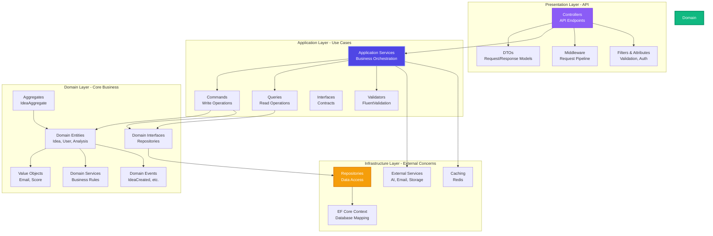
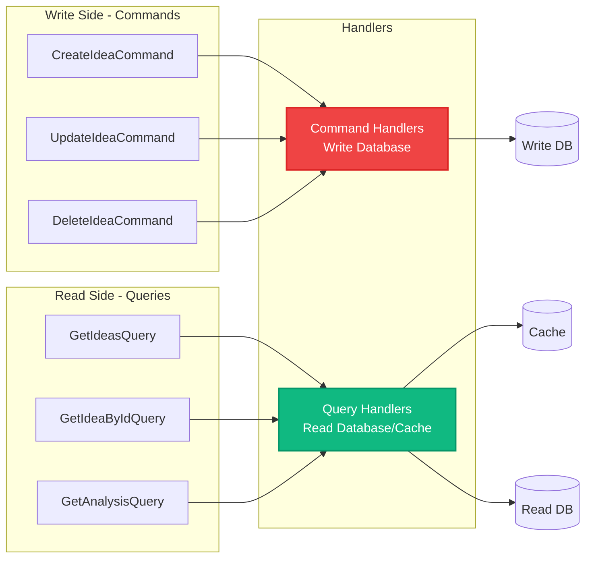

# Ideas Vault - Backend Architecture (.NET)

## ⚠️ IMPORTANT: This Backend Does Not Exist

**This document describes a PROPOSED future architecture.**

- ❌ **NO backend is currently implemented**
- ❌ **NO API exists**
- ❌ **NO database is configured**
- ❌ **NO .NET code has been written**

Ideas Vault is currently a **frontend-only application** using:
- ✅ React + TypeScript frontend
- ✅ LocalStorage for data persistence
- ✅ Mock AI analysis with heuristic algorithms
- ✅ No server or backend required

### Purpose of This Document

This document serves as a **design proposal** for future contributors who want to add a backend to Ideas Vault. It provides:
- Recommended architectural patterns
- Technology stack suggestions
- Code structure examples
- Best practices to follow

**Want to build this backend?** See [Contributing](../../README.md#contributing) for how to get started!

---

## Overview (Proposed Future Architecture)

This document outlines the **planned** backend architecture for Ideas Vault using .NET 8+ and ASP.NET Core. The architecture follows Clean Architecture principles with clear separation of concerns, SOLID principles, and Domain-Driven Design (DDD) patterns.

## Technology Stack

| Layer | Technology | Version | Purpose |
|-------|-----------|---------|---------|
| **API Framework** | ASP.NET Core | 8.0+ | RESTful Web API |
| **Language** | C# | 12.0+ | Backend development |
| **ORM** | Entity Framework Core | 8.0+ | Data access |
| **Authentication** | ASP.NET Core Identity | 8.0+ | User authentication |
| **Authorization** | JWT Bearer Tokens | - | Token-based auth |
| **Validation** | FluentValidation | 11.0+ | Input validation |
| **Mapping** | AutoMapper | 12.0+ | Object-to-object mapping |
| **Logging** | Serilog | 3.0+ | Structured logging |
| **Testing** | xUnit + Moq + FluentAssertions | Latest | Unit & integration tests |
| **API Documentation** | Swagger/OpenAPI | 3.0 | API documentation |
| **Background Jobs** | Hangfire | 1.8+ | Background processing |
| **Real-time** | SignalR | 8.0+ | WebSocket connections |

## Clean Architecture Layers

### Layer Diagram



## Project Structure

```
ideasvault-backend/
├── src/
│   ├── IdeasVault.Api/                    # Presentation Layer
│   │   ├── Controllers/
│   │   │   ├── IdeasController.cs
│   │   │   ├── UsersController.cs
│   │   │   ├── AuthController.cs
│   │   │   └── AnalysisController.cs
│   │   ├── Middleware/
│   │   │   ├── ErrorHandlingMiddleware.cs
│   │   │   ├── LoggingMiddleware.cs
│   │   │   └── RateLimitingMiddleware.cs
│   │   ├── Filters/
│   │   │   ├── ValidationFilter.cs
│   │   │   └── AuthorizationFilter.cs
│   │   ├── DTOs/
│   │   │   ├── Requests/
│   │   │   │   ├── CreateIdeaRequest.cs
│   │   │   │   └── UpdateIdeaRequest.cs
│   │   │   └── Responses/
│   │   │       ├── IdeaResponse.cs
│   │   │       └── AnalysisResponse.cs
│   │   ├── Hubs/
│   │   │   └── NotificationHub.cs
│   │   └── Program.cs
│   │
│   ├── IdeasVault.Application/            # Application Layer
│   │   ├── Services/
│   │   │   ├── IdeaService.cs
│   │   │   ├── UserService.cs
│   │   │   └── AnalysisService.cs
│   │   ├── Commands/
│   │   │   ├── CreateIdeaCommand.cs
│   │   │   ├── UpdateIdeaCommand.cs
│   │   │   └── DeleteIdeaCommand.cs
│   │   ├── Queries/
│   │   │   ├── GetIdeasQuery.cs
│   │   │   ├── GetIdeaByIdQuery.cs
│   │   │   └── GetAnalysisQuery.cs
│   │   ├── Validators/
│   │   │   ├── CreateIdeaValidator.cs
│   │   │   └── UpdateIdeaValidator.cs
│   │   ├── Interfaces/
│   │   │   ├── IIdeaService.cs
│   │   │   ├── IAnalysisService.cs
│   │   │   └── IEmailService.cs
│   │   ├── Mapping/
│   │   │   └── MappingProfile.cs
│   │   └── Exceptions/
│   │       ├── NotFoundException.cs
│   │       └── ValidationException.cs
│   │
│   ├── IdeasVault.Domain/                 # Domain Layer
│   │   ├── Entities/
│   │   │   ├── Idea.cs
│   │   │   ├── User.cs
│   │   │   ├── Analysis.cs
│   │   │   └── Competitor.cs
│   │   ├── Aggregates/
│   │   │   └── IdeaAggregate.cs
│   │   ├── ValueObjects/
│   │   │   ├── Email.cs
│   │   │   ├── ReadinessScore.cs
│   │   │   └── MarketSize.cs
│   │   ├── Enums/
│   │   │   ├── IdeaStatus.cs
│   │   │   └── InputType.cs
│   │   ├── Events/
│   │   │   ├── IdeaCreatedEvent.cs
│   │   │   ├── AnalysisCompletedEvent.cs
│   │   │   └── IdeaDeletedEvent.cs
│   │   ├── Interfaces/
│   │   │   ├── IIdeaRepository.cs
│   │   │   ├── IUserRepository.cs
│   │   │   └── IUnitOfWork.cs
│   │   └── Services/
│   │       └── ReadinessScoreCalculator.cs
│   │
│   └── IdeasVault.Infrastructure/         # Infrastructure Layer
│       ├── Data/
│       │   ├── ApplicationDbContext.cs
│       │   ├── Configurations/
│       │   │   ├── IdeaConfiguration.cs
│       │   │   └── UserConfiguration.cs
│       │   └── Migrations/
│       ├── Repositories/
│       │   ├── IdeaRepository.cs
│       │   ├── UserRepository.cs
│       │   └── UnitOfWork.cs
│       ├── Services/
│       │   ├── AIAnalysisService.cs
│       │   ├── EmailService.cs
│       │   ├── BlobStorageService.cs
│       │   └── CachingService.cs
│       ├── ExternalClients/
│       │   ├── OpenAIClient.cs
│       │   └── MarketDataClient.cs
│       └── Identity/
│           └── ApplicationUser.cs
│
└── tests/
    ├── IdeasVault.UnitTests/
    ├── IdeasVault.IntegrationTests/
    └── IdeasVault.E2ETests/
```

## Domain Layer Design

### Domain Entities

```csharp
// Domain/Entities/Idea.cs
public class Idea : BaseEntity
{
    public string Title { get; private set; }
    public string Description { get; private set; }
    public List<string> Tags { get; private set; }
    public IdeaStatus Status { get; private set; }
    public InputType InputType { get; private set; }
    public string? ImageData { get; private set; }
    
    // Navigation Properties
    public string UserId { get; private set; }
    public User User { get; private set; }
    public Analysis? Analysis { get; private set; }
    
    // Factory Method
    public static Idea Create(
        string title,
        string description,
        List<string> tags,
        InputType inputType,
        string userId,
        string? imageData = null)
    {
        var idea = new Idea
        {
            Id = Guid.NewGuid().ToString(),
            Title = title,
            Description = description,
            Tags = tags,
            Status = IdeaStatus.Analyzing,
            InputType = inputType,
            ImageData = imageData,
            UserId = userId,
            CreatedAt = DateTime.UtcNow
        };
        
        // Raise domain event
        idea.AddDomainEvent(new IdeaCreatedEvent(idea));
        
        return idea;
    }
    
    // Business Logic
    public void UpdateAnalysis(Analysis analysis)
    {
        Analysis = analysis;
        Status = IdeaStatus.Ready;
        UpdatedAt = DateTime.UtcNow;
        
        AddDomainEvent(new AnalysisCompletedEvent(this, analysis));
    }
    
    public void MarkAsDeleted()
    {
        IsDeleted = true;
        DeletedAt = DateTime.UtcNow;
        
        AddDomainEvent(new IdeaDeletedEvent(this));
    }
}
```

### Value Objects

```csharp
// Domain/ValueObjects/ReadinessScore.cs
public class ReadinessScore : ValueObject
{
    public int Value { get; private set; }
    
    private ReadinessScore(int value)
    {
        Value = value;
    }
    
    public static ReadinessScore Create(int value)
    {
        if (value < 0 || value > 100)
            throw new ArgumentException("Readiness score must be between 0 and 100");
            
        return new ReadinessScore(value);
    }
    
    protected override IEnumerable<object> GetEqualityComponents()
    {
        yield return Value;
    }
    
    public static implicit operator int(ReadinessScore score) => score.Value;
}

// Domain/ValueObjects/Email.cs
public class Email : ValueObject
{
    public string Value { get; private set; }
    
    private Email(string value)
    {
        Value = value;
    }
    
    public static Email Create(string email)
    {
        if (string.IsNullOrWhiteSpace(email))
            throw new ArgumentException("Email cannot be empty");
            
        if (!IsValidEmail(email))
            throw new ArgumentException("Invalid email format");
            
        return new Email(email.ToLowerInvariant());
    }
    
    private static bool IsValidEmail(string email)
    {
        var regex = new Regex(@"^[^@\s]+@[^@\s]+\.[^@\s]+$");
        return regex.IsMatch(email);
    }
    
    protected override IEnumerable<object> GetEqualityComponents()
    {
        yield return Value;
    }
}
```

### Domain Events

```csharp
// Domain/Events/IdeaCreatedEvent.cs
public class IdeaCreatedEvent : DomainEvent
{
    public Idea Idea { get; }
    
    public IdeaCreatedEvent(Idea idea)
    {
        Idea = idea;
    }
}

// Domain/Events/AnalysisCompletedEvent.cs
public class AnalysisCompletedEvent : DomainEvent
{
    public Idea Idea { get; }
    public Analysis Analysis { get; }
    
    public AnalysisCompletedEvent(Idea idea, Analysis analysis)
    {
        Idea = idea;
        Analysis = analysis;
    }
}
```

### Repository Interfaces

```csharp
// Domain/Interfaces/IIdeaRepository.cs
public interface IIdeaRepository
{
    Task<Idea?> GetByIdAsync(string id, CancellationToken cancellationToken = default);
    Task<IEnumerable<Idea>> GetByUserIdAsync(string userId, CancellationToken cancellationToken = default);
    Task<PaginatedList<Idea>> GetPaginatedAsync(
        string userId,
        int pageIndex,
        int pageSize,
        CancellationToken cancellationToken = default);
    Task<Idea> AddAsync(Idea idea, CancellationToken cancellationToken = default);
    Task UpdateAsync(Idea idea, CancellationToken cancellationToken = default);
    Task DeleteAsync(string id, CancellationToken cancellationToken = default);
}

// Domain/Interfaces/IUnitOfWork.cs
public interface IUnitOfWork
{
    Task<int> SaveChangesAsync(CancellationToken cancellationToken = default);
    Task BeginTransactionAsync(CancellationToken cancellationToken = default);
    Task CommitTransactionAsync(CancellationToken cancellationToken = default);
    Task RollbackTransactionAsync(CancellationToken cancellationToken = default);
}
```

## Application Layer Design

### CQRS Pattern



### Commands

```csharp
// Application/Commands/CreateIdeaCommand.cs
public class CreateIdeaCommand
{
    public string Title { get; set; }
    public string Description { get; set; }
    public List<string> Tags { get; set; }
    public InputType InputType { get; set; }
    public string? ImageData { get; set; }
    public string UserId { get; set; }
}

// Application/Commands/CreateIdeaCommandHandler.cs
public class CreateIdeaCommandHandler
{
    private readonly IIdeaRepository _ideaRepository;
    private readonly IUnitOfWork _unitOfWork;
    private readonly IAnalysisService _analysisService;
    private readonly ILogger<CreateIdeaCommandHandler> _logger;
    
    public async Task<Idea> HandleAsync(
        CreateIdeaCommand command,
        CancellationToken cancellationToken)
    {
        _logger.LogInformation("Creating idea: {Title}", command.Title);
        
        // Create domain entity
        var idea = Idea.Create(
            command.Title,
            command.Description,
            command.Tags,
            command.InputType,
            command.UserId,
            command.ImageData
        );
        
        // Save to database
        await _ideaRepository.AddAsync(idea, cancellationToken);
        await _unitOfWork.SaveChangesAsync(cancellationToken);
        
        // Trigger async analysis (fire and forget)
        _ = _analysisService.AnalyzeIdeaAsync(idea.Id, cancellationToken);
        
        return idea;
    }
}
```

### Queries

```csharp
// Application/Queries/GetIdeasQuery.cs
public class GetIdeasQuery
{
    public string UserId { get; set; }
    public int PageIndex { get; set; } = 0;
    public int PageSize { get; set; } = 20;
    public string? SearchTerm { get; set; }
    public IdeaStatus? Status { get; set; }
}

// Application/Queries/GetIdeasQueryHandler.cs
public class GetIdeasQueryHandler
{
    private readonly IIdeaRepository _ideaRepository;
    private readonly ICachingService _cachingService;
    
    public async Task<PaginatedList<IdeaResponse>> HandleAsync(
        GetIdeasQuery query,
        CancellationToken cancellationToken)
    {
        var cacheKey = $"ideas:{query.UserId}:{query.PageIndex}:{query.PageSize}";
        
        // Try cache first
        var cachedIdeas = await _cachingService.GetAsync<PaginatedList<Idea>>(cacheKey);
        if (cachedIdeas != null)
            return MapToResponse(cachedIdeas);
        
        // Fetch from database
        var ideas = await _ideaRepository.GetPaginatedAsync(
            query.UserId,
            query.PageIndex,
            query.PageSize,
            cancellationToken
        );
        
        // Cache the results
        await _cachingService.SetAsync(cacheKey, ideas, TimeSpan.FromMinutes(5));
        
        return MapToResponse(ideas);
    }
}
```

### Validators

```csharp
// Application/Validators/CreateIdeaValidator.cs
public class CreateIdeaValidator : AbstractValidator<CreateIdeaCommand>
{
    public CreateIdeaValidator()
    {
        RuleFor(x => x.Title)
            .NotEmpty().WithMessage("Title is required")
            .MaximumLength(200).WithMessage("Title cannot exceed 200 characters");
            
        RuleFor(x => x.Description)
            .NotEmpty().WithMessage("Description is required")
            .MinimumLength(20).WithMessage("Description must be at least 20 characters")
            .MaximumLength(5000).WithMessage("Description cannot exceed 5000 characters");
            
        RuleFor(x => x.Tags)
            .NotNull().WithMessage("Tags are required")
            .Must(tags => tags.Count <= 10).WithMessage("Maximum 10 tags allowed");
            
        RuleFor(x => x.UserId)
            .NotEmpty().WithMessage("User ID is required");
    }
}
```

### Application Services

```csharp
// Application/Services/IdeaService.cs
public class IdeaService : IIdeaService
{
    private readonly IIdeaRepository _ideaRepository;
    private readonly IUnitOfWork _unitOfWork;
    private readonly IMapper _mapper;
    private readonly IValidator<CreateIdeaCommand> _createValidator;
    private readonly ILogger<IdeaService> _logger;
    
    public async Task<IdeaResponse> CreateIdeaAsync(
        CreateIdeaCommand command,
        CancellationToken cancellationToken)
    {
        // Validate
        var validationResult = await _createValidator.ValidateAsync(command, cancellationToken);
        if (!validationResult.IsValid)
            throw new ValidationException(validationResult.Errors);
        
        // Execute command
        var handler = new CreateIdeaCommandHandler(
            _ideaRepository,
            _unitOfWork,
            _analysisService,
            _logger
        );
        
        var idea = await handler.HandleAsync(command, cancellationToken);
        
        // Map to response
        return _mapper.Map<IdeaResponse>(idea);
    }
    
    public async Task<IdeaResponse?> GetIdeaByIdAsync(
        string id,
        CancellationToken cancellationToken)
    {
        var idea = await _ideaRepository.GetByIdAsync(id, cancellationToken);
        return idea == null ? null : _mapper.Map<IdeaResponse>(idea);
    }
}
```

## Infrastructure Layer Design

### Repository Implementation

```csharp
// Infrastructure/Repositories/IdeaRepository.cs
public class IdeaRepository : IIdeaRepository
{
    private readonly ApplicationDbContext _context;
    
    public async Task<Idea?> GetByIdAsync(
        string id,
        CancellationToken cancellationToken = default)
    {
        return await _context.Ideas
            .Include(i => i.Analysis)
            .Include(i => i.User)
            .FirstOrDefaultAsync(i => i.Id == id && !i.IsDeleted, cancellationToken);
    }
    
    public async Task<IEnumerable<Idea>> GetByUserIdAsync(
        string userId,
        CancellationToken cancellationToken = default)
    {
        return await _context.Ideas
            .Include(i => i.Analysis)
            .Where(i => i.UserId == userId && !i.IsDeleted)
            .OrderByDescending(i => i.CreatedAt)
            .ToListAsync(cancellationToken);
    }
    
    public async Task<Idea> AddAsync(
        Idea idea,
        CancellationToken cancellationToken = default)
    {
        await _context.Ideas.AddAsync(idea, cancellationToken);
        return idea;
    }
    
    public async Task UpdateAsync(
        Idea idea,
        CancellationToken cancellationToken = default)
    {
        _context.Ideas.Update(idea);
        await Task.CompletedTask;
    }
}
```

### Entity Framework Configuration

```csharp
// Infrastructure/Data/Configurations/IdeaConfiguration.cs
public class IdeaConfiguration : IEntityTypeConfiguration<Idea>
{
    public void Configure(EntityTypeBuilder<Idea> builder)
    {
        builder.ToTable("Ideas");
        
        builder.HasKey(i => i.Id);
        
        builder.Property(i => i.Title)
            .IsRequired()
            .HasMaxLength(200);
            
        builder.Property(i => i.Description)
            .IsRequired()
            .HasMaxLength(5000);
            
        builder.Property(i => i.Tags)
            .HasConversion(
                v => JsonSerializer.Serialize(v, (JsonSerializerOptions)null),
                v => JsonSerializer.Deserialize<List<string>>(v, (JsonSerializerOptions)null)
            );
            
        builder.Property(i => i.Status)
            .HasConversion<string>();
            
        builder.Property(i => i.InputType)
            .HasConversion<string>();
            
        builder.HasOne(i => i.User)
            .WithMany(u => u.Ideas)
            .HasForeignKey(i => i.UserId)
            .OnDelete(DeleteBehavior.Cascade);
            
        builder.HasOne(i => i.Analysis)
            .WithOne(a => a.Idea)
            .HasForeignKey<Analysis>(a => a.IdeaId)
            .OnDelete(DeleteBehavior.Cascade);
            
        builder.HasIndex(i => i.UserId);
        builder.HasIndex(i => i.CreatedAt);
        
        builder.HasQueryFilter(i => !i.IsDeleted);
    }
}
```

### External Services

```csharp
// Infrastructure/Services/AIAnalysisService.cs
public class AIAnalysisService : IAnalysisService
{
    private readonly IOpenAIClient _openAIClient;
    private readonly IMarketDataClient _marketDataClient;
    private readonly IIdeaRepository _ideaRepository;
    private readonly IUnitOfWork _unitOfWork;
    
    public async Task AnalyzeIdeaAsync(
        string ideaId,
        CancellationToken cancellationToken)
    {
        var idea = await _ideaRepository.GetByIdAsync(ideaId, cancellationToken);
        if (idea == null) return;
        
        try
        {
            // 1. Get AI insights
            var aiInsights = await _openAIClient.GenerateAnalysisAsync(
                idea.Title,
                idea.Description,
                idea.Tags,
                cancellationToken
            );
            
            // 2. Fetch market data
            var marketData = await _marketDataClient.GetMarketDataAsync(
                idea.Title,
                idea.Tags.FirstOrDefault(),
                cancellationToken
            );
            
            // 3. Create analysis entity
            var analysis = Analysis.Create(
                idea.Id,
                aiInsights.ReadinessScore,
                aiInsights.MarketSize,
                aiInsights.TargetAudience,
                aiInsights.KeyTrend,
                marketData.Competitors,
                marketData.GrowthMetrics,
                aiInsights.ActionPlan
            );
            
            // 4. Update idea with analysis
            idea.UpdateAnalysis(analysis);
            
            await _ideaRepository.UpdateAsync(idea, cancellationToken);
            await _unitOfWork.SaveChangesAsync(cancellationToken);
        }
        catch (Exception ex)
        {
            _logger.LogError(ex, "Failed to analyze idea {IdeaId}", ideaId);
            throw;
        }
    }
}
```

## API Layer Design

### Controllers

```csharp
// Api/Controllers/IdeasController.cs
[ApiController]
[Route("api/[controller]")]
[Authorize]
public class IdeasController : ControllerBase
{
    private readonly IIdeaService _ideaService;
    private readonly ILogger<IdeasController> _logger;
    
    [HttpGet]
    [ProducesResponseType(typeof(PaginatedList<IdeaResponse>), StatusCodes.Status200OK)]
    public async Task<IActionResult> GetIdeas(
        [FromQuery] int pageIndex = 0,
        [FromQuery] int pageSize = 20,
        CancellationToken cancellationToken = default)
    {
        var userId = User.FindFirst(ClaimTypes.NameIdentifier)?.Value;
        if (string.IsNullOrEmpty(userId))
            return Unauthorized();
            
        var query = new GetIdeasQuery
        {
            UserId = userId,
            PageIndex = pageIndex,
            PageSize = pageSize
        };
        
        var ideas = await _ideaService.GetIdeasAsync(query, cancellationToken);
        return Ok(ideas);
    }
    
    [HttpGet("{id}")]
    [ProducesResponseType(typeof(IdeaResponse), StatusCodes.Status200OK)]
    [ProducesResponseType(StatusCodes.Status404NotFound)]
    public async Task<IActionResult> GetIdea(
        string id,
        CancellationToken cancellationToken)
    {
        var idea = await _ideaService.GetIdeaByIdAsync(id, cancellationToken);
        if (idea == null)
            return NotFound();
            
        return Ok(idea);
    }
    
    [HttpPost]
    [ProducesResponseType(typeof(IdeaResponse), StatusCodes.Status201Created)]
    [ProducesResponseType(StatusCodes.Status400BadRequest)]
    public async Task<IActionResult> CreateIdea(
        [FromBody] CreateIdeaRequest request,
        CancellationToken cancellationToken)
    {
        var userId = User.FindFirst(ClaimTypes.NameIdentifier)?.Value;
        if (string.IsNullOrEmpty(userId))
            return Unauthorized();
            
        var command = new CreateIdeaCommand
        {
            Title = request.Title,
            Description = request.Description,
            Tags = request.Tags,
            InputType = request.InputType,
            ImageData = request.ImageData,
            UserId = userId
        };
        
        var idea = await _ideaService.CreateIdeaAsync(command, cancellationToken);
        return CreatedAtAction(nameof(GetIdea), new { id = idea.Id }, idea);
    }
    
    [HttpDelete("{id}")]
    [ProducesResponseType(StatusCodes.Status204NoContent)]
    [ProducesResponseType(StatusCodes.Status404NotFound)]
    public async Task<IActionResult> DeleteIdea(
        string id,
        CancellationToken cancellationToken)
    {
        await _ideaService.DeleteIdeaAsync(id, cancellationToken);
        return NoContent();
    }
}
```

### Middleware

```csharp
// Api/Middleware/ErrorHandlingMiddleware.cs
public class ErrorHandlingMiddleware
{
    private readonly RequestDelegate _next;
    private readonly ILogger<ErrorHandlingMiddleware> _logger;
    
    public async Task InvokeAsync(HttpContext context)
    {
        try
        {
            await _next(context);
        }
        catch (ValidationException ex)
        {
            _logger.LogWarning(ex, "Validation error occurred");
            await HandleValidationExceptionAsync(context, ex);
        }
        catch (NotFoundException ex)
        {
            _logger.LogWarning(ex, "Resource not found");
            await HandleNotFoundExceptionAsync(context, ex);
        }
        catch (Exception ex)
        {
            _logger.LogError(ex, "Unhandled exception occurred");
            await HandleExceptionAsync(context, ex);
        }
    }
    
    private static Task HandleValidationExceptionAsync(
        HttpContext context,
        ValidationException exception)
    {
        context.Response.StatusCode = StatusCodes.Status400BadRequest;
        context.Response.ContentType = "application/json";
        
        var response = new
        {
            error = "validation_error",
            message = "One or more validation errors occurred",
            details = exception.Errors.Select(e => new
            {
                field = e.PropertyName,
                message = e.ErrorMessage
            })
        };
        
        return context.Response.WriteAsJsonAsync(response);
    }
}
```

### Dependency Injection

```csharp
// Api/Program.cs
var builder = WebApplication.CreateBuilder(args);

// Add services to the container
builder.Services.AddControllers();
builder.Services.AddEndpointsApiExplorer();
builder.Services.AddSwaggerGen();

// Database
builder.Services.AddDbContext<ApplicationDbContext>(options =>
    options.UseNpgsql(builder.Configuration.GetConnectionString("DefaultConnection")));

// Authentication
builder.Services.AddAuthentication(JwtBearerDefaults.AuthenticationScheme)
    .AddJwtBearer(options =>
    {
        options.TokenValidationParameters = new TokenValidationParameters
        {
            ValidateIssuer = true,
            ValidateAudience = true,
            ValidateLifetime = true,
            ValidateIssuerSigningKey = true,
            ValidIssuer = builder.Configuration["Jwt:Issuer"],
            ValidAudience = builder.Configuration["Jwt:Audience"],
            IssuerSigningKey = new SymmetricSecurityKey(
                Encoding.UTF8.GetBytes(builder.Configuration["Jwt:Key"]))
        };
    });

// Application Services
builder.Services.AddScoped<IIdeaService, IdeaService>();
builder.Services.AddScoped<IAnalysisService, AIAnalysisService>();
builder.Services.AddScoped<IEmailService, EmailService>();

// Repositories
builder.Services.AddScoped<IIdeaRepository, IdeaRepository>();
builder.Services.AddScoped<IUserRepository, UserRepository>();
builder.Services.AddScoped<IUnitOfWork, UnitOfWork>();

// External Services
builder.Services.AddHttpClient<IOpenAIClient, OpenAIClient>();
builder.Services.AddSingleton<ICachingService, RedisCachingService>();

// Validators
builder.Services.AddValidatorsFromAssemblyContaining<CreateIdeaValidator>();

// AutoMapper
builder.Services.AddAutoMapper(typeof(MappingProfile));

// Logging
builder.Host.UseSerilog((context, configuration) =>
    configuration.ReadFrom.Configuration(context.Configuration));

// SignalR
builder.Services.AddSignalR();

var app = builder.Build();

// Configure the HTTP request pipeline
if (app.Environment.IsDevelopment())
{
    app.UseSwagger();
    app.UseSwaggerUI();
}

app.UseHttpsRedirection();
app.UseAuthentication();
app.UseAuthorization();
app.UseMiddleware<ErrorHandlingMiddleware>();
app.MapControllers();
app.MapHub<NotificationHub>("/hubs/notifications");

app.Run();
```

## API Endpoints

### Ideas API

| Method | Endpoint | Description |
|--------|----------|-------------|
| GET | `/api/ideas` | List user's ideas (paginated) |
| GET | `/api/ideas/{id}` | Get single idea by ID |
| POST | `/api/ideas` | Create new idea |
| PUT | `/api/ideas/{id}` | Update existing idea |
| DELETE | `/api/ideas/{id}` | Delete idea (soft delete) |
| GET | `/api/ideas/{id}/analysis` | Get idea analysis details |
| POST | `/api/ideas/{id}/share` | Generate shareable link |

### Authentication API

| Method | Endpoint | Description |
|--------|----------|-------------|
| POST | `/api/auth/register` | Register new user |
| POST | `/api/auth/login` | Login user |
| POST | `/api/auth/refresh` | Refresh access token |
| POST | `/api/auth/logout` | Logout user |
| POST | `/api/auth/forgot-password` | Request password reset |
| POST | `/api/auth/reset-password` | Reset password |

## Related Documentation

- [Architecture Overview](./README.md)
- [System Architecture](./system-architecture.md)
- [Frontend Architecture](./frontend-architecture.md)
- [Data Architecture](./data-architecture.md)
- [ADR: .NET Backend Selection](./adr/002-dotnet-backend.md)
