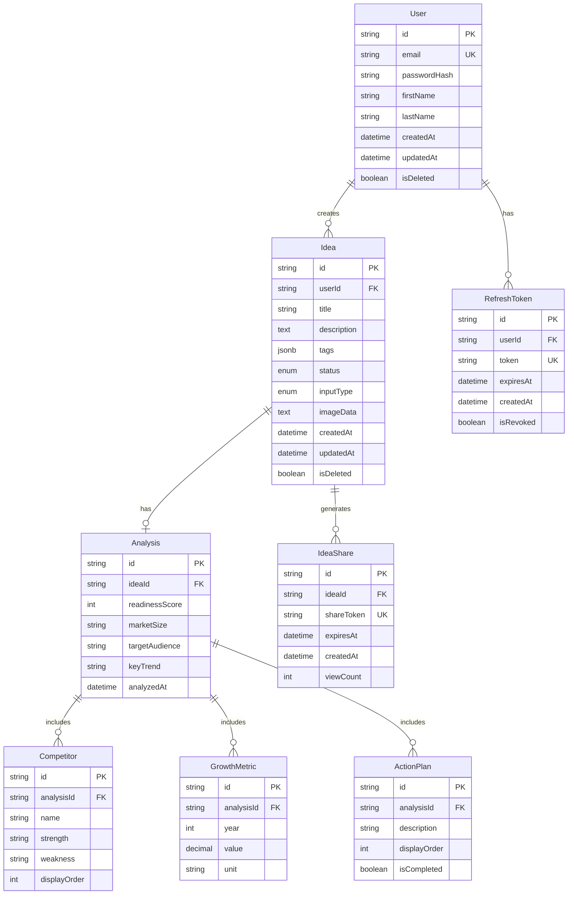
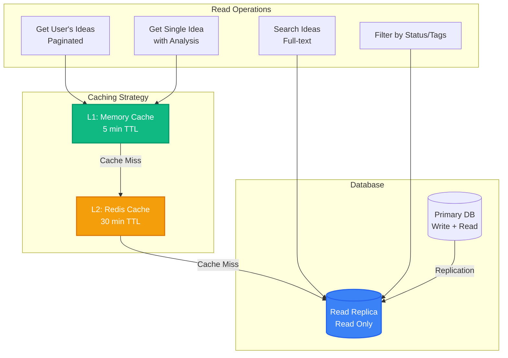
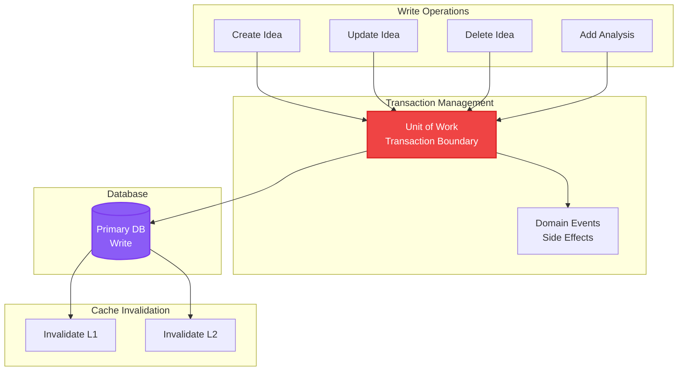
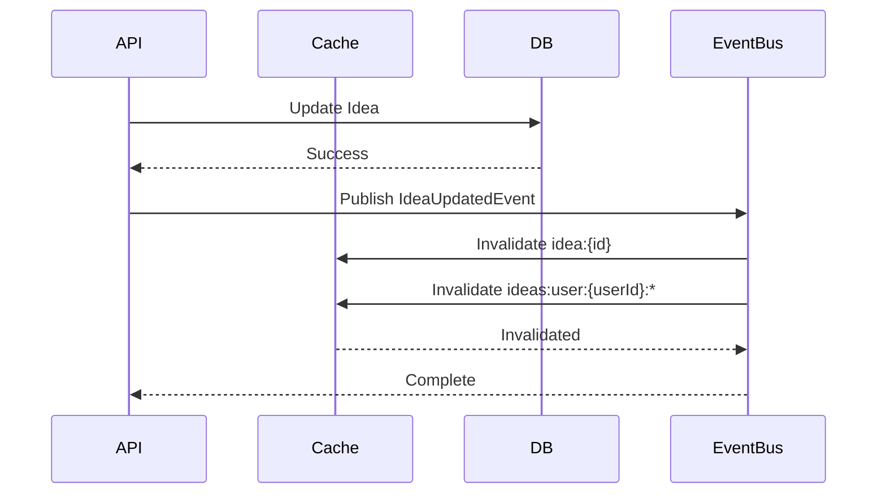
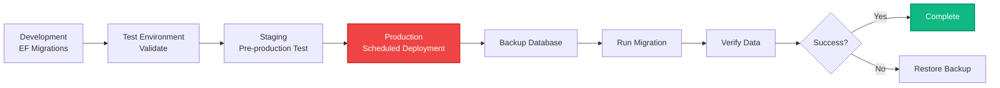
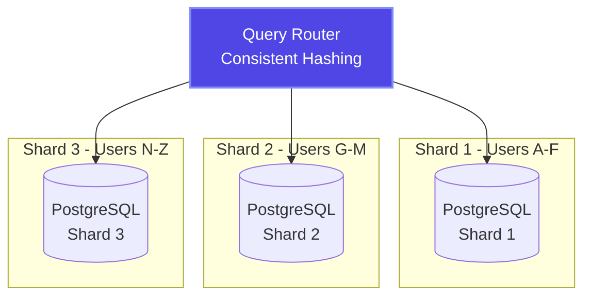
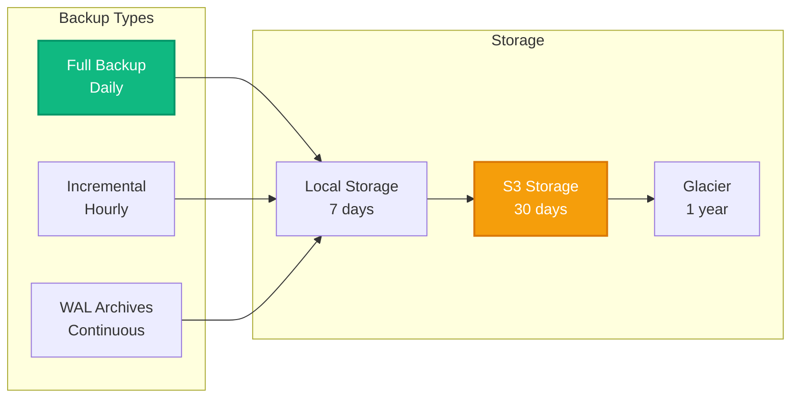
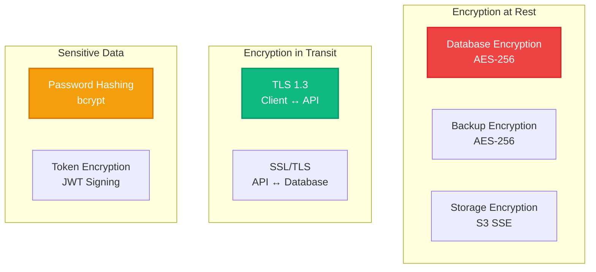

# Ideas Vault - Data Architecture

## Overview

This document outlines the data architecture for Ideas Vault, including database schema design, data access patterns, caching strategies, and data flow. The architecture is designed for scalability, performance, and data integrity.

## Database Technology

**Primary Database**: PostgreSQL 16+

**Rationale**:
- **ACID Compliance**: Strong transactional guarantees
- **JSON Support**: Native JSONB for flexible data structures
- **Performance**: Excellent query performance with proper indexing
- **Scalability**: Horizontal scaling with read replicas
- **Open Source**: No licensing costs, active community
- **Advanced Features**: Full-text search, CTEs, window functions

## Entity Relationship Diagram



## Database Schema

### Users Table

```sql
CREATE TABLE users (
    id UUID PRIMARY KEY DEFAULT gen_random_uuid(),
    email VARCHAR(255) NOT NULL UNIQUE,
    password_hash VARCHAR(255) NOT NULL,
    first_name VARCHAR(100),
    last_name VARCHAR(100),
    created_at TIMESTAMP NOT NULL DEFAULT CURRENT_TIMESTAMP,
    updated_at TIMESTAMP NOT NULL DEFAULT CURRENT_TIMESTAMP,
    is_deleted BOOLEAN NOT NULL DEFAULT FALSE,
    
    CONSTRAINT chk_email_format CHECK (email ~* '^[A-Za-z0-9._%+-]+@[A-Za-z0-9.-]+\.[A-Za-z]{2,}$')
);

CREATE INDEX idx_users_email ON users(email) WHERE NOT is_deleted;
CREATE INDEX idx_users_created_at ON users(created_at);
```

### Ideas Table

```sql
CREATE TYPE idea_status AS ENUM ('analyzing', 'ready');
CREATE TYPE input_type AS ENUM ('text', 'voice', 'image');

CREATE TABLE ideas (
    id UUID PRIMARY KEY DEFAULT gen_random_uuid(),
    user_id UUID NOT NULL REFERENCES users(id) ON DELETE CASCADE,
    title VARCHAR(200) NOT NULL,
    description TEXT NOT NULL,
    tags JSONB NOT NULL DEFAULT '[]'::jsonb,
    status idea_status NOT NULL DEFAULT 'analyzing',
    input_type input_type NOT NULL,
    image_data TEXT,
    created_at TIMESTAMP NOT NULL DEFAULT CURRENT_TIMESTAMP,
    updated_at TIMESTAMP NOT NULL DEFAULT CURRENT_TIMESTAMP,
    is_deleted BOOLEAN NOT NULL DEFAULT FALSE,
    
    CONSTRAINT chk_title_length CHECK (LENGTH(title) >= 3),
    CONSTRAINT chk_description_length CHECK (LENGTH(description) >= 20)
);

CREATE INDEX idx_ideas_user_id ON ideas(user_id) WHERE NOT is_deleted;
CREATE INDEX idx_ideas_status ON ideas(status) WHERE NOT is_deleted;
CREATE INDEX idx_ideas_created_at ON ideas(created_at DESC);
CREATE INDEX idx_ideas_tags ON ideas USING GIN(tags);

-- Full-text search index
CREATE INDEX idx_ideas_fulltext ON ideas USING GIN(
    to_tsvector('english', title || ' ' || description)
) WHERE NOT is_deleted;
```

### Analysis Table

```sql
CREATE TABLE analysis (
    id UUID PRIMARY KEY DEFAULT gen_random_uuid(),
    idea_id UUID NOT NULL UNIQUE REFERENCES ideas(id) ON DELETE CASCADE,
    readiness_score INT NOT NULL,
    market_size VARCHAR(100) NOT NULL,
    target_audience TEXT NOT NULL,
    key_trend TEXT NOT NULL,
    analyzed_at TIMESTAMP NOT NULL DEFAULT CURRENT_TIMESTAMP,
    
    CONSTRAINT chk_readiness_score CHECK (readiness_score BETWEEN 0 AND 100)
);

CREATE INDEX idx_analysis_idea_id ON analysis(idea_id);
CREATE INDEX idx_analysis_readiness_score ON analysis(readiness_score);
```

### Competitors Table

```sql
CREATE TABLE competitors (
    id UUID PRIMARY KEY DEFAULT gen_random_uuid(),
    analysis_id UUID NOT NULL REFERENCES analysis(id) ON DELETE CASCADE,
    name VARCHAR(200) NOT NULL,
    strength TEXT NOT NULL,
    weakness TEXT NOT NULL,
    display_order INT NOT NULL DEFAULT 0
);

CREATE INDEX idx_competitors_analysis_id ON competitors(analysis_id);
CREATE INDEX idx_competitors_order ON competitors(analysis_id, display_order);
```

### Growth Metrics Table

```sql
CREATE TABLE growth_metrics (
    id UUID PRIMARY KEY DEFAULT gen_random_uuid(),
    analysis_id UUID NOT NULL REFERENCES analysis(id) ON DELETE CASCADE,
    year INT NOT NULL,
    value DECIMAL(15, 2) NOT NULL,
    unit VARCHAR(50) NOT NULL DEFAULT 'USD',
    
    CONSTRAINT chk_year_range CHECK (year BETWEEN 2020 AND 2100),
    CONSTRAINT chk_value_positive CHECK (value >= 0)
);

CREATE INDEX idx_growth_metrics_analysis_id ON growth_metrics(analysis_id);
CREATE UNIQUE INDEX idx_growth_metrics_unique ON growth_metrics(analysis_id, year);
```

### Action Plans Table

```sql
CREATE TABLE action_plans (
    id UUID PRIMARY KEY DEFAULT gen_random_uuid(),
    analysis_id UUID NOT NULL REFERENCES analysis(id) ON DELETE CASCADE,
    description TEXT NOT NULL,
    display_order INT NOT NULL DEFAULT 0,
    is_completed BOOLEAN NOT NULL DEFAULT FALSE
);

CREATE INDEX idx_action_plans_analysis_id ON action_plans(analysis_id);
CREATE INDEX idx_action_plans_order ON action_plans(analysis_id, display_order);
```

### Refresh Tokens Table

```sql
CREATE TABLE refresh_tokens (
    id UUID PRIMARY KEY DEFAULT gen_random_uuid(),
    user_id UUID NOT NULL REFERENCES users(id) ON DELETE CASCADE,
    token VARCHAR(500) NOT NULL UNIQUE,
    expires_at TIMESTAMP NOT NULL,
    created_at TIMESTAMP NOT NULL DEFAULT CURRENT_TIMESTAMP,
    is_revoked BOOLEAN NOT NULL DEFAULT FALSE
);

CREATE INDEX idx_refresh_tokens_user_id ON refresh_tokens(user_id);
CREATE INDEX idx_refresh_tokens_token ON refresh_tokens(token) WHERE NOT is_revoked;
CREATE INDEX idx_refresh_tokens_expires_at ON refresh_tokens(expires_at);
```

### Idea Shares Table

```sql
CREATE TABLE idea_shares (
    id UUID PRIMARY KEY DEFAULT gen_random_uuid(),
    idea_id UUID NOT NULL REFERENCES ideas(id) ON DELETE CASCADE,
    share_token VARCHAR(100) NOT NULL UNIQUE,
    expires_at TIMESTAMP NOT NULL,
    created_at TIMESTAMP NOT NULL DEFAULT CURRENT_TIMESTAMP,
    view_count INT NOT NULL DEFAULT 0,
    
    CONSTRAINT chk_view_count_positive CHECK (view_count >= 0)
);

CREATE INDEX idx_idea_shares_idea_id ON idea_shares(idea_id);
CREATE INDEX idx_idea_shares_token ON idea_shares(share_token);
CREATE INDEX idx_idea_shares_expires_at ON idea_shares(expires_at);
```

## Data Access Patterns

### Read Patterns



### Write Patterns



## Caching Strategy

### Cache Layers

```typescript
interface CacheStrategy {
  // L1: In-Memory Cache (Per Server)
  memoryCache: {
    maxSize: 100MB,
    ttl: 5 minutes,
    eviction: 'LRU', // Least Recently Used
    scope: 'per-instance'
  },
  
  // L2: Distributed Cache (Redis)
  redisCache: {
    ttl: 30 minutes,
    eviction: 'LRU',
    scope: 'global',
    cluster: true
  }
}
```

### Cache Keys

```typescript
// Cache key patterns
const cacheKeys = {
  userIdeas: (userId: string, page: number) => 
    `ideas:user:${userId}:page:${page}`,
  
  singleIdea: (ideaId: string) => 
    `idea:${ideaId}`,
  
  ideaAnalysis: (ideaId: string) => 
    `analysis:idea:${ideaId}`,
  
  userProfile: (userId: string) => 
    `user:${userId}:profile`,
};
```

### Cache Invalidation



## Data Migration Strategy

### Migration Workflow



### Sample Migration

```csharp
// Example: Add Email Notification Preferences
public partial class AddEmailNotificationPreferences : Migration
{
    protected override void Up(MigrationBuilder migrationBuilder)
    {
        migrationBuilder.AddColumn<bool>(
            name: "email_notifications_enabled",
            table: "users",
            type: "boolean",
            nullable: false,
            defaultValue: true);
            
        migrationBuilder.AddColumn<string>(
            name: "notification_frequency",
            table: "users",
            type: "varchar(20)",
            maxLength: 20,
            nullable: false,
            defaultValue: "daily");
    }
    
    protected override void Down(MigrationBuilder migrationBuilder)
    {
        migrationBuilder.DropColumn(
            name: "email_notifications_enabled",
            table: "users");
            
        migrationBuilder.DropColumn(
            name: "notification_frequency",
            table: "users");
    }
}
```

## Query Optimization

### Efficient Queries

```sql
-- ✅ GOOD: Use indexes, limit results, specific columns
SELECT id, title, status, created_at
FROM ideas
WHERE user_id = $1
  AND NOT is_deleted
  AND status = 'ready'
ORDER BY created_at DESC
LIMIT 20 OFFSET $2;

-- ❌ BAD: No indexes, select *, no limit
SELECT *
FROM ideas
WHERE description LIKE '%startup%'
ORDER BY created_at DESC;

-- ✅ GOOD: Full-text search with index
SELECT id, title, ts_rank(to_tsvector('english', title || ' ' || description), query) AS rank
FROM ideas, to_tsquery('english', $1) AS query
WHERE to_tsvector('english', title || ' ' || description) @@ query
  AND user_id = $2
  AND NOT is_deleted
ORDER BY rank DESC
LIMIT 10;
```

### N+1 Query Prevention

```csharp
// ❌ BAD: N+1 queries
var ideas = await _context.Ideas
    .Where(i => i.UserId == userId)
    .ToListAsync();

foreach (var idea in ideas)
{
    // This triggers a separate query for each idea!
    var analysis = await _context.Analysis
        .FirstOrDefaultAsync(a => a.IdeaId == idea.Id);
}

// ✅ GOOD: Single query with eager loading
var ideas = await _context.Ideas
    .Include(i => i.Analysis)
        .ThenInclude(a => a.Competitors)
    .Include(i => i.Analysis)
        .ThenInclude(a => a.GrowthMetrics)
    .Where(i => i.UserId == userId)
    .ToListAsync();
```

## Data Partitioning

### Horizontal Partitioning (Future)

```sql
-- Partition ideas by creation date (yearly)
CREATE TABLE ideas (
    id UUID NOT NULL,
    user_id UUID NOT NULL,
    -- ... other columns
    created_at TIMESTAMP NOT NULL
) PARTITION BY RANGE (created_at);

CREATE TABLE ideas_2024 PARTITION OF ideas
    FOR VALUES FROM ('2024-01-01') TO ('2025-01-01');

CREATE TABLE ideas_2025 PARTITION OF ideas
    FOR VALUES FROM ('2025-01-01') TO ('2026-01-01');

CREATE TABLE ideas_2026 PARTITION OF ideas
    FOR VALUES FROM ('2026-01-01') TO ('2027-01-01');
```

### Sharding Strategy (Future)



## Backup & Recovery

### Backup Strategy



### Recovery Procedures

```bash
# Point-in-Time Recovery (PITR)
# Restore from base backup
pg_restore -d ideasvault /backups/base_backup_2024-01-15.dump

# Apply WAL logs up to specific timestamp
pg_restore -d ideasvault --recovery-target-time='2024-01-15 14:30:00'

# Verify data integrity
psql -d ideasvault -c "SELECT COUNT(*) FROM ideas;"
psql -d ideasvault -c "SELECT MAX(created_at) FROM ideas;"
```

## Data Retention Policy

| Data Type | Retention Period | Archive Strategy |
|-----------|-----------------|------------------|
| **Active User Data** | Indefinite | Live database |
| **Inactive Users (1 year)** | 5 years | Cold storage |
| **Deleted Ideas** | 30 days | Soft delete, then purge |
| **Audit Logs** | 2 years | Compressed archives |
| **Analytics Data** | 1 year | Aggregated summaries |
| **Session Tokens** | Expiry + 7 days | Auto-cleanup job |
| **Backup Files** | 1 year | S3 → Glacier → Delete |

## Data Security

### Encryption



### Data Masking

```sql
-- Create masked view for analytics
CREATE VIEW ideas_analytics AS
SELECT 
    id,
    user_id,
    -- Mask actual content
    'REDACTED' AS title,
    'REDACTED' AS description,
    LENGTH(title) AS title_length,
    LENGTH(description) AS description_length,
    tags,
    status,
    created_at
FROM ideas
WHERE NOT is_deleted;

-- Grant analytics team access to masked view only
GRANT SELECT ON ideas_analytics TO analytics_role;
```

## Performance Monitoring

### Query Performance

```sql
-- Enable query logging for slow queries
ALTER SYSTEM SET log_min_duration_statement = 1000; -- 1 second

-- Analyze query performance
EXPLAIN ANALYZE
SELECT i.*, a.*
FROM ideas i
LEFT JOIN analysis a ON i.id = a.idea_id
WHERE i.user_id = 'user-uuid'
  AND NOT i.is_deleted
ORDER BY i.created_at DESC
LIMIT 20;
```

### Database Metrics

```yaml
# Metrics to monitor
metrics:
  - query_execution_time_p95
  - connection_pool_usage
  - cache_hit_ratio
  - index_usage_stats
  - table_bloat_percentage
  - replication_lag
  - disk_io_wait
  - transaction_throughput
```

## Related Documentation

- [Architecture Overview](./README.md)
- [System Architecture](./system-architecture.md)
- [Backend Architecture](./backend-architecture.md)
- [Frontend Architecture](./frontend-architecture.md)
