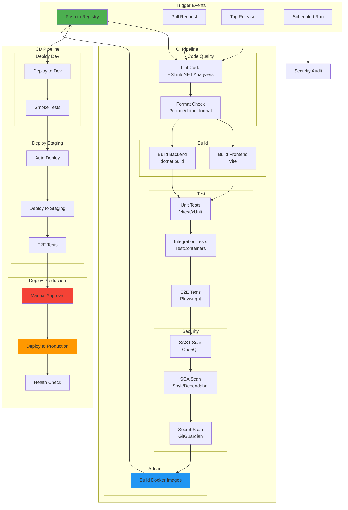
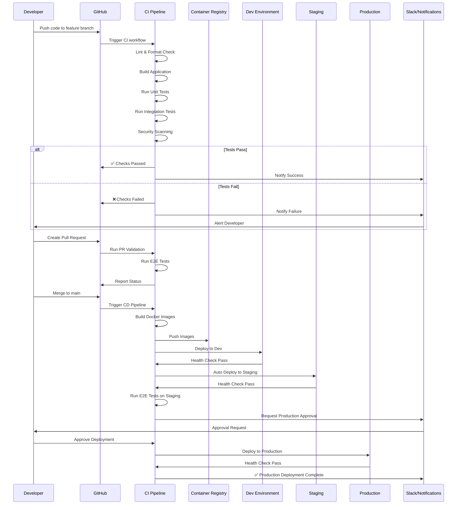
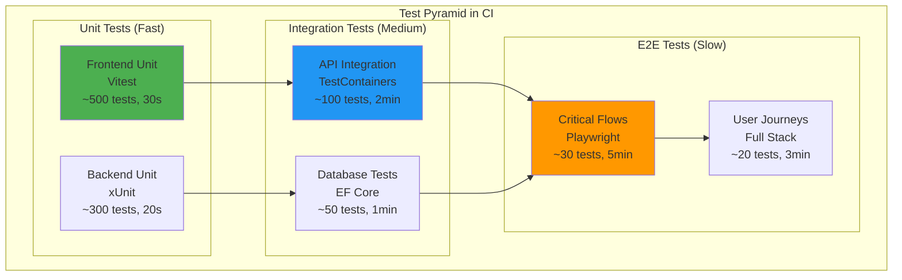
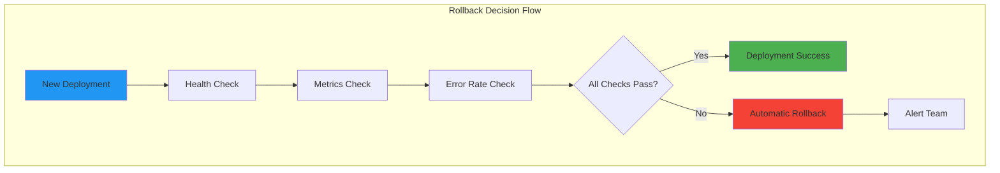
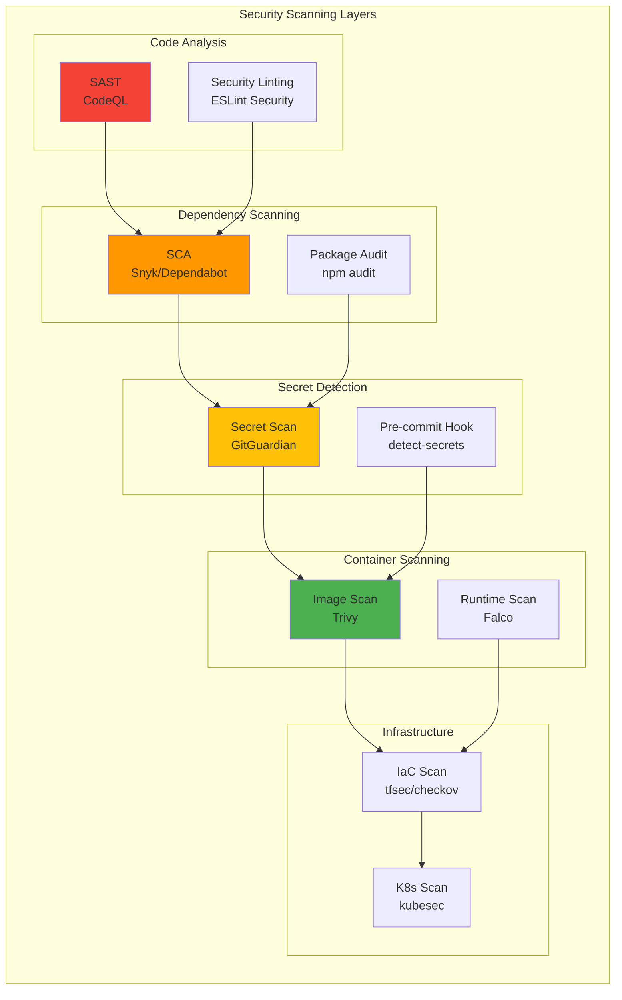

# CI/CD Pipeline Documentation

## Table of Contents
- [Overview](#overview)
- [GitHub Actions Workflow](#github-actions-workflow)
- [Pipeline Stages](#pipeline-stages)
- [Automated Testing](#automated-testing)
- [Deployment Automation](#deployment-automation)
- [Rollback Procedures](#rollback-procedures)
- [Security Scanning](#security-scanning)
- [Secrets Management](#secrets-management)

## Overview

Ideas Vault uses GitHub Actions for continuous integration and continuous deployment (CI/CD). The pipeline automates building, testing, security scanning, and deployment across all environments.

## GitHub Actions Workflow

### Complete CI/CD Pipeline Architecture



### Workflow Orchestration



## Pipeline Stages

### Stage 1: Code Quality and Linting

**File**: `.github/workflows/code-quality.yml`

```yaml
name: Code Quality

on:
  push:
    branches: [ main, develop ]
  pull_request:
    branches: [ main, develop ]

jobs:
  lint-frontend:
    name: Lint Frontend
    runs-on: ubuntu-latest
    steps:
      - uses: actions/checkout@v4
      
      - name: Setup Node.js
        uses: actions/setup-node@v4
        with:
          node-version: '20'
          cache: 'npm'
          cache-dependency-path: 'ideasvault-ui/package-lock.json'
      
      - name: Install dependencies
        working-directory: ./ideasvault-ui
        run: npm ci
      
      - name: Run ESLint
        working-directory: ./ideasvault-ui
        run: npm run lint
      
      - name: Check formatting with Prettier
        working-directory: ./ideasvault-ui
        run: npm run format:check
      
      - name: Type check
        working-directory: ./ideasvault-ui
        run: npm run type-check

  lint-backend:
    name: Lint Backend
    runs-on: ubuntu-latest
    steps:
      - uses: actions/checkout@v4
      
      - name: Setup .NET
        uses: actions/setup-dotnet@v4
        with:
          dotnet-version: '8.0.x'
      
      - name: Restore dependencies
        working-directory: ./ideasvault-backend
        run: dotnet restore
      
      - name: Check formatting
        working-directory: ./ideasvault-backend
        run: dotnet format --verify-no-changes --verbosity diagnostic
      
      - name: Run code analysis
        working-directory: ./ideasvault-backend
        run: dotnet build --no-restore /p:TreatWarningsAsErrors=true
```

### Stage 2: Build

**File**: `.github/workflows/build.yml`

```yaml
name: Build

on:
  push:
    branches: [ main, develop ]
  pull_request:
    branches: [ main, develop ]

env:
  REGISTRY: ghcr.io
  IMAGE_NAME_FRONTEND: ${{ github.repository }}/frontend
  IMAGE_NAME_BACKEND: ${{ github.repository }}/backend

jobs:
  build-frontend:
    name: Build Frontend
    runs-on: ubuntu-latest
    steps:
      - uses: actions/checkout@v4
      
      - name: Setup Node.js
        uses: actions/setup-node@v4
        with:
          node-version: '20'
          cache: 'npm'
          cache-dependency-path: 'ideasvault-ui/package-lock.json'
      
      - name: Install dependencies
        working-directory: ./ideasvault-ui
        run: npm ci
      
      - name: Build application
        working-directory: ./ideasvault-ui
        run: npm run build
        env:
          NODE_ENV: production
      
      - name: Upload build artifacts
        uses: actions/upload-artifact@v4
        with:
          name: frontend-dist
          path: ideasvault-ui/dist
          retention-days: 7

  build-backend:
    name: Build Backend
    runs-on: ubuntu-latest
    steps:
      - uses: actions/checkout@v4
      
      - name: Setup .NET
        uses: actions/setup-dotnet@v4
        with:
          dotnet-version: '8.0.x'
      
      - name: Restore dependencies
        working-directory: ./ideasvault-backend
        run: dotnet restore
      
      - name: Build application
        working-directory: ./ideasvault-backend
        run: dotnet build --configuration Release --no-restore
      
      - name: Publish application
        working-directory: ./ideasvault-backend
        run: dotnet publish --configuration Release --no-build --output ./publish
      
      - name: Upload publish artifacts
        uses: actions/upload-artifact@v4
        with:
          name: backend-publish
          path: ideasvault-backend/publish
          retention-days: 7
```

### Stage 3: Testing

**File**: `.github/workflows/test.yml`

```yaml
name: Test

on:
  push:
    branches: [ main, develop ]
  pull_request:
    branches: [ main, develop ]

jobs:
  test-frontend:
    name: Test Frontend
    runs-on: ubuntu-latest
    steps:
      - uses: actions/checkout@v4
      
      - name: Setup Node.js
        uses: actions/setup-node@v4
        with:
          node-version: '20'
          cache: 'npm'
          cache-dependency-path: 'ideasvault-ui/package-lock.json'
      
      - name: Install dependencies
        working-directory: ./ideasvault-ui
        run: npm ci
      
      - name: Run unit tests
        working-directory: ./ideasvault-ui
        run: npm run test:ci
      
      - name: Upload coverage reports
        uses: codecov/codecov-action@v4
        with:
          files: ./ideasvault-ui/coverage/coverage-final.json
          flags: frontend
          name: frontend-coverage

  test-backend:
    name: Test Backend
    runs-on: ubuntu-latest
    services:
      postgres:
        image: postgres:16-alpine
        env:
          POSTGRES_DB: ideasvault_test
          POSTGRES_USER: postgres
          POSTGRES_PASSWORD: postgres
        ports:
          - 5432:5432
        options: >-
          --health-cmd pg_isready
          --health-interval 10s
          --health-timeout 5s
          --health-retries 5
      
      redis:
        image: redis:7-alpine
        ports:
          - 6379:6379
        options: >-
          --health-cmd "redis-cli ping"
          --health-interval 10s
          --health-timeout 5s
          --health-retries 5
    
    steps:
      - uses: actions/checkout@v4
      
      - name: Setup .NET
        uses: actions/setup-dotnet@v4
        with:
          dotnet-version: '8.0.x'
      
      - name: Restore dependencies
        working-directory: ./ideasvault-backend
        run: dotnet restore
      
      - name: Run unit tests
        working-directory: ./ideasvault-backend
        run: dotnet test --configuration Release --no-restore --verbosity normal --collect:"XPlat Code Coverage" --results-directory ./coverage
        env:
          ConnectionStrings__DefaultConnection: "Host=localhost;Port=5432;Database=ideasvault_test;Username=postgres;Password=postgres"
          Redis__ConnectionString: "localhost:6379"
      
      - name: Upload coverage reports
        uses: codecov/codecov-action@v4
        with:
          files: ./ideasvault-backend/coverage/**/coverage.cobertura.xml
          flags: backend
          name: backend-coverage

  e2e-tests:
    name: E2E Tests
    runs-on: ubuntu-latest
    needs: [test-frontend, test-backend]
    steps:
      - uses: actions/checkout@v4
      
      - name: Setup Node.js
        uses: actions/setup-node@v4
        with:
          node-version: '20'
      
      - name: Start services with Docker Compose
        run: docker-compose up -d
      
      - name: Wait for services to be ready
        run: |
          timeout 120 bash -c 'until curl -f http://localhost:5000/health; do sleep 2; done'
          timeout 120 bash -c 'until curl -f http://localhost:3000; do sleep 2; done'
      
      - name: Install Playwright
        working-directory: ./tests/e2e
        run: |
          npm ci
          npx playwright install --with-deps
      
      - name: Run E2E tests
        working-directory: ./tests/e2e
        run: npm run test
        env:
          BASE_URL: http://localhost:3000
          API_URL: http://localhost:5000
      
      - name: Upload Playwright report
        if: always()
        uses: actions/upload-artifact@v4
        with:
          name: playwright-report
          path: tests/e2e/playwright-report
          retention-days: 30
      
      - name: Stop services
        if: always()
        run: docker-compose down -v
```

### Stage 4: Security Scanning

**File**: `.github/workflows/security.yml`

```yaml
name: Security Scanning

on:
  push:
    branches: [ main, develop ]
  pull_request:
    branches: [ main, develop ]
  schedule:
    - cron: '0 0 * * 0'  # Weekly on Sunday

jobs:
  codeql-analysis:
    name: CodeQL Analysis
    runs-on: ubuntu-latest
    permissions:
      security-events: write
      actions: read
      contents: read
    
    strategy:
      matrix:
        language: [ 'javascript', 'csharp' ]
    
    steps:
      - uses: actions/checkout@v4
      
      - name: Initialize CodeQL
        uses: github/codeql-action/init@v3
        with:
          languages: ${{ matrix.language }}
      
      - name: Autobuild
        uses: github/codeql-action/autobuild@v3
      
      - name: Perform CodeQL Analysis
        uses: github/codeql-action/analyze@v3

  dependency-scan:
    name: Dependency Scanning
    runs-on: ubuntu-latest
    steps:
      - uses: actions/checkout@v4
      
      - name: Run Snyk to check for vulnerabilities (Frontend)
        uses: snyk/actions/node@master
        continue-on-error: true
        env:
          SNYK_TOKEN: ${{ secrets.SNYK_TOKEN }}
        with:
          args: --severity-threshold=high --file=ideasvault-ui/package.json
      
      - name: Run Snyk to check for vulnerabilities (Backend)
        uses: snyk/actions/dotnet@master
        continue-on-error: true
        env:
          SNYK_TOKEN: ${{ secrets.SNYK_TOKEN }}
        with:
          args: --severity-threshold=high --file=ideasvault-backend/IdeasVault.sln

  secret-scan:
    name: Secret Scanning
    runs-on: ubuntu-latest
    steps:
      - uses: actions/checkout@v4
        with:
          fetch-depth: 0
      
      - name: GitGuardian scan
        uses: GitGuardian/ggshield-action@v1
        env:
          GITHUB_PUSH_BEFORE_SHA: ${{ github.event.before }}
          GITHUB_PUSH_BASE_SHA: ${{ github.event.base }}
          GITHUB_DEFAULT_BRANCH: ${{ github.event.repository.default_branch }}
          GITGUARDIAN_API_KEY: ${{ secrets.GITGUARDIAN_API_KEY }}

  container-scan:
    name: Container Security Scan
    runs-on: ubuntu-latest
    needs: [codeql-analysis]
    steps:
      - uses: actions/checkout@v4
      
      - name: Build Docker images
        run: |
          docker build -t ideasvault-frontend:test ./ideasvault-ui
          docker build -t ideasvault-backend:test ./ideasvault-backend
      
      - name: Run Trivy vulnerability scanner (Frontend)
        uses: aquasecurity/trivy-action@master
        with:
          image-ref: 'ideasvault-frontend:test'
          format: 'sarif'
          output: 'trivy-frontend-results.sarif'
          severity: 'CRITICAL,HIGH'
      
      - name: Run Trivy vulnerability scanner (Backend)
        uses: aquasecurity/trivy-action@master
        with:
          image-ref: 'ideasvault-backend:test'
          format: 'sarif'
          output: 'trivy-backend-results.sarif'
          severity: 'CRITICAL,HIGH'
      
      - name: Upload Trivy results to GitHub Security
        uses: github/codeql-action/upload-sarif@v3
        with:
          sarif_file: '.'
```

### Stage 5: Build and Push Docker Images

**File**: `.github/workflows/docker-build-push.yml`

```yaml
name: Docker Build and Push

on:
  push:
    branches: [ main, develop ]
    tags:
      - 'v*'

env:
  REGISTRY: ghcr.io

jobs:
  build-and-push:
    name: Build and Push Docker Images
    runs-on: ubuntu-latest
    permissions:
      contents: read
      packages: write
    
    strategy:
      matrix:
        include:
          - context: ./ideasvault-ui
            image: ghcr.io/${{ github.repository }}/frontend
            dockerfile: ./ideasvault-ui/Dockerfile
          - context: ./ideasvault-backend
            image: ghcr.io/${{ github.repository }}/backend
            dockerfile: ./ideasvault-backend/Dockerfile
    
    steps:
      - uses: actions/checkout@v4
      
      - name: Set up Docker Buildx
        uses: docker/setup-buildx-action@v3
      
      - name: Log in to Container Registry
        uses: docker/login-action@v3
        with:
          registry: ${{ env.REGISTRY }}
          username: ${{ github.actor }}
          password: ${{ secrets.GITHUB_TOKEN }}
      
      - name: Extract metadata
        id: meta
        uses: docker/metadata-action@v5
        with:
          images: ${{ matrix.image }}
          tags: |
            type=ref,event=branch
            type=ref,event=pr
            type=semver,pattern={{version}}
            type=semver,pattern={{major}}.{{minor}}
            type=sha,prefix={{branch}}-
            type=raw,value=latest,enable={{is_default_branch}}
      
      - name: Build and push Docker image
        uses: docker/build-push-action@v5
        with:
          context: ${{ matrix.context }}
          file: ${{ matrix.dockerfile }}
          push: true
          tags: ${{ steps.meta.outputs.tags }}
          labels: ${{ steps.meta.outputs.labels }}
          cache-from: type=gha
          cache-to: type=gha,mode=max
          build-args: |
            BUILD_VERSION=${{ github.ref_name }}
            BUILD_DATE=${{ github.event.head_commit.timestamp }}
            BUILD_COMMIT=${{ github.sha }}
```

## Automated Testing

### Testing Strategy in CI



### Test Execution Flow

```yaml
# Parallel test execution for speed
jobs:
  unit-tests:
    strategy:
      matrix:
        test-suite:
          - frontend-unit
          - backend-unit-domain
          - backend-unit-application
          - backend-unit-infrastructure
    runs-on: ubuntu-latest
    steps:
      - name: Run ${{ matrix.test-suite }}
        run: npm run test:${{ matrix.test-suite }}

  integration-tests:
    needs: unit-tests
    strategy:
      matrix:
        test-suite:
          - api-integration
          - database-integration
          - cache-integration
    runs-on: ubuntu-latest
    steps:
      - name: Run ${{ matrix.test-suite }}
        run: npm run test:${{ matrix.test-suite }}

  e2e-tests:
    needs: integration-tests
    strategy:
      matrix:
        shard: [1, 2, 3, 4]
    runs-on: ubuntu-latest
    steps:
      - name: Run E2E tests (Shard ${{ matrix.shard }})
        run: npx playwright test --shard=${{ matrix.shard }}/4
```

## Deployment Automation

### Deployment Workflow

**File**: `.github/workflows/deploy.yml`

```yaml
name: Deploy

on:
  workflow_run:
    workflows: ["Docker Build and Push"]
    types:
      - completed
    branches:
      - main
      - develop

jobs:
  deploy-dev:
    name: Deploy to Development
    runs-on: ubuntu-latest
    if: github.ref == 'refs/heads/develop'
    environment:
      name: development
      url: https://dev.ideasvault.com
    
    steps:
      - uses: actions/checkout@v4
      
      - name: Configure kubectl
        uses: azure/k8s-set-context@v3
        with:
          method: kubeconfig
          kubeconfig: ${{ secrets.KUBE_CONFIG_DEV }}
      
      - name: Deploy to Dev
        run: |
          kubectl apply -k infrastructure/kubernetes/ideasvault/overlays/dev
          kubectl rollout status deployment/ideasvault-frontend -n ideasvault-dev
          kubectl rollout status deployment/ideasvault-backend -n ideasvault-dev
      
      - name: Run smoke tests
        run: |
          npm ci
          npm run test:smoke -- --base-url=https://dev.ideasvault.com

  deploy-staging:
    name: Deploy to Staging
    runs-on: ubuntu-latest
    needs: deploy-dev
    if: github.ref == 'refs/heads/main'
    environment:
      name: staging
      url: https://staging.ideasvault.com
    
    steps:
      - uses: actions/checkout@v4
      
      - name: Configure kubectl
        uses: azure/k8s-set-context@v3
        with:
          method: kubeconfig
          kubeconfig: ${{ secrets.KUBE_CONFIG_STAGING }}
      
      - name: Deploy to Staging
        run: |
          kubectl apply -k infrastructure/kubernetes/ideasvault/overlays/staging
          kubectl rollout status deployment/ideasvault-frontend -n ideasvault-staging
          kubectl rollout status deployment/ideasvault-backend -n ideasvault-staging
      
      - name: Run E2E tests on Staging
        run: |
          npm ci
          npm run test:e2e -- --base-url=https://staging.ideasvault.com
      
      - name: Notify on Slack
        uses: slackapi/slack-github-action@v1
        with:
          payload: |
            {
              "text": "✅ Staging deployment successful. Ready for production approval.",
              "blocks": [
                {
                  "type": "section",
                  "text": {
                    "type": "mrkdwn",
                    "text": "*Staging Deployment Complete*\n\nVersion: `${{ github.sha }}`\nEnvironment: `staging`\nURL: https://staging.ideasvault.com"
                  }
                }
              ]
            }
        env:
          SLACK_WEBHOOK_URL: ${{ secrets.SLACK_WEBHOOK_URL }}

  deploy-production:
    name: Deploy to Production
    runs-on: ubuntu-latest
    needs: deploy-staging
    if: github.ref == 'refs/heads/main'
    environment:
      name: production
      url: https://ideasvault.com
    
    steps:
      - uses: actions/checkout@v4
      
      - name: Configure kubectl
        uses: azure/k8s-set-context@v3
        with:
          method: kubeconfig
          kubeconfig: ${{ secrets.KUBE_CONFIG_PROD }}
      
      - name: Update image tags
        run: |
          cd infrastructure/kubernetes/ideasvault/overlays/production
          kustomize edit set image \
            ghcr.io/${{ github.repository }}/frontend:${{ github.sha }} \
            ghcr.io/${{ github.repository }}/backend:${{ github.sha }}
      
      - name: Deploy to Production (Blue-Green)
        run: |
          # Deploy green environment
          kubectl apply -k infrastructure/kubernetes/ideasvault/overlays/production
          
          # Wait for rollout
          kubectl rollout status deployment/ideasvault-frontend -n ideasvault --timeout=10m
          kubectl rollout status deployment/ideasvault-backend -n ideasvault --timeout=10m
          
          # Verify health
          kubectl wait --for=condition=ready pod -l app=ideasvault -n ideasvault --timeout=5m
      
      - name: Run production smoke tests
        run: |
          npm ci
          npm run test:smoke -- --base-url=https://ideasvault.com
      
      - name: Create deployment record
        uses: chrnorm/deployment-action@v2
        with:
          token: ${{ secrets.GITHUB_TOKEN }}
          environment: production
          deployment-status: success
      
      - name: Notify on Slack
        uses: slackapi/slack-github-action@v1
        with:
          payload: |
            {
              "text": "🚀 Production deployment successful!",
              "blocks": [
                {
                  "type": "section",
                  "text": {
                    "type": "mrkdwn",
                    "text": "*Production Deployment Complete*\n\nVersion: `${{ github.sha }}`\nEnvironment: `production`\nURL: https://ideasvault.com\nDeployed by: ${{ github.actor }}"
                  }
                }
              ]
            }
        env:
          SLACK_WEBHOOK_URL: ${{ secrets.SLACK_WEBHOOK_URL }}
```

## Rollback Procedures

### Automated Rollback



### Rollback Workflow

**File**: `.github/workflows/rollback.yml`

```yaml
name: Rollback Deployment

on:
  workflow_dispatch:
    inputs:
      environment:
        description: 'Environment to rollback'
        required: true
        type: choice
        options:
          - development
          - staging
          - production
      revision:
        description: 'Revision to rollback to (leave empty for previous)'
        required: false
        type: string

jobs:
  rollback:
    name: Rollback ${{ github.event.inputs.environment }}
    runs-on: ubuntu-latest
    environment: ${{ github.event.inputs.environment }}
    
    steps:
      - uses: actions/checkout@v4
      
      - name: Configure kubectl
        uses: azure/k8s-set-context@v3
        with:
          method: kubeconfig
          kubeconfig: ${{ secrets[format('KUBE_CONFIG_{0}', upper(github.event.inputs.environment))] }}
      
      - name: Rollback deployment
        run: |
          NAMESPACE="ideasvault-${{ github.event.inputs.environment }}"
          
          if [ -n "${{ github.event.inputs.revision }}" ]; then
            # Rollback to specific revision
            kubectl rollout undo deployment/ideasvault-frontend -n $NAMESPACE --to-revision=${{ github.event.inputs.revision }}
            kubectl rollout undo deployment/ideasvault-backend -n $NAMESPACE --to-revision=${{ github.event.inputs.revision }}
          else
            # Rollback to previous revision
            kubectl rollout undo deployment/ideasvault-frontend -n $NAMESPACE
            kubectl rollout undo deployment/ideasvault-backend -n $NAMESPACE
          fi
          
          # Wait for rollback to complete
          kubectl rollout status deployment/ideasvault-frontend -n $NAMESPACE
          kubectl rollout status deployment/ideasvault-backend -n $NAMESPACE
      
      - name: Verify rollback
        run: |
          NAMESPACE="ideasvault-${{ github.event.inputs.environment }}"
          kubectl wait --for=condition=ready pod -l app=ideasvault -n $NAMESPACE --timeout=5m
      
      - name: Run smoke tests
        run: |
          npm ci
          npm run test:smoke -- --base-url=https://${{ github.event.inputs.environment }}.ideasvault.com
      
      - name: Notify on Slack
        uses: slackapi/slack-github-action@v1
        with:
          payload: |
            {
              "text": "⚠️ Rollback completed for ${{ github.event.inputs.environment }}",
              "blocks": [
                {
                  "type": "section",
                  "text": {
                    "type": "mrkdwn",
                    "text": "*Rollback Complete*\n\nEnvironment: `${{ github.event.inputs.environment }}`\nTriggered by: ${{ github.actor }}\nRevision: `${{ github.event.inputs.revision || 'previous' }}`"
                  }
                }
              ]
            }
        env:
          SLACK_WEBHOOK_URL: ${{ secrets.SLACK_WEBHOOK_URL }}
```

### Manual Rollback Commands

```bash
# View deployment history
kubectl rollout history deployment/ideasvault-backend -n ideasvault

# Rollback to previous version
kubectl rollout undo deployment/ideasvault-backend -n ideasvault

# Rollback to specific revision
kubectl rollout undo deployment/ideasvault-backend -n ideasvault --to-revision=3

# Check rollback status
kubectl rollout status deployment/ideasvault-backend -n ideasvault

# Pause rollout if issues detected
kubectl rollout pause deployment/ideasvault-backend -n ideasvault

# Resume rollout after fix
kubectl rollout resume deployment/ideasvault-backend -n ideasvault
```

## Security Scanning

### Security Pipeline Integration



## Secrets Management

### GitHub Secrets Organization

```yaml
# Repository Secrets
KUBE_CONFIG_DEV          # Kubernetes config for dev
KUBE_CONFIG_STAGING      # Kubernetes config for staging
KUBE_CONFIG_PROD         # Kubernetes config for production

REGISTRY_USERNAME        # Container registry username
REGISTRY_PASSWORD        # Container registry password

SNYK_TOKEN              # Snyk API token
GITGUARDIAN_API_KEY     # GitGuardian API key

DATABASE_PASSWORD_DEV    # Dev database password
DATABASE_PASSWORD_STG    # Staging database password
DATABASE_PASSWORD_PROD   # Production database password

JWT_SECRET_DEV          # Dev JWT secret
JWT_SECRET_STG          # Staging JWT secret
JWT_SECRET_PROD         # Production JWT secret

SLACK_WEBHOOK_URL       # Slack notifications webhook
```

### External Secrets in Kubernetes

```yaml
# Use External Secrets Operator
apiVersion: external-secrets.io/v1beta1
kind: SecretStore
metadata:
  name: aws-secrets-manager
  namespace: ideasvault
spec:
  provider:
    aws:
      service: SecretsManager
      region: us-east-1
      auth:
        jwt:
          serviceAccountRef:
            name: external-secrets-sa

---
apiVersion: external-secrets.io/v1beta1
kind: ExternalSecret
metadata:
  name: ideasvault-secrets
  namespace: ideasvault
spec:
  refreshInterval: 1h
  secretStoreRef:
    name: aws-secrets-manager
    kind: SecretStore
  target:
    name: ideasvault-secrets
    creationPolicy: Owner
  data:
  - secretKey: database-password
    remoteRef:
      key: /ideasvault/production/database-password
  - secretKey: jwt-secret
    remoteRef:
      key: /ideasvault/production/jwt-secret
```

---

**Next Steps**:
- [Monitoring and Observability](./monitoring.md)
- [Kubernetes Deployment Guide](./kubernetes.md)
- [Docker Deployment Guide](./docker.md)

**Document Version**: 1.0.0  
**Last Updated**: January 2026  
**Maintained By**: Infrastructure Team
