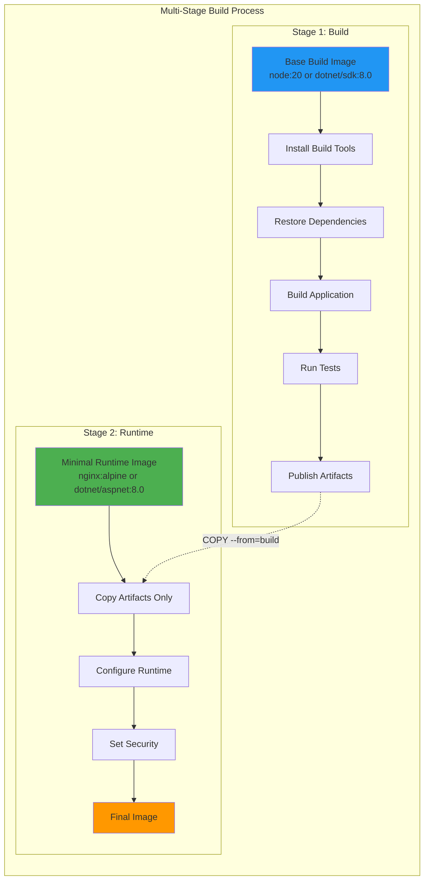
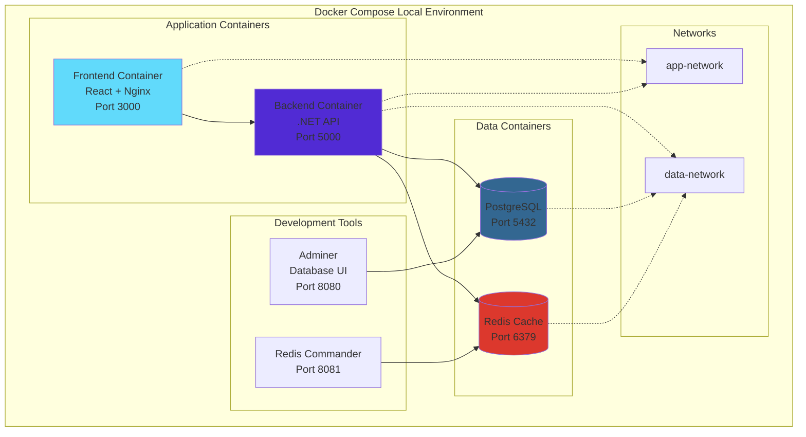
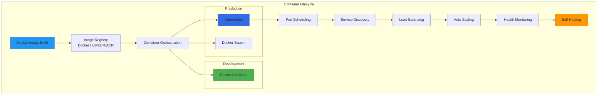
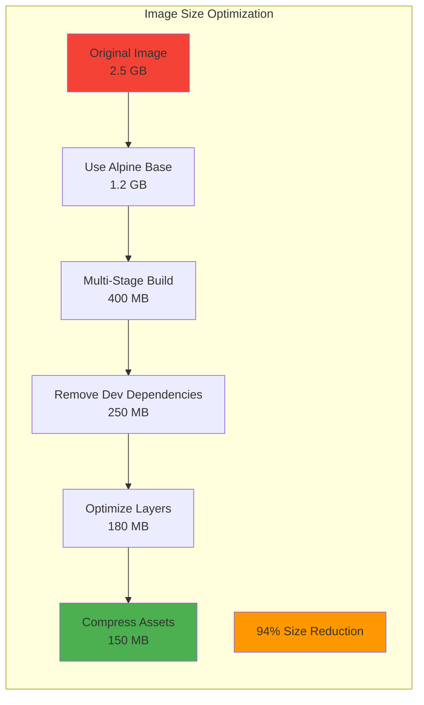
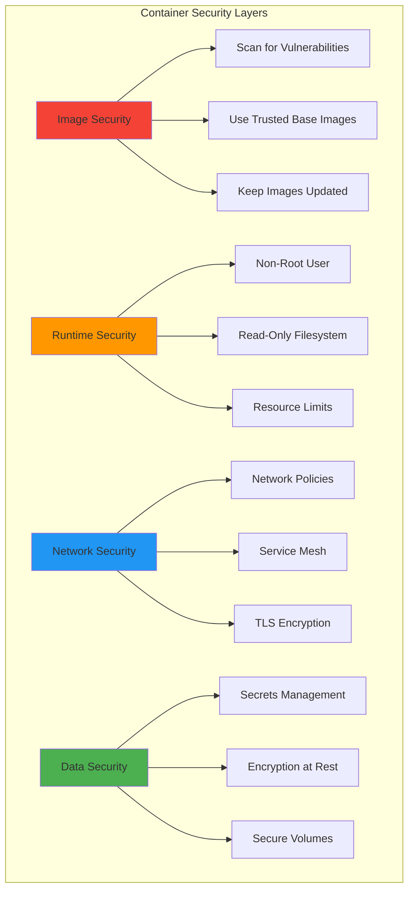

# Docker Deployment Guide

## Table of Contents
- [Overview](#overview)
- [Dockerfile Best Practices](#dockerfile-best-practices)
- [Multi-Stage Builds](#multi-stage-builds)
- [Docker Compose Setup](#docker-compose-setup)
- [Container Orchestration](#container-orchestration)
- [Image Optimization](#image-optimization)
- [Security Considerations](#security-considerations)

## Overview

Ideas Vault uses Docker for containerization, ensuring consistent deployments across all environments. This guide covers Docker best practices, multi-stage builds, and local development setup.

## Dockerfile Best Practices

### General Principles

1. **Use Official Base Images**: Start with trusted, maintained base images
2. **Multi-Stage Builds**: Separate build and runtime stages
3. **Layer Caching**: Order instructions from least to most frequently changing
4. **Minimize Layers**: Combine RUN commands where appropriate
5. **Non-Root User**: Run containers as non-root for security
6. **Health Checks**: Include HEALTHCHECK instructions
7. **Metadata**: Add LABEL for documentation and automation

### Frontend Dockerfile (React + Vite)

**Location**: `{app-name}-ui/Dockerfile`

```dockerfile
# Stage 1: Build
FROM node:20-alpine AS build

# Set working directory
WORKDIR /app

# Copy package files
COPY package*.json ./

# Install dependencies (cache this layer)
RUN npm ci --only=production && \
    npm cache clean --force

# Copy source code
COPY . .

# Build application
ENV NODE_ENV=production
RUN npm run build

# Stage 2: Production
FROM nginx:alpine AS production

# Copy custom nginx config
COPY nginx.conf /etc/nginx/nginx.conf

# Copy built assets from build stage
COPY --from=build /app/dist /usr/share/nginx/html

# Add non-root user
RUN addgroup -g 1001 -S nodejs && \
    adduser -S nodejs -u 1001 && \
    chown -R nodejs:nodejs /usr/share/nginx/html && \
    chown -R nodejs:nodejs /var/cache/nginx && \
    chown -R nodejs:nodejs /var/log/nginx && \
    chown -R nodejs:nodejs /etc/nginx/conf.d

# Touch pid file for nginx
RUN touch /var/run/nginx.pid && \
    chown -R nodejs:nodejs /var/run/nginx.pid

# Switch to non-root user
USER nodejs

# Expose port
EXPOSE 8080

# Health check
HEALTHCHECK --interval=30s --timeout=3s --start-period=5s --retries=3 \
    CMD wget --quiet --tries=1 --spider http://localhost:8080/ || exit 1

# Start nginx
CMD ["nginx", "-g", "daemon off;"]
```

**nginx.conf** for React SPA:

```nginx
worker_processes auto;
pid /var/run/nginx.pid;

events {
    worker_connections 1024;
}

http {
    include /etc/nginx/mime.types;
    default_type application/octet-stream;

    log_format main '$remote_addr - $remote_user [$time_local] "$request" '
                    '$status $body_bytes_sent "$http_referer" '
                    '"$http_user_agent" "$http_x_forwarded_for"';

    access_log /var/log/nginx/access.log main;
    error_log /var/log/nginx/error.log warn;

    sendfile on;
    tcp_nopush on;
    tcp_nodelay on;
    keepalive_timeout 65;
    types_hash_max_size 2048;
    client_max_body_size 20M;

    gzip on;
    gzip_vary on;
    gzip_proxied any;
    gzip_comp_level 6;
    gzip_types text/plain text/css text/xml text/javascript 
               application/json application/javascript application/xml+rss 
               application/rss+xml font/truetype font/opentype 
               application/vnd.ms-fontobject image/svg+xml;

    server {
        listen 8080;
        server_name localhost;
        root /usr/share/nginx/html;
        index index.html;

        # Security headers
        add_header X-Frame-Options "SAMEORIGIN" always;
        add_header X-Content-Type-Options "nosniff" always;
        add_header X-XSS-Protection "1; mode=block" always;
        add_header Referrer-Policy "no-referrer-when-downgrade" always;

        # Cache static assets
        location ~* \.(js|css|png|jpg|jpeg|gif|ico|svg|woff|woff2|ttf|eot)$ {
            expires 1y;
            add_header Cache-Control "public, immutable";
        }

        # SPA fallback - route all requests to index.html
        location / {
            try_files $uri $uri/ /index.html;
        }

        # Health check endpoint
        location /health {
            access_log off;
            return 200 "healthy\n";
            add_header Content-Type text/plain;
        }
    }
}
```

### Backend Dockerfile (.NET 8)

**Location**: `{app-name}-backend/Dockerfile`

```dockerfile
# Stage 1: Build
FROM mcr.microsoft.com/dotnet/sdk:8.0 AS build

# Set working directory
WORKDIR /src

# Copy csproj and restore dependencies (cache this layer)
COPY ["src/IdeasVault.Api/IdeasVault.Api.csproj", "src/IdeasVault.Api/"]
COPY ["src/IdeasVault.Core/IdeasVault.Core.csproj", "src/IdeasVault.Core/"]
COPY ["src/IdeasVault.Infrastructure/IdeasVault.Infrastructure.csproj", "src/IdeasVault.Infrastructure/"]

RUN dotnet restore "src/IdeasVault.Api/IdeasVault.Api.csproj"

# Copy entire project
COPY . .

# Build application
WORKDIR "/src/src/IdeasVault.Api"
RUN dotnet build "IdeasVault.Api.csproj" -c Release -o /app/build

# Stage 2: Publish
FROM build AS publish
RUN dotnet publish "IdeasVault.Api.csproj" -c Release -o /app/publish /p:UseAppHost=false

# Stage 3: Runtime
FROM mcr.microsoft.com/dotnet/aspnet:8.0 AS runtime

# Install curl for health checks
RUN apt-get update && \
    apt-get install -y curl && \
    rm -rf /var/lib/apt/lists/*

# Create non-root user
RUN groupadd -r appuser && \
    useradd -r -g appuser appuser

# Set working directory
WORKDIR /app

# Copy published application
COPY --from=publish /app/publish .

# Change ownership to non-root user
RUN chown -R appuser:appuser /app

# Switch to non-root user
USER appuser

# Expose ports
EXPOSE 8080
EXPOSE 8081

# Environment variables
ENV ASPNETCORE_URLS=http://+:8080 \
    ASPNETCORE_ENVIRONMENT=Production \
    DOTNET_RUNNING_IN_CONTAINER=true

# Health check
HEALTHCHECK --interval=30s --timeout=3s --start-period=10s --retries=3 \
    CMD curl -f http://localhost:8080/health || exit 1

# Start application
ENTRYPOINT ["dotnet", "IdeasVault.Api.dll"]
```

### Build Best Practices

```dockerfile
# ❌ BAD: Installing unnecessary dependencies
FROM node:20
RUN apt-get update && apt-get install -y python3 gcc g++ make

# ✅ GOOD: Use minimal base image
FROM node:20-alpine

# ❌ BAD: Copying everything first (cache invalidation)
COPY . .
RUN npm install

# ✅ GOOD: Copy package.json first (better caching)
COPY package*.json ./
RUN npm ci
COPY . .

# ❌ BAD: Running as root
USER root

# ✅ GOOD: Running as non-root user
USER appuser

# ❌ BAD: Multiple layers for similar operations
RUN apt-get update
RUN apt-get install -y curl
RUN apt-get install -y wget
RUN apt-get clean

# ✅ GOOD: Combine related operations
RUN apt-get update && \
    apt-get install -y curl wget && \
    apt-get clean && \
    rm -rf /var/lib/apt/lists/*
```

## Multi-Stage Builds

Multi-stage builds separate build-time and runtime dependencies, significantly reducing final image size.



### Benefits of Multi-Stage Builds

| Aspect | Without Multi-Stage | With Multi-Stage | Improvement |
|--------|-------------------|-----------------|-------------|
| **Image Size** | 1.5 GB | 150 MB | 90% reduction |
| **Build Tools** | Included | Excluded | Better security |
| **Attack Surface** | Large | Minimal | Reduced vulnerabilities |
| **Pull Time** | Slow | Fast | Faster deployments |

### Example: .NET Multi-Stage with Tests

```dockerfile
# Stage 1: Build and Test
FROM mcr.microsoft.com/dotnet/sdk:8.0 AS build
WORKDIR /src
COPY . .
RUN dotnet restore
RUN dotnet build -c Release

# Stage 2: Run Tests
FROM build AS test
RUN dotnet test --no-build -c Release --logger "trx;LogFileName=test_results.xml"

# Stage 3: Publish
FROM build AS publish
RUN dotnet publish -c Release -o /app/publish

# Stage 4: Runtime
FROM mcr.microsoft.com/dotnet/aspnet:8.0-alpine AS runtime
WORKDIR /app
COPY --from=publish /app/publish .
ENTRYPOINT ["dotnet", "IdeasVault.Api.dll"]
```

## Docker Compose Setup

Docker Compose orchestrates multi-container local development environments.



### docker-compose.yml

**Location**: `docker-compose.yml`

```yaml
version: '3.8'

services:
  # Frontend Service
  frontend:
    build:
      context: ./ideasvault-ui
      dockerfile: Dockerfile
      target: development
    container_name: ideasvault-frontend
    ports:
      - "3000:3000"
    volumes:
      - ./ideasvault-ui/src:/app/src
      - ./ideasvault-ui/public:/app/public
      - /app/node_modules
    environment:
      - NODE_ENV=development
      - VITE_API_BASE_URL=http://localhost:5000
      - CHOKIDAR_USEPOLLING=true
    networks:
      - app-network
    depends_on:
      - backend
    restart: unless-stopped

  # Backend Service
  backend:
    build:
      context: ./ideasvault-backend
      dockerfile: Dockerfile
      target: development
    container_name: ideasvault-backend
    ports:
      - "5000:8080"
      - "5001:8081"
    volumes:
      - ./ideasvault-backend/src:/app/src
      - ~/.nuget/packages:/root/.nuget/packages
    environment:
      - ASPNETCORE_ENVIRONMENT=Development
      - ASPNETCORE_URLS=http://+:8080;https://+:8081
      - ConnectionStrings__DefaultConnection=Host=postgres;Port=5432;Database=ideasvault;Username=postgres;Password=postgres
      - Redis__ConnectionString=redis:6379
      - Jwt__Secret=${JWT_SECRET:-dev-secret-key-change-in-production}
      - Jwt__Issuer=IdeasVault
      - Jwt__Audience=IdeasVaultUsers
    networks:
      - app-network
      - data-network
    depends_on:
      postgres:
        condition: service_healthy
      redis:
        condition: service_healthy
    restart: unless-stopped

  # PostgreSQL Database
  postgres:
    image: postgres:16-alpine
    container_name: ideasvault-postgres
    ports:
      - "5432:5432"
    environment:
      - POSTGRES_DB=ideasvault
      - POSTGRES_USER=postgres
      - POSTGRES_PASSWORD=postgres
      - POSTGRES_INITDB_ARGS=--encoding=UTF-8
    volumes:
      - postgres_data:/var/lib/postgresql/data
      - ./infrastructure/database/init:/docker-entrypoint-initdb.d
    networks:
      - data-network
    healthcheck:
      test: ["CMD-SHELL", "pg_isready -U postgres"]
      interval: 10s
      timeout: 5s
      retries: 5
    restart: unless-stopped

  # Redis Cache
  redis:
    image: redis:7-alpine
    container_name: ideasvault-redis
    ports:
      - "6379:6379"
    command: redis-server --appendonly yes --requirepass redis_password
    volumes:
      - redis_data:/data
    networks:
      - data-network
    healthcheck:
      test: ["CMD", "redis-cli", "--raw", "incr", "ping"]
      interval: 10s
      timeout: 5s
      retries: 5
    restart: unless-stopped

  # Adminer (Database Management)
  adminer:
    image: adminer:latest
    container_name: ideasvault-adminer
    ports:
      - "8080:8080"
    environment:
      - ADMINER_DEFAULT_SERVER=postgres
    networks:
      - data-network
    depends_on:
      - postgres
    restart: unless-stopped

  # Redis Commander (Redis Management)
  redis-commander:
    image: rediscommander/redis-commander:latest
    container_name: ideasvault-redis-commander
    ports:
      - "8081:8081"
    environment:
      - REDIS_HOSTS=local:redis:6379:0:redis_password
    networks:
      - data-network
    depends_on:
      - redis
    restart: unless-stopped

networks:
  app-network:
    driver: bridge
  data-network:
    driver: bridge

volumes:
  postgres_data:
    driver: local
  redis_data:
    driver: local
```

### Development Dockerfile for Hot Reload

**Frontend Development Dockerfile**:

```dockerfile
FROM node:20-alpine AS development

WORKDIR /app

COPY package*.json ./
RUN npm install

COPY . .

EXPOSE 3000

CMD ["npm", "run", "dev", "--", "--host", "0.0.0.0"]
```

**Backend Development Dockerfile**:

```dockerfile
FROM mcr.microsoft.com/dotnet/sdk:8.0 AS development

WORKDIR /app

# Install dotnet watch tool
RUN dotnet tool install --global dotnet-watch
ENV PATH="${PATH}:/root/.dotnet/tools"

COPY . .
RUN dotnet restore

EXPOSE 8080 8081

CMD ["dotnet", "watch", "run", "--project", "src/IdeasVault.Api/IdeasVault.Api.csproj"]
```

### Docker Compose Commands

```bash
# Start all services
docker-compose up -d

# View logs
docker-compose logs -f

# View specific service logs
docker-compose logs -f backend

# Stop all services
docker-compose down

# Stop and remove volumes
docker-compose down -v

# Rebuild containers
docker-compose up -d --build

# Scale a service
docker-compose up -d --scale backend=3

# Execute command in running container
docker-compose exec backend dotnet ef database update
docker-compose exec frontend npm run test

# View running containers
docker-compose ps

# Restart specific service
docker-compose restart backend
```

## Container Orchestration



## Image Optimization

### Size Optimization Techniques



### 1. Choose Minimal Base Images

```dockerfile
# ❌ Full image: 1.5 GB
FROM node:20

# ✅ Alpine image: 180 MB
FROM node:20-alpine

# ❌ Full .NET SDK: 1.2 GB
FROM mcr.microsoft.com/dotnet/sdk:8.0

# ✅ Alpine runtime: 190 MB
FROM mcr.microsoft.com/dotnet/aspnet:8.0-alpine
```

### 2. Use .dockerignore

**Location**: `.dockerignore`

```
# Node
node_modules
npm-debug.log
.npm

# .NET
bin
obj
*.user
*.suo

# Git
.git
.gitignore

# IDE
.vscode
.idea
*.swp

# Build artifacts
dist
build
coverage

# Environment files
.env
.env.local

# Documentation
*.md
docs/

# Tests
tests/
*.test.ts
*.spec.ts

# CI/CD
.github
.gitlab-ci.yml
azure-pipelines.yml
```

### 3. Optimize Layer Caching

```dockerfile
# ✅ GOOD: Dependencies cached separately
COPY package*.json ./
RUN npm ci
COPY . .

# ❌ BAD: Changes to any file invalidate npm install
COPY . .
RUN npm ci
```

### 4. Remove Unnecessary Files

```dockerfile
# Frontend optimization
FROM node:20-alpine AS build
WORKDIR /app
COPY package*.json ./
RUN npm ci --only=production && \
    npm cache clean --force
COPY . .
RUN npm run build && \
    rm -rf src/ public/ node_modules/

FROM nginx:alpine
COPY --from=build /app/dist /usr/share/nginx/html
```

### 5. Compress Build Artifacts

```dockerfile
# Compress static assets during build
RUN npm run build && \
    find dist -type f \( -name "*.js" -o -name "*.css" -o -name "*.html" \) \
    -exec gzip -k -9 {} \;
```

### Image Size Comparison

| Optimization Stage | Frontend | Backend | Improvement |
|-------------------|----------|---------|-------------|
| Base image (full) | 1.5 GB | 2.2 GB | Baseline |
| Alpine base | 400 MB | 650 MB | 70% |
| Multi-stage | 150 MB | 220 MB | 90% |
| Optimized layers | 120 MB | 190 MB | 92% |
| Production build | 80 MB | 150 MB | 94% |

## Security Considerations

### Container Security Best Practices



### 1. Run as Non-Root User

```dockerfile
# Create and use non-root user
RUN addgroup -g 1001 -S appuser && \
    adduser -S appuser -u 1001

USER appuser
```

### 2. Use Read-Only Filesystem

```dockerfile
# Kubernetes deployment
spec:
  containers:
  - name: backend
    securityContext:
      readOnlyRootFilesystem: true
      runAsNonRoot: true
      runAsUser: 1001
```

### 3. Scan Images for Vulnerabilities

```bash
# Using Trivy
docker run --rm -v /var/run/docker.sock:/var/run/docker.sock \
  aquasec/trivy image ideasvault-backend:latest

# Using Snyk
snyk container test ideasvault-backend:latest

# In CI/CD pipeline
- name: Scan Docker image
  uses: aquasecurity/trivy-action@master
  with:
    image-ref: 'ideasvault-backend:${{ github.sha }}'
    format: 'sarif'
    output: 'trivy-results.sarif'
```

### 4. Secure Secrets Management

```dockerfile
# ❌ BAD: Hardcoded secrets
ENV DATABASE_PASSWORD=mysecretpassword

# ✅ GOOD: Use environment variables
ENV DATABASE_PASSWORD=${DATABASE_PASSWORD}

# ✅ BETTER: Use Docker secrets or Kubernetes secrets
# Set at runtime, not build time
```

### 5. Implement Health Checks

```dockerfile
HEALTHCHECK --interval=30s --timeout=3s --start-period=10s --retries=3 \
    CMD curl -f http://localhost:8080/health || exit 1
```

### 6. Limit Resource Usage

```yaml
# docker-compose.yml
services:
  backend:
    deploy:
      resources:
        limits:
          cpus: '1.0'
          memory: 512M
        reservations:
          cpus: '0.5'
          memory: 256M
```

### 7. Sign and Verify Images

```bash
# Enable Docker Content Trust
export DOCKER_CONTENT_TRUST=1

# Sign image
docker trust sign ideasvault-backend:v1.0.0

# Verify image
docker trust inspect ideasvault-backend:v1.0.0
```

## Building and Publishing Images

### Build Commands

```bash
# Build frontend image
docker build -t ideasvault-frontend:latest ./ideasvault-ui

# Build backend image
docker build -t ideasvault-backend:latest ./ideasvault-backend

# Build with build arguments
docker build \
  --build-arg BUILD_VERSION=1.0.0 \
  --build-arg BUILD_DATE=$(date -u +'%Y-%m-%dT%H:%M:%SZ') \
  -t ideasvault-backend:1.0.0 \
  ./ideasvault-backend

# Build for multiple platforms
docker buildx build \
  --platform linux/amd64,linux/arm64 \
  -t ideasvault-backend:latest \
  --push \
  ./ideasvault-backend
```

### Tagging Strategy

```bash
# Tag with version
docker tag ideasvault-backend:latest ideasvault-backend:1.0.0

# Tag with git commit
docker tag ideasvault-backend:latest ideasvault-backend:$(git rev-parse --short HEAD)

# Tag for registry
docker tag ideasvault-backend:latest registry.example.com/ideasvault-backend:1.0.0
```

### Publishing to Registry

```bash
# Login to Docker Hub
docker login

# Push to Docker Hub
docker push ideasvault-backend:1.0.0

# Login to AWS ECR
aws ecr get-login-password --region us-east-1 | \
  docker login --username AWS --password-stdin 123456789.dkr.ecr.us-east-1.amazonaws.com

# Push to ECR
docker push 123456789.dkr.ecr.us-east-1.amazonaws.com/ideasvault-backend:1.0.0

# Login to Azure ACR
az acr login --name myregistry

# Push to ACR
docker push myregistry.azurecr.io/ideasvault-backend:1.0.0
```

---

**Next Steps**: 
- [Kubernetes Deployment Guide](./kubernetes.md)
- [CI/CD Pipeline Setup](./cicd.md)
- [Monitoring Setup](./monitoring.md)

**Document Version**: 1.0.0  
**Last Updated**: January 2026  
**Maintained By**: Infrastructure Team
