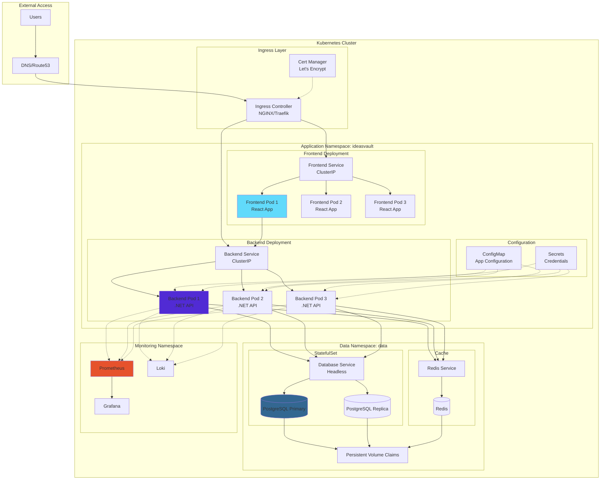
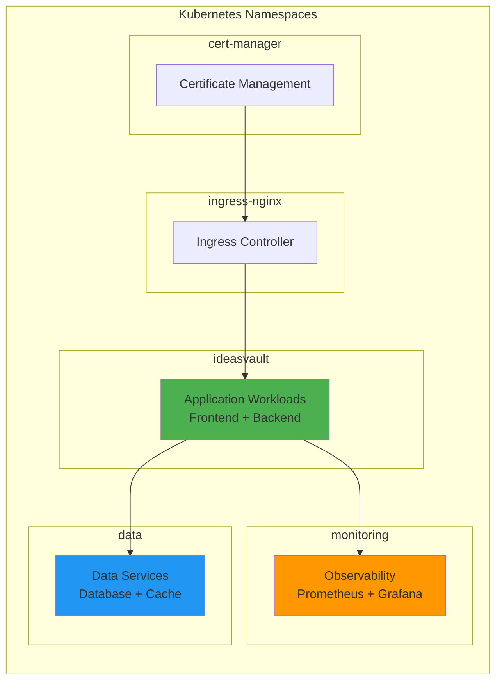
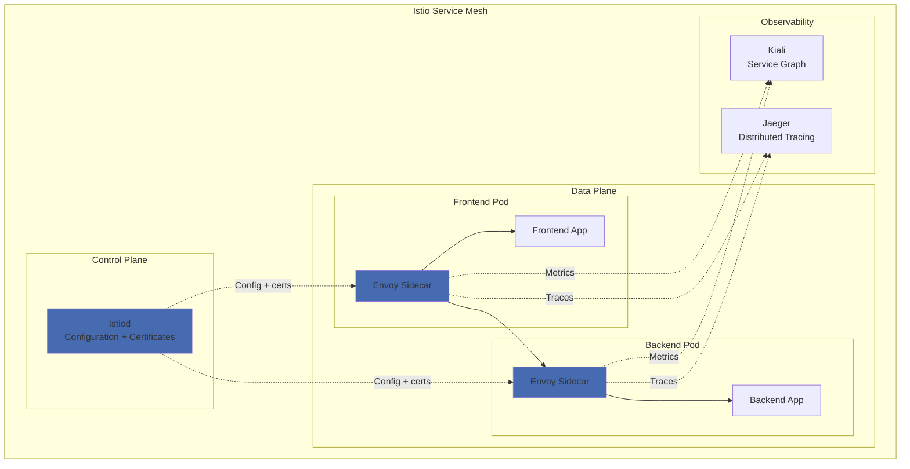
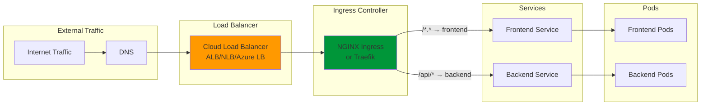
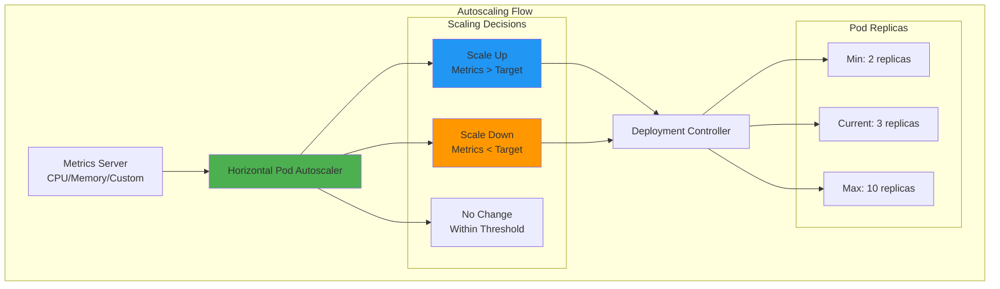
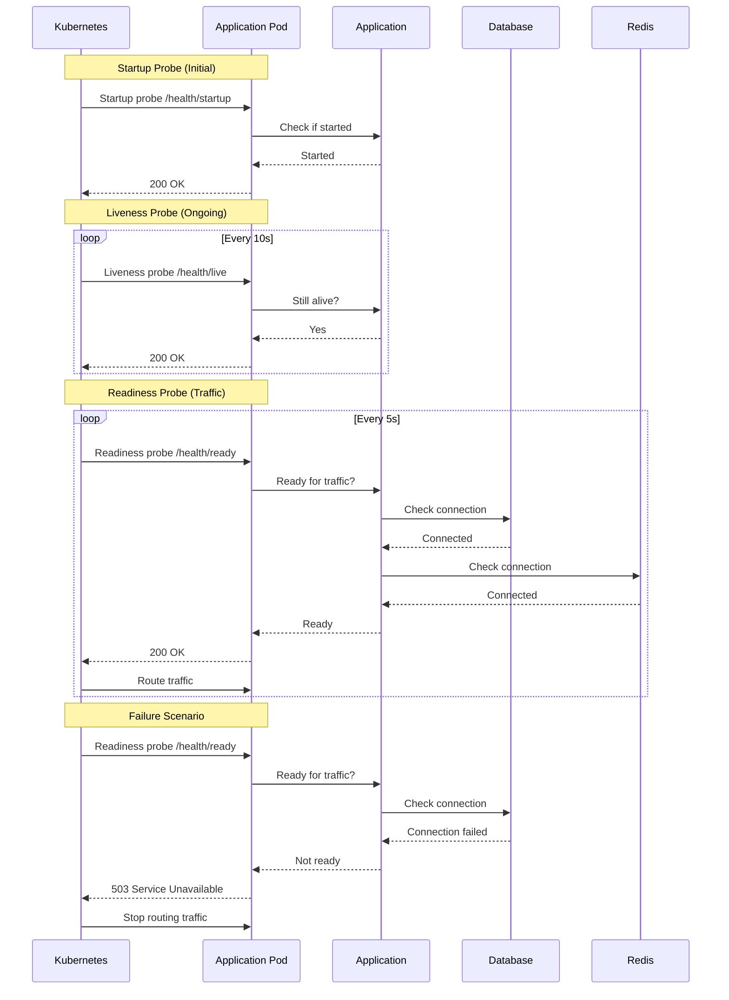
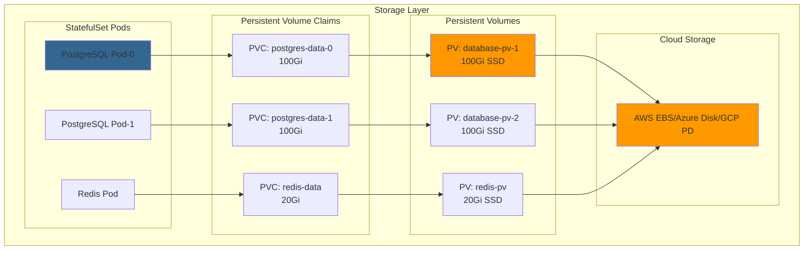

# Kubernetes Deployment Guide

## Table of Contents
- [Overview](#overview)
- [Architecture](#architecture)
- [Deployment Manifests](#deployment-manifests)
- [Service Mesh Integration](#service-mesh-integration)
- [Configuration Management](#configuration-management)
- [Ingress and Load Balancing](#ingress-and-load-balancing)
- [Autoscaling](#autoscaling)
- [Health Checks](#health-checks)
- [Storage](#storage)
- [Security](#security)

## Overview

Ideas Vault is deployed on Kubernetes for high availability, scalability, and self-healing capabilities. This guide covers the complete Kubernetes deployment architecture and best practices.

## Architecture

### Kubernetes Cluster Architecture



### Namespace Organization



## Deployment Manifests

### Directory Structure with Kustomize

```
infrastructure/kubernetes/ideasvault/
├── base/
│   ├── namespace.yaml
│   ├── frontend/
│   │   ├── deployment.yaml
│   │   ├── service.yaml
│   │   ├── hpa.yaml
│   │   └── kustomization.yaml
│   ├── backend/
│   │   ├── deployment.yaml
│   │   ├── service.yaml
│   │   ├── configmap.yaml
│   │   ├── secret.yaml
│   │   ├── hpa.yaml
│   │   └── kustomization.yaml
│   ├── ingress.yaml
│   └── kustomization.yaml
├── overlays/
│   ├── dev/
│   │   ├── kustomization.yaml
│   │   ├── configmap-patch.yaml
│   │   └── replica-patch.yaml
│   ├── staging/
│   │   ├── kustomization.yaml
│   │   ├── configmap-patch.yaml
│   │   └── replica-patch.yaml
│   └── production/
│       ├── kustomization.yaml
│       ├── configmap-patch.yaml
│       ├── replica-patch.yaml
│       └── resource-limits-patch.yaml
└── README.md
```

### Namespace Definition

**File**: `base/namespace.yaml`

```yaml
apiVersion: v1
kind: Namespace
metadata:
  name: ideasvault
  labels:
    name: ideasvault
    environment: production
    app: ideasvault
    managed-by: kustomize
```

### Frontend Deployment

**File**: `base/frontend/deployment.yaml`

```yaml
apiVersion: apps/v1
kind: Deployment
metadata:
  name: ideasvault-frontend
  namespace: ideasvault
  labels:
    app: ideasvault
    component: frontend
    version: v1
spec:
  replicas: 3
  strategy:
    type: RollingUpdate
    rollingUpdate:
      maxSurge: 1
      maxUnavailable: 0
  selector:
    matchLabels:
      app: ideasvault
      component: frontend
  template:
    metadata:
      labels:
        app: ideasvault
        component: frontend
        version: v1
      annotations:
        prometheus.io/scrape: "true"
        prometheus.io/port: "8080"
        prometheus.io/path: "/metrics"
    spec:
      # Security context for pod
      securityContext:
        runAsNonRoot: true
        runAsUser: 1001
        fsGroup: 1001
        seccompProfile:
          type: RuntimeDefault
      
      # Anti-affinity to spread pods across nodes
      affinity:
        podAntiAffinity:
          preferredDuringSchedulingIgnoredDuringExecution:
          - weight: 100
            podAffinityTerm:
              labelSelector:
                matchExpressions:
                - key: component
                  operator: In
                  values:
                  - frontend
              topologyKey: kubernetes.io/hostname
      
      containers:
      - name: frontend
        image: ideasvault-frontend:latest
        imagePullPolicy: Always
        
        ports:
        - name: http
          containerPort: 8080
          protocol: TCP
        
        # Environment variables
        env:
        - name: NODE_ENV
          value: "production"
        
        # Resource limits
        resources:
          requests:
            cpu: 100m
            memory: 128Mi
          limits:
            cpu: 500m
            memory: 512Mi
        
        # Liveness probe
        livenessProbe:
          httpGet:
            path: /health
            port: 8080
          initialDelaySeconds: 10
          periodSeconds: 10
          timeoutSeconds: 3
          failureThreshold: 3
        
        # Readiness probe
        readinessProbe:
          httpGet:
            path: /health
            port: 8080
          initialDelaySeconds: 5
          periodSeconds: 5
          timeoutSeconds: 3
          failureThreshold: 3
        
        # Security context for container
        securityContext:
          allowPrivilegeEscalation: false
          readOnlyRootFilesystem: true
          runAsNonRoot: true
          runAsUser: 1001
          capabilities:
            drop:
            - ALL
        
        # Volume mounts for temporary files
        volumeMounts:
        - name: tmp
          mountPath: /tmp
        - name: nginx-cache
          mountPath: /var/cache/nginx
        - name: nginx-run
          mountPath: /var/run
      
      volumes:
      - name: tmp
        emptyDir: {}
      - name: nginx-cache
        emptyDir: {}
      - name: nginx-run
        emptyDir: {}
```

### Backend Deployment

**File**: `base/backend/deployment.yaml`

```yaml
apiVersion: apps/v1
kind: Deployment
metadata:
  name: ideasvault-backend
  namespace: ideasvault
  labels:
    app: ideasvault
    component: backend
    version: v1
spec:
  replicas: 3
  strategy:
    type: RollingUpdate
    rollingUpdate:
      maxSurge: 1
      maxUnavailable: 0
  selector:
    matchLabels:
      app: ideasvault
      component: backend
  template:
    metadata:
      labels:
        app: ideasvault
        component: backend
        version: v1
      annotations:
        prometheus.io/scrape: "true"
        prometheus.io/port: "8080"
        prometheus.io/path: "/metrics"
    spec:
      # Security context for pod
      securityContext:
        runAsNonRoot: true
        runAsUser: 1001
        fsGroup: 1001
        seccompProfile:
          type: RuntimeDefault
      
      # Service account
      serviceAccountName: ideasvault-backend
      
      # Anti-affinity to spread pods across nodes
      affinity:
        podAntiAffinity:
          preferredDuringSchedulingIgnoredDuringExecution:
          - weight: 100
            podAffinityTerm:
              labelSelector:
                matchExpressions:
                - key: component
                  operator: In
                  values:
                  - backend
              topologyKey: kubernetes.io/hostname
      
      # Init container for database migrations
      initContainers:
      - name: database-migration
        image: ideasvault-backend:latest
        command: ["dotnet", "ef", "database", "update"]
        env:
        - name: ASPNETCORE_ENVIRONMENT
          value: "Production"
        - name: ConnectionStrings__DefaultConnection
          valueFrom:
            secretKeyRef:
              name: ideasvault-secrets
              key: database-connection-string
      
      containers:
      - name: backend
        image: ideasvault-backend:latest
        imagePullPolicy: Always
        
        ports:
        - name: http
          containerPort: 8080
          protocol: TCP
        - name: metrics
          containerPort: 8081
          protocol: TCP
        
        # Environment variables from ConfigMap
        envFrom:
        - configMapRef:
            name: ideasvault-config
        
        # Sensitive environment variables from Secret
        env:
        - name: ConnectionStrings__DefaultConnection
          valueFrom:
            secretKeyRef:
              name: ideasvault-secrets
              key: database-connection-string
        - name: Jwt__Secret
          valueFrom:
            secretKeyRef:
              name: ideasvault-secrets
              key: jwt-secret
        - name: Redis__ConnectionString
          valueFrom:
            secretKeyRef:
              name: ideasvault-secrets
              key: redis-connection-string
        
        # Resource limits
        resources:
          requests:
            cpu: 250m
            memory: 512Mi
          limits:
            cpu: 1000m
            memory: 2Gi
        
        # Liveness probe
        livenessProbe:
          httpGet:
            path: /health/live
            port: 8080
          initialDelaySeconds: 30
          periodSeconds: 10
          timeoutSeconds: 5
          failureThreshold: 3
        
        # Readiness probe
        readinessProbe:
          httpGet:
            path: /health/ready
            port: 8080
          initialDelaySeconds: 10
          periodSeconds: 5
          timeoutSeconds: 3
          failureThreshold: 3
        
        # Startup probe (for slower starting applications)
        startupProbe:
          httpGet:
            path: /health/startup
            port: 8080
          initialDelaySeconds: 0
          periodSeconds: 10
          timeoutSeconds: 3
          failureThreshold: 30
        
        # Security context for container
        securityContext:
          allowPrivilegeEscalation: false
          readOnlyRootFilesystem: true
          runAsNonRoot: true
          runAsUser: 1001
          capabilities:
            drop:
            - ALL
        
        # Volume mounts
        volumeMounts:
        - name: tmp
          mountPath: /tmp
        - name: logs
          mountPath: /app/logs
      
      volumes:
      - name: tmp
        emptyDir: {}
      - name: logs
        emptyDir: {}
```

### Service Definitions

**Frontend Service** (`base/frontend/service.yaml`):

```yaml
apiVersion: v1
kind: Service
metadata:
  name: ideasvault-frontend
  namespace: ideasvault
  labels:
    app: ideasvault
    component: frontend
spec:
  type: ClusterIP
  selector:
    app: ideasvault
    component: frontend
  ports:
  - name: http
    port: 80
    targetPort: 8080
    protocol: TCP
  sessionAffinity: None
```

**Backend Service** (`base/backend/service.yaml`):

```yaml
apiVersion: v1
kind: Service
metadata:
  name: ideasvault-backend
  namespace: ideasvault
  labels:
    app: ideasvault
    component: backend
  annotations:
    prometheus.io/scrape: "true"
    prometheus.io/port: "8081"
spec:
  type: ClusterIP
  selector:
    app: ideasvault
    component: backend
  ports:
  - name: http
    port: 80
    targetPort: 8080
    protocol: TCP
  - name: metrics
    port: 8081
    targetPort: 8081
    protocol: TCP
  sessionAffinity: ClientIP
  sessionAffinityConfig:
    clientIP:
      timeoutSeconds: 10800
```

### ConfigMap

**File**: `base/backend/configmap.yaml`

```yaml
apiVersion: v1
kind: ConfigMap
metadata:
  name: ideasvault-config
  namespace: ideasvault
  labels:
    app: ideasvault
    component: backend
data:
  ASPNETCORE_ENVIRONMENT: "Production"
  ASPNETCORE_URLS: "http://+:8080"
  
  # Logging configuration
  Logging__LogLevel__Default: "Information"
  Logging__LogLevel__Microsoft: "Warning"
  Logging__LogLevel__System: "Warning"
  
  # JWT configuration (non-sensitive parts)
  Jwt__Issuer: "IdeasVault"
  Jwt__Audience: "IdeasVaultUsers"
  Jwt__ExpirationMinutes: "60"
  
  # CORS configuration
  Cors__AllowedOrigins: "https://ideasvault.com,https://www.ideasvault.com"
  
  # Rate limiting
  RateLimit__EnableRateLimiting: "true"
  RateLimit__PermitLimit: "100"
  RateLimit__Window: "60"
  
  # Feature flags
  Features__EnableNewFeature: "false"
  Features__EnableBetaFeatures: "false"
```

### Secrets

**File**: `base/backend/secret.yaml`

```yaml
apiVersion: v1
kind: Secret
metadata:
  name: ideasvault-secrets
  namespace: ideasvault
  labels:
    app: ideasvault
    component: backend
type: Opaque
stringData:
  # Note: In production, use external secrets management
  # This is just a template - actual values should come from CI/CD
  database-connection-string: "Host=postgres.data.svc.cluster.local;Database=ideasvault;Username=admin;Password=CHANGE_ME"
  jwt-secret: "CHANGE_ME_TO_RANDOM_SECRET_AT_LEAST_32_CHARACTERS"
  redis-connection-string: "redis.data.svc.cluster.local:6379,password=CHANGE_ME"
```

**Production Best Practice**: Use External Secrets Operator or Sealed Secrets:

```yaml
apiVersion: external-secrets.io/v1beta1
kind: ExternalSecret
metadata:
  name: ideasvault-secrets
  namespace: ideasvault
spec:
  refreshInterval: 1h
  secretStoreRef:
    name: aws-secrets-manager
    kind: SecretStore
  target:
    name: ideasvault-secrets
    creationPolicy: Owner
  data:
  - secretKey: database-connection-string
    remoteRef:
      key: /ideasvault/production/database-connection-string
  - secretKey: jwt-secret
    remoteRef:
      key: /ideasvault/production/jwt-secret
  - secretKey: redis-connection-string
    remoteRef:
      key: /ideasvault/production/redis-connection-string
```

## Service Mesh Integration

### Istio Service Mesh Architecture



### Istio VirtualService

**File**: `base/istio/virtual-service.yaml`

```yaml
apiVersion: networking.istio.io/v1beta1
kind: VirtualService
metadata:
  name: ideasvault
  namespace: ideasvault
spec:
  hosts:
  - ideasvault.com
  - www.ideasvault.com
  gateways:
  - ideasvault-gateway
  http:
  # Frontend routing
  - match:
    - uri:
        prefix: /
    - uri:
        prefix: /assets/
    route:
    - destination:
        host: ideasvault-frontend
        port:
          number: 80
      weight: 100
    retries:
      attempts: 3
      perTryTimeout: 2s
      retryOn: 5xx,reset,connect-failure,refused-stream
  
  # Backend API routing
  - match:
    - uri:
        prefix: /api/
    route:
    - destination:
        host: ideasvault-backend
        port:
          number: 80
      weight: 100
    timeout: 30s
    retries:
      attempts: 3
      perTryTimeout: 10s
      retryOn: 5xx,reset,connect-failure,refused-stream
```

### Istio DestinationRule

**File**: `base/istio/destination-rule.yaml`

```yaml
apiVersion: networking.istio.io/v1beta1
kind: DestinationRule
metadata:
  name: ideasvault-backend
  namespace: ideasvault
spec:
  host: ideasvault-backend
  trafficPolicy:
    connectionPool:
      tcp:
        maxConnections: 100
      http:
        http1MaxPendingRequests: 50
        http2MaxRequests: 100
        maxRequestsPerConnection: 2
    loadBalancer:
      simple: LEAST_REQUEST
    outlierDetection:
      consecutiveErrors: 5
      interval: 30s
      baseEjectionTime: 30s
      maxEjectionPercent: 50
      minHealthPercent: 40
  subsets:
  - name: v1
    labels:
      version: v1
  - name: v2
    labels:
      version: v2
```

### Canary Deployment with Istio

```yaml
apiVersion: networking.istio.io/v1beta1
kind: VirtualService
metadata:
  name: ideasvault-backend-canary
  namespace: ideasvault
spec:
  hosts:
  - ideasvault-backend
  http:
  - match:
    - headers:
        x-canary:
          exact: "true"
    route:
    - destination:
        host: ideasvault-backend
        subset: v2
      weight: 100
  - route:
    - destination:
        host: ideasvault-backend
        subset: v1
      weight: 95
    - destination:
        host: ideasvault-backend
        subset: v2
      weight: 5
```

## Configuration Management

### Environment-Specific Overlays

**Development Overlay** (`overlays/dev/kustomization.yaml`):

```yaml
apiVersion: kustomize.config.k8s.io/v1beta1
kind: Kustomization

namespace: ideasvault-dev

bases:
- ../../base

namePrefix: dev-

commonLabels:
  environment: dev

replicas:
- name: ideasvault-frontend
  count: 1
- name: ideasvault-backend
  count: 1

patches:
- path: configmap-patch.yaml
- path: replica-patch.yaml

images:
- name: ideasvault-frontend
  newTag: dev-latest
- name: ideasvault-backend
  newTag: dev-latest
```

**Production Overlay** (`overlays/production/kustomization.yaml`):

```yaml
apiVersion: kustomize.config.k8s.io/v1beta1
kind: Kustomization

namespace: ideasvault

bases:
- ../../base

namePrefix: prod-

commonLabels:
  environment: production

replicas:
- name: ideasvault-frontend
  count: 5
- name: ideasvault-backend
  count: 5

patches:
- path: configmap-patch.yaml
- path: replica-patch.yaml
- path: resource-limits-patch.yaml

images:
- name: ideasvault-frontend
  newTag: v1.0.0
- name: ideasvault-backend
  newTag: v1.0.0
```

## Ingress and Load Balancing

### Ingress Controller



### Ingress Resource

**File**: `base/ingress.yaml`

```yaml
apiVersion: networking.k8s.io/v1
kind: Ingress
metadata:
  name: ideasvault
  namespace: ideasvault
  annotations:
    # NGINX Ingress Controller annotations
    kubernetes.io/ingress.class: nginx
    cert-manager.io/cluster-issuer: letsencrypt-prod
    nginx.ingress.kubernetes.io/ssl-redirect: "true"
    nginx.ingress.kubernetes.io/force-ssl-redirect: "true"
    
    # Rate limiting
    nginx.ingress.kubernetes.io/limit-rps: "100"
    nginx.ingress.kubernetes.io/limit-connections: "10"
    
    # Timeouts
    nginx.ingress.kubernetes.io/proxy-connect-timeout: "30"
    nginx.ingress.kubernetes.io/proxy-send-timeout: "30"
    nginx.ingress.kubernetes.io/proxy-read-timeout: "30"
    
    # Body size
    nginx.ingress.kubernetes.io/proxy-body-size: "10m"
    
    # CORS
    nginx.ingress.kubernetes.io/enable-cors: "true"
    nginx.ingress.kubernetes.io/cors-allow-methods: "GET, POST, PUT, DELETE, OPTIONS"
    nginx.ingress.kubernetes.io/cors-allow-origin: "https://ideasvault.com"
    
    # Security headers
    nginx.ingress.kubernetes.io/configuration-snippet: |
      more_set_headers "X-Frame-Options: SAMEORIGIN";
      more_set_headers "X-Content-Type-Options: nosniff";
      more_set_headers "X-XSS-Protection: 1; mode=block";
      more_set_headers "Referrer-Policy: no-referrer-when-downgrade";
spec:
  tls:
  - hosts:
    - ideasvault.com
    - www.ideasvault.com
    secretName: ideasvault-tls
  
  rules:
  # Main domain
  - host: ideasvault.com
    http:
      paths:
      # Backend API
      - path: /api
        pathType: Prefix
        backend:
          service:
            name: ideasvault-backend
            port:
              number: 80
      
      # Frontend SPA
      - path: /
        pathType: Prefix
        backend:
          service:
            name: ideasvault-frontend
            port:
              number: 80
  
  # WWW subdomain
  - host: www.ideasvault.com
    http:
      paths:
      - path: /
        pathType: Prefix
        backend:
          service:
            name: ideasvault-frontend
            port:
              number: 80
```

## Autoscaling

### Horizontal Pod Autoscaler (HPA)



**Backend HPA** (`base/backend/hpa.yaml`):

```yaml
apiVersion: autoscaling/v2
kind: HorizontalPodAutoscaler
metadata:
  name: ideasvault-backend
  namespace: ideasvault
spec:
  scaleTargetRef:
    apiVersion: apps/v1
    kind: Deployment
    name: ideasvault-backend
  
  minReplicas: 2
  maxReplicas: 10
  
  metrics:
  # CPU-based scaling
  - type: Resource
    resource:
      name: cpu
      target:
        type: Utilization
        averageUtilization: 70
  
  # Memory-based scaling
  - type: Resource
    resource:
      name: memory
      target:
        type: Utilization
        averageUtilization: 80
  
  # Custom metric: requests per second
  - type: Pods
    pods:
      metric:
        name: http_requests_per_second
      target:
        type: AverageValue
        averageValue: "1000"
  
  behavior:
    scaleDown:
      stabilizationWindowSeconds: 300
      policies:
      - type: Percent
        value: 50
        periodSeconds: 60
      - type: Pods
        value: 2
        periodSeconds: 60
      selectPolicy: Min
    
    scaleUp:
      stabilizationWindowSeconds: 0
      policies:
      - type: Percent
        value: 100
        periodSeconds: 30
      - type: Pods
        value: 4
        periodSeconds: 30
      selectPolicy: Max
```

**Frontend HPA** (`base/frontend/hpa.yaml`):

```yaml
apiVersion: autoscaling/v2
kind: HorizontalPodAutoscaler
metadata:
  name: ideasvault-frontend
  namespace: ideasvault
spec:
  scaleTargetRef:
    apiVersion: apps/v1
    kind: Deployment
    name: ideasvault-frontend
  
  minReplicas: 3
  maxReplicas: 20
  
  metrics:
  - type: Resource
    resource:
      name: cpu
      target:
        type: Utilization
        averageUtilization: 60
  
  - type: Resource
    resource:
      name: memory
      target:
        type: Utilization
        averageUtilization: 70
```

### Vertical Pod Autoscaler (VPA)

```yaml
apiVersion: autoscaling.k8s.io/v1
kind: VerticalPodAutoscaler
metadata:
  name: ideasvault-backend-vpa
  namespace: ideasvault
spec:
  targetRef:
    apiVersion: apps/v1
    kind: Deployment
    name: ideasvault-backend
  
  updatePolicy:
    updateMode: "Auto"
  
  resourcePolicy:
    containerPolicies:
    - containerName: backend
      minAllowed:
        cpu: 100m
        memory: 256Mi
      maxAllowed:
        cpu: 2000m
        memory: 4Gi
      controlledResources:
      - cpu
      - memory
```

## Health Checks

### Health Check Architecture



### Health Check Endpoints (.NET)

```csharp
// Program.cs or Startup.cs
builder.Services.AddHealthChecks()
    .AddNpgSql(
        connectionString: builder.Configuration.GetConnectionString("DefaultConnection"),
        name: "database",
        failureStatus: HealthStatus.Unhealthy,
        tags: new[] { "db", "sql", "postgresql" })
    .AddRedis(
        redisConnectionString: builder.Configuration["Redis:ConnectionString"],
        name: "redis",
        failureStatus: HealthStatus.Degraded,
        tags: new[] { "cache", "redis" })
    .AddUrlGroup(
        new Uri("https://external-api.com/health"),
        name: "external-api",
        failureStatus: HealthStatus.Degraded,
        tags: new[] { "external" });

app.MapHealthChecks("/health/live", new HealthCheckOptions
{
    Predicate = _ => false // No checks, just returns 200 if app is running
});

app.MapHealthChecks("/health/ready", new HealthCheckOptions
{
    Predicate = check => check.Tags.Contains("db") || check.Tags.Contains("cache"),
    ResponseWriter = UIResponseWriter.WriteHealthCheckUIResponse
});

app.MapHealthChecks("/health/startup", new HealthCheckOptions
{
    Predicate = _ => false
});

app.MapHealthChecks("/health", new HealthCheckOptions
{
    ResponseWriter = UIResponseWriter.WriteHealthCheckUIResponse
});
```

## Storage

### Persistent Volume Architecture



### StorageClass

```yaml
apiVersion: storage.k8s.io/v1
kind: StorageClass
metadata:
  name: fast-ssd
provisioner: kubernetes.io/aws-ebs  # or azure-disk, gce-pd
parameters:
  type: gp3
  iops: "3000"
  throughput: "125"
  encrypted: "true"
volumeBindingMode: WaitForFirstConsumer
allowVolumeExpansion: true
reclaimPolicy: Retain
```

### StatefulSet for Database

```yaml
apiVersion: apps/v1
kind: StatefulSet
metadata:
  name: postgres
  namespace: data
spec:
  serviceName: postgres
  replicas: 2
  selector:
    matchLabels:
      app: postgres
  template:
    metadata:
      labels:
        app: postgres
    spec:
      containers:
      - name: postgres
        image: postgres:16-alpine
        ports:
        - containerPort: 5432
        env:
        - name: POSTGRES_DB
          value: ideasvault
        - name: POSTGRES_USER
          valueFrom:
            secretKeyRef:
              name: postgres-secret
              key: username
        - name: POSTGRES_PASSWORD
          valueFrom:
            secretKeyRef:
              name: postgres-secret
              key: password
        volumeMounts:
        - name: postgres-data
          mountPath: /var/lib/postgresql/data
        resources:
          requests:
            cpu: 500m
            memory: 1Gi
          limits:
            cpu: 2000m
            memory: 4Gi
  volumeClaimTemplates:
  - metadata:
      name: postgres-data
    spec:
      accessModes: ["ReadWriteOnce"]
      storageClassName: fast-ssd
      resources:
        requests:
          storage: 100Gi
```

## Security

### RBAC (Role-Based Access Control)

```yaml
---
apiVersion: v1
kind: ServiceAccount
metadata:
  name: ideasvault-backend
  namespace: ideasvault

---
apiVersion: rbac.authorization.k8s.io/v1
kind: Role
metadata:
  name: ideasvault-backend-role
  namespace: ideasvault
rules:
- apiGroups: [""]
  resources: ["configmaps", "secrets"]
  verbs: ["get", "list"]
- apiGroups: [""]
  resources: ["pods"]
  verbs: ["get", "list"]

---
apiVersion: rbac.authorization.k8s.io/v1
kind: RoleBinding
metadata:
  name: ideasvault-backend-binding
  namespace: ideasvault
subjects:
- kind: ServiceAccount
  name: ideasvault-backend
  namespace: ideasvault
roleRef:
  kind: Role
  name: ideasvault-backend-role
  apiGroup: rbac.authorization.k8s.io
```

### Network Policies

```yaml
apiVersion: networking.k8s.io/v1
kind: NetworkPolicy
metadata:
  name: ideasvault-backend-policy
  namespace: ideasvault
spec:
  podSelector:
    matchLabels:
      component: backend
  policyTypes:
  - Ingress
  - Egress
  
  ingress:
  # Allow traffic from frontend
  - from:
    - podSelector:
        matchLabels:
          component: frontend
    ports:
    - protocol: TCP
      port: 8080
  
  # Allow traffic from ingress controller
  - from:
    - namespaceSelector:
        matchLabels:
          name: ingress-nginx
    ports:
    - protocol: TCP
      port: 8080
  
  egress:
  # Allow DNS
  - to:
    - namespaceSelector:
        matchLabels:
          name: kube-system
    ports:
    - protocol: UDP
      port: 53
  
  # Allow database access
  - to:
    - namespaceSelector:
        matchLabels:
          name: data
      podSelector:
        matchLabels:
          app: postgres
    ports:
    - protocol: TCP
      port: 5432
  
  # Allow Redis access
  - to:
    - namespaceSelector:
        matchLabels:
          name: data
      podSelector:
        matchLabels:
          app: redis
    ports:
    - protocol: TCP
      port: 6379
```

### Pod Security Standards

```yaml
apiVersion: v1
kind: Namespace
metadata:
  name: ideasvault
  labels:
    pod-security.kubernetes.io/enforce: restricted
    pod-security.kubernetes.io/audit: restricted
    pod-security.kubernetes.io/warn: restricted
```

## Deployment Commands

```bash
# Create namespace
kubectl create namespace ideasvault

# Deploy using Kustomize
kubectl apply -k infrastructure/kubernetes/ideasvault/overlays/production

# Check deployment status
kubectl rollout status deployment/ideasvault-backend -n ideasvault
kubectl rollout status deployment/ideasvault-frontend -n ideasvault

# View pods
kubectl get pods -n ideasvault

# View services
kubectl get svc -n ideasvault

# View ingress
kubectl get ingress -n ideasvault

# Check HPA status
kubectl get hpa -n ideasvault

# View logs
kubectl logs -f deployment/ideasvault-backend -n ideasvault
kubectl logs -f deployment/ideasvault-frontend -n ideasvault

# Execute commands in pod
kubectl exec -it deployment/ideasvault-backend -n ideasvault -- /bin/bash

# Port forward for local access
kubectl port-forward -n ideasvault service/ideasvault-backend 5000:80
kubectl port-forward -n ideasvault service/ideasvault-frontend 3000:80

# Rollback deployment
kubectl rollout undo deployment/ideasvault-backend -n ideasvault

# Scale deployment manually
kubectl scale deployment/ideasvault-backend --replicas=5 -n ideasvault

# Delete resources
kubectl delete -k infrastructure/kubernetes/ideasvault/overlays/production
```

---

**Next Steps**:
- [CI/CD Pipeline Setup](./cicd.md)
- [Monitoring and Observability](./monitoring.md)
- [Docker Deployment Guide](./docker.md)

**Document Version**: 1.0.0  
**Last Updated**: January 2026  
**Maintained By**: Infrastructure Team
