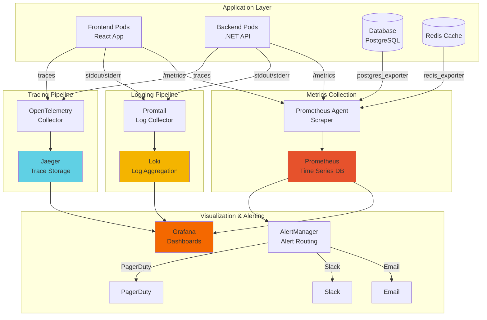
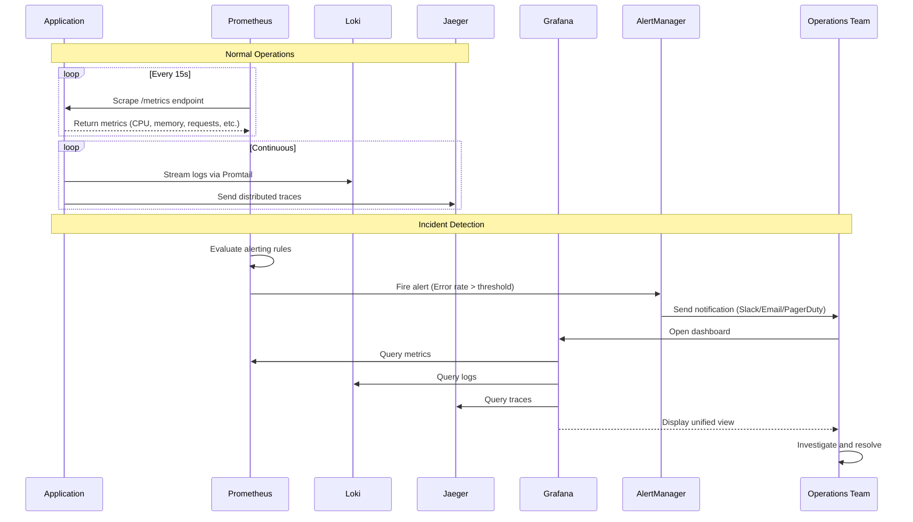
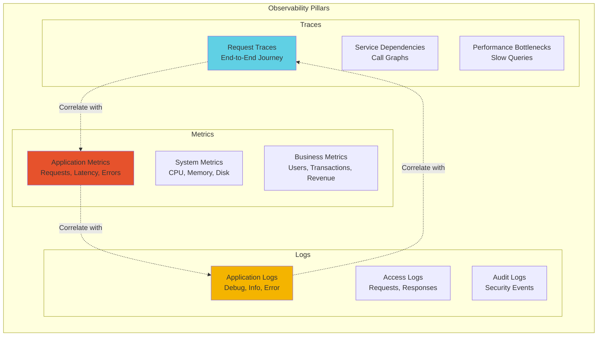
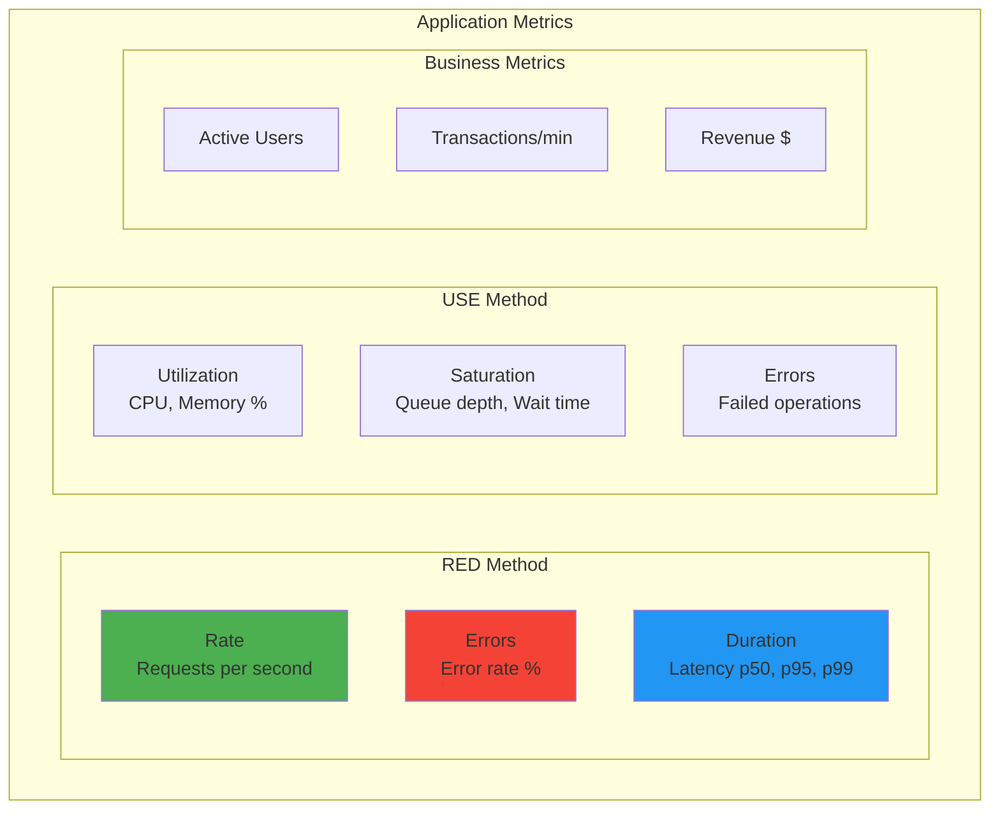
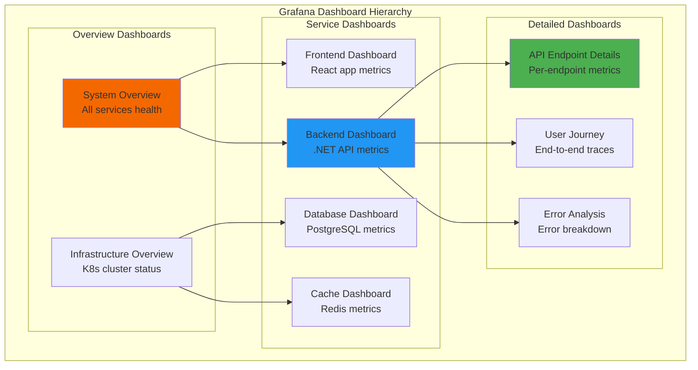
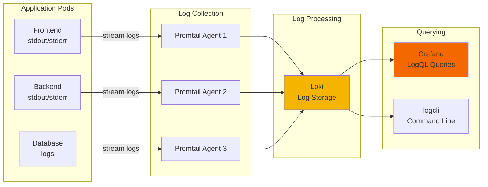
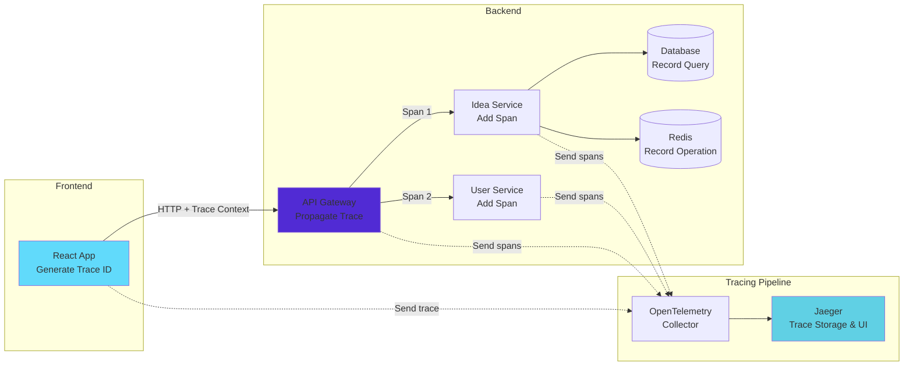
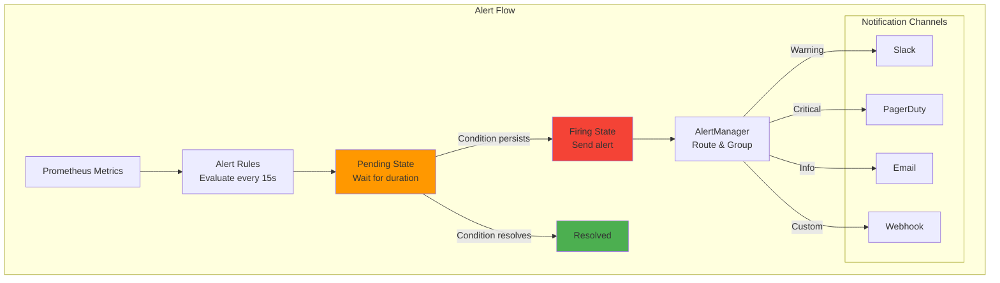
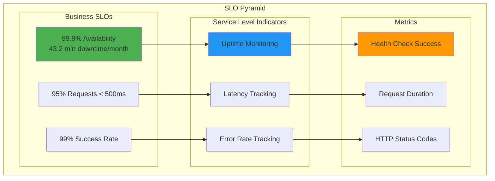

# Monitoring and Observability

## Table of Contents
- [Overview](#overview)
- [Monitoring Architecture](#monitoring-architecture)
- [Prometheus Metrics Collection](#prometheus-metrics-collection)
- [Grafana Dashboards](#grafana-dashboards)
- [Logging Strategy](#logging-strategy)
- [Distributed Tracing](#distributed-tracing)
- [Alerting Rules](#alerting-rules)
- [SLIs and SLOs](#slis-and-slos)

## Overview

Ideas Vault implements comprehensive observability using the three pillars: metrics (Prometheus), logs (Loki), and traces (Jaeger). This enables proactive monitoring, rapid troubleshooting, and performance optimization.

## Monitoring Architecture

### Complete Observability Stack



### Data Flow Architecture



### Three Pillars of Observability



## Prometheus Metrics Collection

### Prometheus Configuration

**File**: `infrastructure/monitoring/prometheus/prometheus.yml`

```yaml
global:
  scrape_interval: 15s
  evaluation_interval: 15s
  external_labels:
    cluster: 'ideasvault-production'
    environment: 'production'

# Alertmanager configuration
alerting:
  alertmanagers:
    - static_configs:
        - targets:
            - alertmanager:9093

# Load rules once and periodically evaluate them
rule_files:
  - "/etc/prometheus/rules/*.yml"

# Scrape configurations
scrape_configs:
  # Prometheus itself
  - job_name: 'prometheus'
    static_configs:
      - targets: ['localhost:9090']

  # Kubernetes API server
  - job_name: 'kubernetes-apiservers'
    kubernetes_sd_configs:
      - role: endpoints
    scheme: https
    tls_config:
      ca_file: /var/run/secrets/kubernetes.io/serviceaccount/ca.crt
    bearer_token_file: /var/run/secrets/kubernetes.io/serviceaccount/token
    relabel_configs:
      - source_labels: [__meta_kubernetes_namespace, __meta_kubernetes_service_name, __meta_kubernetes_endpoint_port_name]
        action: keep
        regex: default;kubernetes;https

  # Kubernetes nodes
  - job_name: 'kubernetes-nodes'
    kubernetes_sd_configs:
      - role: node
    scheme: https
    tls_config:
      ca_file: /var/run/secrets/kubernetes.io/serviceaccount/ca.crt
    bearer_token_file: /var/run/secrets/kubernetes.io/serviceaccount/token
    relabel_configs:
      - action: labelmap
        regex: __meta_kubernetes_node_label_(.+)

  # Kubernetes pods (with prometheus.io annotations)
  - job_name: 'kubernetes-pods'
    kubernetes_sd_configs:
      - role: pod
    relabel_configs:
      # Only scrape pods with prometheus.io/scrape annotation
      - source_labels: [__meta_kubernetes_pod_annotation_prometheus_io_scrape]
        action: keep
        regex: true
      
      # Use prometheus.io/path annotation or default to /metrics
      - source_labels: [__meta_kubernetes_pod_annotation_prometheus_io_path]
        action: replace
        target_label: __metrics_path__
        regex: (.+)
      
      # Use prometheus.io/port annotation or pod port
      - source_labels: [__address__, __meta_kubernetes_pod_annotation_prometheus_io_port]
        action: replace
        regex: ([^:]+)(?::\d+)?;(\d+)
        replacement: $1:$2
        target_label: __address__
      
      # Add pod metadata as labels
      - action: labelmap
        regex: __meta_kubernetes_pod_label_(.+)
      - source_labels: [__meta_kubernetes_namespace]
        action: replace
        target_label: kubernetes_namespace
      - source_labels: [__meta_kubernetes_pod_name]
        action: replace
        target_label: kubernetes_pod_name

  # Ideas Vault Backend API
  - job_name: 'ideasvault-backend'
    kubernetes_sd_configs:
      - role: pod
        namespaces:
          names:
            - ideasvault
    relabel_configs:
      - source_labels: [__meta_kubernetes_pod_label_component]
        action: keep
        regex: backend
      - source_labels: [__meta_kubernetes_pod_annotation_prometheus_io_scrape]
        action: keep
        regex: true
      - source_labels: [__meta_kubernetes_pod_annotation_prometheus_io_port]
        action: replace
        target_label: __address__
        regex: ([^:]+)(?::\d+)?;(\d+)
        replacement: $1:$2

  # Ideas Vault Frontend
  - job_name: 'ideasvault-frontend'
    kubernetes_sd_configs:
      - role: pod
        namespaces:
          names:
            - ideasvault
    relabel_configs:
      - source_labels: [__meta_kubernetes_pod_label_component]
        action: keep
        regex: frontend
      - source_labels: [__meta_kubernetes_pod_annotation_prometheus_io_scrape]
        action: keep
        regex: true

  # PostgreSQL Exporter
  - job_name: 'postgres'
    static_configs:
      - targets: ['postgres-exporter:9187']
        labels:
          service: 'postgresql'
          environment: 'production'

  # Redis Exporter
  - job_name: 'redis'
    static_configs:
      - targets: ['redis-exporter:9121']
        labels:
          service: 'redis'
          environment: 'production'

  # NGINX Ingress Controller
  - job_name: 'nginx-ingress'
    kubernetes_sd_configs:
      - role: pod
        namespaces:
          names:
            - ingress-nginx
    relabel_configs:
      - source_labels: [__meta_kubernetes_pod_label_app_kubernetes_io_name]
        action: keep
        regex: ingress-nginx
```

### Application Metrics Implementation

**Backend Metrics (.NET)**:

```csharp
// Program.cs - Configure metrics
using Prometheus;

var builder = WebApplication.CreateBuilder(args);

// Add Prometheus metrics
builder.Services.AddSingleton<IMetricsService, MetricsService>();

var app = builder.Build();

// Expose metrics endpoint
app.UseMetricServer(); // Default: /metrics
app.UseHttpMetrics();  // HTTP request metrics

// Custom metrics middleware
app.UseMiddleware<MetricsMiddleware>();

app.Run();
```

**Custom Metrics Service**:

```csharp
public interface IMetricsService
{
    void IncrementRequestCount(string endpoint, string method, int statusCode);
    void RecordRequestDuration(string endpoint, string method, double durationSeconds);
    void IncrementErrorCount(string errorType);
    void RecordDatabaseQueryDuration(string queryType, double durationSeconds);
    void RecordCacheHitRate(bool isHit);
    void SetActiveUsers(int count);
}

public class MetricsService : IMetricsService
{
    private readonly Counter _requestCounter;
    private readonly Histogram _requestDuration;
    private readonly Counter _errorCounter;
    private readonly Histogram _dbQueryDuration;
    private readonly Counter _cacheCounter;
    private readonly Gauge _activeUsers;

    public MetricsService()
    {
        // HTTP request counter
        _requestCounter = Metrics.CreateCounter(
            "http_requests_total",
            "Total number of HTTP requests",
            new CounterConfiguration
            {
                LabelNames = new[] { "endpoint", "method", "status_code" }
            });

        // HTTP request duration histogram
        _requestDuration = Metrics.CreateHistogram(
            "http_request_duration_seconds",
            "HTTP request duration in seconds",
            new HistogramConfiguration
            {
                LabelNames = new[] { "endpoint", "method" },
                Buckets = Histogram.ExponentialBuckets(0.001, 2, 10)
            });

        // Error counter
        _errorCounter = Metrics.CreateCounter(
            "application_errors_total",
            "Total number of application errors",
            new CounterConfiguration
            {
                LabelNames = new[] { "error_type" }
            });

        // Database query duration
        _dbQueryDuration = Metrics.CreateHistogram(
            "database_query_duration_seconds",
            "Database query duration in seconds",
            new HistogramConfiguration
            {
                LabelNames = new[] { "query_type" },
                Buckets = Histogram.ExponentialBuckets(0.001, 2, 10)
            });

        // Cache hit/miss counter
        _cacheCounter = Metrics.CreateCounter(
            "cache_operations_total",
            "Total cache operations",
            new CounterConfiguration
            {
                LabelNames = new[] { "result" }
            });

        // Active users gauge
        _activeUsers = Metrics.CreateGauge(
            "active_users",
            "Number of currently active users");
    }

    public void IncrementRequestCount(string endpoint, string method, int statusCode)
        => _requestCounter.WithLabels(endpoint, method, statusCode.ToString()).Inc();

    public void RecordRequestDuration(string endpoint, string method, double durationSeconds)
        => _requestDuration.WithLabels(endpoint, method).Observe(durationSeconds);

    public void IncrementErrorCount(string errorType)
        => _errorCounter.WithLabels(errorType).Inc();

    public void RecordDatabaseQueryDuration(string queryType, double durationSeconds)
        => _dbQueryDuration.WithLabels(queryType).Observe(durationSeconds);

    public void RecordCacheHitRate(bool isHit)
        => _cacheCounter.WithLabels(isHit ? "hit" : "miss").Inc();

    public void SetActiveUsers(int count)
        => _activeUsers.Set(count);
}
```

### Key Metrics to Monitor



## Grafana Dashboards

### Dashboard Architecture



### System Overview Dashboard

**File**: `infrastructure/monitoring/grafana/dashboards/system-overview.json`

Key panels:
- **Service Health**: Up/Down status of all services
- **Request Rate**: Requests per second across all services
- **Error Rate**: 4xx and 5xx error rates
- **Latency**: P50, P95, P99 latencies
- **Resource Usage**: CPU and memory across pods
- **Active Users**: Current active user count

**PromQL Queries**:

```promql
# Request rate (requests per second)
sum(rate(http_requests_total[5m])) by (service)

# Error rate (percentage)
sum(rate(http_requests_total{status_code=~"5.."}[5m])) by (service) 
/ 
sum(rate(http_requests_total[5m])) by (service) * 100

# P95 latency
histogram_quantile(0.95, sum(rate(http_request_duration_seconds_bucket[5m])) by (le, service))

# CPU usage
sum(rate(container_cpu_usage_seconds_total{namespace="ideasvault"}[5m])) by (pod) * 100

# Memory usage
sum(container_memory_usage_bytes{namespace="ideasvault"}) by (pod) / 1024 / 1024 / 1024

# Active users
active_users

# Database connections
sum(pg_stat_database_numbackends{datname="ideasvault"})

# Cache hit rate
sum(rate(cache_operations_total{result="hit"}[5m])) 
/ 
sum(rate(cache_operations_total[5m])) * 100
```

### Backend API Dashboard

**Panels**:
1. **Request Volume**: Total requests over time
2. **Response Times**: Latency percentiles (P50, P90, P95, P99)
3. **Error Rate**: 4xx and 5xx errors percentage
4. **Top Endpoints**: Most frequently called endpoints
5. **Slowest Endpoints**: Endpoints with highest latency
6. **Database Performance**: Query duration and connection pool
7. **Cache Performance**: Hit rate and operation latency
8. **Thread Pool**: Available threads and queue length

### Database Dashboard

**Panels**:
1. **Connection Pool**: Active, idle, and total connections
2. **Query Performance**: Average query duration
3. **Slow Queries**: Queries over threshold
4. **Transaction Rate**: Commits and rollbacks per second
5. **Table Statistics**: Rows, inserts, updates, deletes
6. **Index Usage**: Index hit rate
7. **Disk I/O**: Read/write operations
8. **Replication Lag**: For replicated setups

### Custom Dashboard Configuration

```yaml
apiVersion: v1
kind: ConfigMap
metadata:
  name: grafana-dashboards
  namespace: monitoring
  labels:
    grafana_dashboard: "1"
data:
  ideasvault-backend.json: |
    {
      "dashboard": {
        "title": "Ideas Vault - Backend API",
        "tags": ["ideasvault", "backend", "api"],
        "timezone": "browser",
        "panels": [
          {
            "title": "Request Rate",
            "type": "graph",
            "targets": [
              {
                "expr": "sum(rate(http_requests_total{component=\"backend\"}[5m])) by (endpoint)",
                "legendFormat": "{{ endpoint }}"
              }
            ]
          }
        ]
      }
    }
```

## Logging Strategy

### Log Aggregation Architecture



### Structured Logging Implementation

**Backend Structured Logging (.NET)**:

```csharp
// Program.cs - Configure logging
builder.Services.AddLogging(config =>
{
    config.ClearProviders();
    config.AddConsole();
    config.AddDebug();
    
    // Add Serilog for structured logging
    config.AddSerilog(new LoggerConfiguration()
        .MinimumLevel.Information()
        .MinimumLevel.Override("Microsoft", LogEventLevel.Warning)
        .MinimumLevel.Override("System", LogEventLevel.Warning)
        .Enrich.FromLogContext()
        .Enrich.WithProperty("Application", "IdeasVault.Backend")
        .Enrich.WithProperty("Environment", builder.Environment.EnvironmentName)
        .WriteTo.Console(new JsonFormatter())
        .CreateLogger());
});
```

**Structured Log Example**:

```csharp
public class IdeaService
{
    private readonly ILogger<IdeaService> _logger;

    public IdeaService(ILogger<IdeaService> logger)
    {
        _logger = logger;
    }

    public async Task<Idea> CreateIdeaAsync(CreateIdeaRequest request)
    {
        _logger.LogInformation(
            "Creating idea {@Request} for user {UserId}",
            request,
            request.UserId);

        try
        {
            var idea = await _repository.CreateAsync(request);
            
            _logger.LogInformation(
                "Idea created successfully with ID {IdeaId} for user {UserId}",
                idea.Id,
                request.UserId);
            
            return idea;
        }
        catch (Exception ex)
        {
            _logger.LogError(
                ex,
                "Failed to create idea for user {UserId}. Error: {ErrorMessage}",
                request.UserId,
                ex.Message);
            
            throw;
        }
    }
}
```

### Log Output Format (JSON)

```json
{
  "timestamp": "2026-01-12T10:30:45.123Z",
  "level": "Information",
  "message": "Creating idea for user 12345",
  "fields": {
    "Application": "IdeasVault.Backend",
    "Environment": "Production",
    "UserId": 12345,
    "IdeaTitle": "New Feature Idea",
    "TraceId": "4d2a3b8c9e1f2a3b",
    "SpanId": "9e1f2a3b4c5d6e7f"
  }
}
```

### Loki Configuration

**File**: `infrastructure/monitoring/loki/loki-config.yaml`

```yaml
auth_enabled: false

server:
  http_listen_port: 3100
  grpc_listen_port: 9096

common:
  path_prefix: /loki
  storage:
    filesystem:
      chunks_directory: /loki/chunks
      rules_directory: /loki/rules
  replication_factor: 1
  ring:
    kvstore:
      store: inmemory

schema_config:
  configs:
    - from: 2024-01-01
      store: boltdb-shipper
      object_store: filesystem
      schema: v11
      index:
        prefix: index_
        period: 24h

limits_config:
  retention_period: 744h  # 31 days
  ingestion_rate_mb: 10
  ingestion_burst_size_mb: 20
  max_query_length: 721h

chunk_store_config:
  max_look_back_period: 744h

table_manager:
  retention_deletes_enabled: true
  retention_period: 744h
```

### Promtail Configuration

**File**: `infrastructure/monitoring/promtail/promtail-config.yaml`

```yaml
server:
  http_listen_port: 9080
  grpc_listen_port: 0

positions:
  filename: /tmp/positions.yaml

clients:
  - url: http://loki:3100/loki/api/v1/push

scrape_configs:
  # Kubernetes pod logs
  - job_name: kubernetes-pods
    kubernetes_sd_configs:
      - role: pod
    
    relabel_configs:
      - source_labels: [__meta_kubernetes_pod_label_app]
        target_label: app
      - source_labels: [__meta_kubernetes_pod_label_component]
        target_label: component
      - source_labels: [__meta_kubernetes_namespace]
        target_label: namespace
      - source_labels: [__meta_kubernetes_pod_name]
        target_label: pod
      - source_labels: [__meta_kubernetes_pod_container_name]
        target_label: container
    
    pipeline_stages:
      # Parse JSON logs
      - json:
          expressions:
            timestamp: timestamp
            level: level
            message: message
            trace_id: fields.TraceId
            user_id: fields.UserId
      
      # Extract timestamp
      - timestamp:
          source: timestamp
          format: RFC3339
      
      # Add labels
      - labels:
          level:
          trace_id:
      
      # Drop debug logs in production
      - match:
          selector: '{level="Debug"}'
          action: drop
```

### LogQL Query Examples

```logql
# All logs from backend
{app="ideasvault", component="backend"}

# Error logs only
{app="ideasvault"} |= "level=Error"

# Logs for specific user
{app="ideasvault"} | json | user_id="12345"

# Logs with specific trace ID
{app="ideasvault"} | json | trace_id="4d2a3b8c9e1f2a3b"

# Rate of errors per minute
sum(rate({app="ideasvault"} |= "level=Error" [1m])) by (component)

# Top 10 error messages
topk(10, sum(count_over_time({app="ideasvault"} |= "level=Error" [1h])) by (message))

# Logs from slow requests (>1s)
{app="ideasvault", component="backend"} 
| json 
| duration > 1000

# Pattern matching for SQL errors
{app="ideasvault"} |~ ".*SQL.*Exception.*"
```

## Distributed Tracing

### Tracing Architecture



### Trace Example

```mermaid
gantt
    title Distributed Trace: Create Idea Request
    dateFormat X
    axisFormat %L ms
    
    section Frontend
    User Action           :0, 5
    API Request           :5, 10
    
    section API Gateway
    Receive Request       :10, 15
    Auth Validation       :15, 25
    Route to Service      :25, 30
    
    section Idea Service
    Process Request       :30, 40
    Validate Input        :40, 50
    Database Query        :50, 150
    Cache Update          :150, 170
    Return Response       :170, 180
    
    section Response
    API Response          :180, 185
    Frontend Render       :185, 200
```



### OpenTelemetry Implementation (.NET)

```csharp
// Program.cs - Configure tracing
using OpenTelemetry;
using OpenTelemetry.Resources;
using OpenTelemetry.Trace;

var builder = WebApplication.CreateBuilder(args);

builder.Services.AddOpenTelemetry()
    .ConfigureResource(resource => resource
        .AddService("IdeasVault.Backend")
        .AddAttributes(new Dictionary<string, object>
        {
            ["environment"] = builder.Environment.EnvironmentName,
            ["version"] = Assembly.GetExecutingAssembly().GetName().Version?.ToString() ?? "unknown"
        }))
    .WithTracing(tracing => tracing
        .AddAspNetCoreInstrumentation(options =>
        {
            options.RecordException = true;
            options.EnrichWithHttpRequest = (activity, httpRequest) =>
            {
                activity.SetTag("http.request_content_length", httpRequest.ContentLength);
                activity.SetTag("http.request_content_type", httpRequest.ContentType);
            };
            options.EnrichWithHttpResponse = (activity, httpResponse) =>
            {
                activity.SetTag("http.response_content_length", httpResponse.ContentLength);
                activity.SetTag("http.response_content_type", httpResponse.ContentType);
            };
        })
        .AddEntityFrameworkCoreInstrumentation(options =>
        {
            options.SetDbStatementForText = true;
            options.SetDbStatementForStoredProcedure = true;
        })
        .AddRedisInstrumentation()
        .AddHttpClientInstrumentation()
        .AddSource("IdeasVault.*")
        .SetSampler(new AlwaysOnSampler())
        .AddJaegerExporter(options =>
        {
            options.AgentHost = builder.Configuration["Jaeger:AgentHost"] ?? "localhost";
            options.AgentPort = int.Parse(builder.Configuration["Jaeger:AgentPort"] ?? "6831");
        }));

var app = builder.Build();
app.Run();
```

**Custom Tracing**:

```csharp
public class IdeaService
{
    private readonly ActivitySource _activitySource;

    public IdeaService()
    {
        _activitySource = new ActivitySource("IdeasVault.IdeaService");
    }

    public async Task<Idea> CreateIdeaAsync(CreateIdeaRequest request)
    {
        using var activity = _activitySource.StartActivity("CreateIdea");
        
        activity?.SetTag("user_id", request.UserId);
        activity?.SetTag("idea_title", request.Title);
        
        try
        {
            // Validate input
            using (var validateActivity = _activitySource.StartActivity("ValidateInput"))
            {
                await ValidateAsync(request);
            }
            
            // Create in database
            Idea idea;
            using (var dbActivity = _activitySource.StartActivity("DatabaseInsert"))
            {
                idea = await _repository.CreateAsync(request);
                dbActivity?.SetTag("idea_id", idea.Id);
            }
            
            // Update cache
            using (var cacheActivity = _activitySource.StartActivity("CacheUpdate"))
            {
                await _cache.SetAsync($"idea:{idea.Id}", idea);
            }
            
            activity?.SetTag("result", "success");
            return idea;
        }
        catch (Exception ex)
        {
            activity?.SetStatus(ActivityStatusCode.Error, ex.Message);
            activity?.RecordException(ex);
            throw;
        }
    }
}
```

## Alerting Rules

### Alerting Architecture



### Alert Rules Configuration

**File**: `infrastructure/monitoring/prometheus/rules/ideasvault-alerts.yml`

```yaml
groups:
  - name: ideasvault_alerts
    interval: 30s
    rules:
      # High error rate
      - alert: HighErrorRate
        expr: |
          sum(rate(http_requests_total{status_code=~"5..", component="backend"}[5m])) by (component)
          /
          sum(rate(http_requests_total{component="backend"}[5m])) by (component)
          > 0.05
        for: 2m
        labels:
          severity: critical
          component: backend
        annotations:
          summary: "High error rate detected (instance {{ $labels.instance }})"
          description: "Error rate is {{ $value | humanizePercentage }} (threshold: 5%)"

      # High latency
      - alert: HighLatency
        expr: |
          histogram_quantile(0.95,
            sum(rate(http_request_duration_seconds_bucket{component="backend"}[5m])) by (le, endpoint)
          ) > 1.0
        for: 5m
        labels:
          severity: warning
          component: backend
        annotations:
          summary: "High latency on {{ $labels.endpoint }}"
          description: "95th percentile latency is {{ $value | humanizeDuration }} (threshold: 1s)"

      # Pod down
      - alert: PodDown
        expr: |
          kube_pod_status_phase{namespace="ideasvault", phase!="Running"} == 1
        for: 1m
        labels:
          severity: critical
        annotations:
          summary: "Pod {{ $labels.pod }} is down"
          description: "Pod {{ $labels.pod }} in namespace {{ $labels.namespace }} is not running"

      # High memory usage
      - alert: HighMemoryUsage
        expr: |
          sum(container_memory_usage_bytes{namespace="ideasvault"}) by (pod)
          /
          sum(container_spec_memory_limit_bytes{namespace="ideasvault"}) by (pod)
          > 0.9
        for: 5m
        labels:
          severity: warning
        annotations:
          summary: "High memory usage on {{ $labels.pod }}"
          description: "Memory usage is {{ $value | humanizePercentage }} of limit"

      # High CPU usage
      - alert: HighCPUUsage
        expr: |
          sum(rate(container_cpu_usage_seconds_total{namespace="ideasvault"}[5m])) by (pod)
          /
          sum(container_spec_cpu_quota{namespace="ideasvault"} / container_spec_cpu_period{namespace="ideasvault"}) by (pod)
          > 0.9
        for: 5m
        labels:
          severity: warning
        annotations:
          summary: "High CPU usage on {{ $labels.pod }}"
          description: "CPU usage is {{ $value | humanizePercentage }} of limit"

      # Database connection pool exhaustion
      - alert: DatabaseConnectionPoolExhausted
        expr: |
          pg_stat_database_numbackends{datname="ideasvault"}
          /
          pg_settings_max_connections
          > 0.8
        for: 2m
        labels:
          severity: critical
          component: database
        annotations:
          summary: "Database connection pool nearly exhausted"
          description: "{{ $value | humanizePercentage }} of connections in use"

      # Cache unavailable
      - alert: CacheUnavailable
        expr: |
          up{job="redis"} == 0
        for: 1m
        labels:
          severity: critical
          component: cache
        annotations:
          summary: "Redis cache is unavailable"
          description: "Redis instance {{ $labels.instance }} is down"

      # Low cache hit rate
      - alert: LowCacheHitRate
        expr: |
          sum(rate(cache_operations_total{result="hit"}[5m]))
          /
          sum(rate(cache_operations_total[5m]))
          < 0.7
        for: 10m
        labels:
          severity: warning
          component: cache
        annotations:
          summary: "Low cache hit rate"
          description: "Cache hit rate is {{ $value | humanizePercentage }} (threshold: 70%)"

      # Disk space low
      - alert: DiskSpaceLow
        expr: |
          (node_filesystem_avail_bytes{mountpoint="/"}
          /
          node_filesystem_size_bytes{mountpoint="/"})
          < 0.1
        for: 5m
        labels:
          severity: warning
        annotations:
          summary: "Disk space low on {{ $labels.instance }}"
          description: "Only {{ $value | humanizePercentage }} disk space available"

      # Certificate expiring soon
      - alert: CertificateExpiringSoon
        expr: |
          (certmanager_certificate_expiration_timestamp_seconds - time()) / 86400 < 7
        for: 1h
        labels:
          severity: warning
        annotations:
          summary: "Certificate {{ $labels.name }} expiring soon"
          description: "Certificate expires in {{ $value }} days"
```

### AlertManager Configuration

**File**: `infrastructure/monitoring/alertmanager/alertmanager.yml`

```yaml
global:
  resolve_timeout: 5m
  slack_api_url: 'https://hooks.slack.com/services/YOUR/SLACK/WEBHOOK'

route:
  group_by: ['alertname', 'cluster', 'service']
  group_wait: 10s
  group_interval: 10s
  repeat_interval: 12h
  receiver: 'default'
  
  routes:
    # Critical alerts to PagerDuty
    - match:
        severity: critical
      receiver: pagerduty
      continue: true
    
    # Critical alerts also to Slack
    - match:
        severity: critical
      receiver: slack-critical
    
    # Warnings to Slack
    - match:
        severity: warning
      receiver: slack-warnings
    
    # Database alerts
    - match:
        component: database
      receiver: database-team
    
    # Cache alerts
    - match:
        component: cache
      receiver: infrastructure-team

receivers:
  - name: 'default'
    email_configs:
      - to: 'ops@ideasvault.com'
        from: 'alerts@ideasvault.com'
        smarthost: 'smtp.gmail.com:587'
        auth_username: 'alerts@ideasvault.com'
        auth_password: 'your-password'

  - name: 'slack-critical'
    slack_configs:
      - channel: '#alerts-critical'
        title: '🚨 Critical Alert'
        text: '{{ range .Alerts }}{{ .Annotations.summary }}\n{{ .Annotations.description }}\n{{ end }}'
        color: 'danger'

  - name: 'slack-warnings'
    slack_configs:
      - channel: '#alerts-warnings'
        title: '⚠️ Warning'
        text: '{{ range .Alerts }}{{ .Annotations.summary }}\n{{ .Annotations.description }}\n{{ end }}'
        color: 'warning'

  - name: 'pagerduty'
    pagerduty_configs:
      - service_key: 'YOUR_PAGERDUTY_SERVICE_KEY'
        description: '{{ range .Alerts }}{{ .Annotations.summary }}{{ end }}'

  - name: 'database-team'
    email_configs:
      - to: 'database-team@ideasvault.com'
    slack_configs:
      - channel: '#database-alerts'

  - name: 'infrastructure-team'
    email_configs:
      - to: 'infra-team@ideasvault.com'
    slack_configs:
      - channel: '#infrastructure-alerts'

inhibit_rules:
  # Inhibit warning if critical is firing
  - source_match:
      severity: 'critical'
    target_match:
      severity: 'warning'
    equal: ['alertname', 'cluster', 'service']
```

## SLIs and SLOs

### Service Level Objectives



### SLO Definitions

| Service | SLI | SLO | Error Budget (30 days) |
|---------|-----|-----|------------------------|
| **API Availability** | Successful health checks / Total checks | 99.9% | 43.2 minutes |
| **API Latency** | Requests < 500ms / Total requests | 95% | 5% slow requests |
| **API Success Rate** | 2xx responses / Total responses | 99% | 1% failed requests |
| **Database Availability** | Successful connections / Total attempts | 99.95% | 21.6 minutes |
| **Cache Availability** | Successful operations / Total operations | 99.5% | 3.6 hours |

### SLO Monitoring Queries

```promql
# API Availability (30-day window)
1 - (
  sum(rate(up{job="ideasvault-backend"}[30d]))
  /
  count(up{job="ideasvault-backend"}[30d])
)

# API Latency SLO
sum(rate(http_request_duration_seconds_bucket{le="0.5"}[30d]))
/
sum(rate(http_request_duration_seconds_count[30d]))

# API Success Rate
sum(rate(http_requests_total{status_code=~"2.."}[30d]))
/
sum(rate(http_requests_total[30d]))

# Error Budget Remaining
(1 - SLO) - (1 - Actual)
```

### Error Budget Dashboard

Track error budget burn rate to know when to stop releasing features and focus on reliability:

```promql
# Error budget burn rate (how fast we're consuming our error budget)
(
  1 - (
    sum(rate(http_requests_total{status_code=~"2.."}[1h]))
    /
    sum(rate(http_requests_total[1h]))
  )
)
/
(1 - 0.99)  # SLO is 99%

# Time until error budget exhausted
(error_budget_remaining * 30 * 24 * 60)  # minutes remaining
```

---

**Next Steps**:
- [CI/CD Pipeline Documentation](./cicd.md)
- [Kubernetes Deployment Guide](./kubernetes.md)
- [Docker Deployment Guide](./docker.md)

**Document Version**: 1.0.0  
**Last Updated**: January 2026  
**Maintained By**: Infrastructure Team
