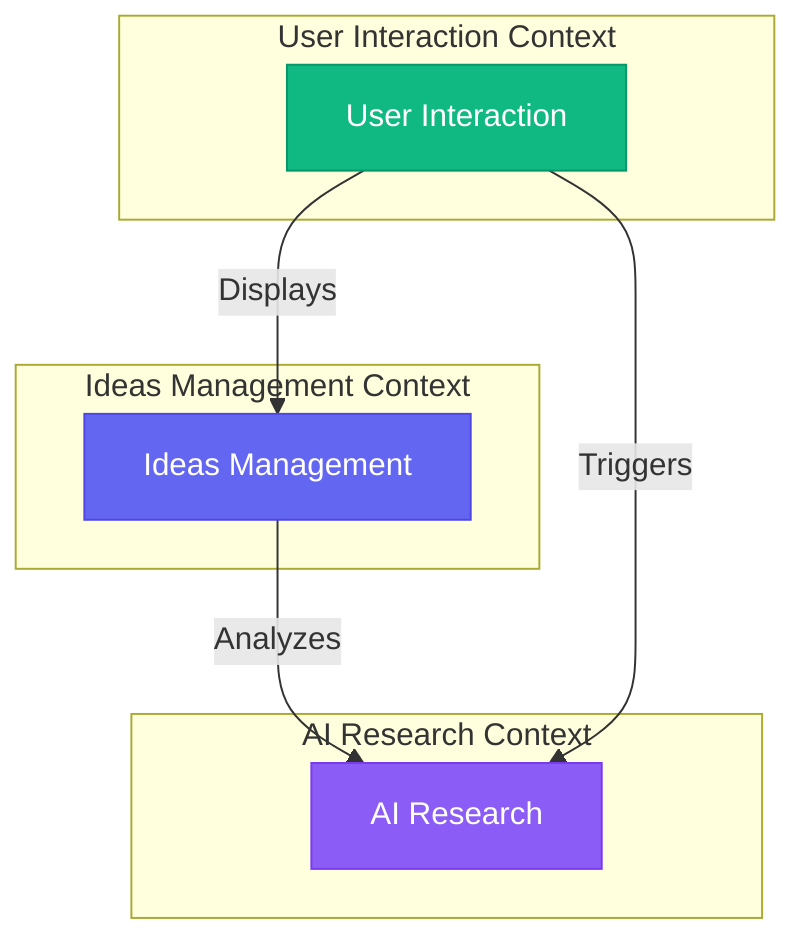
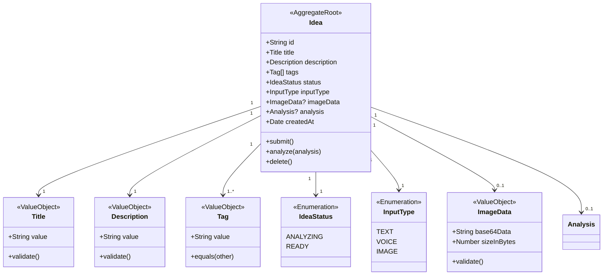
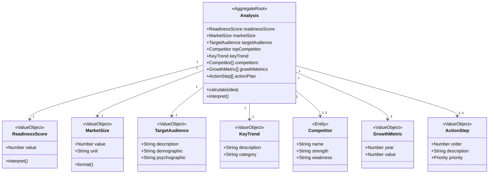
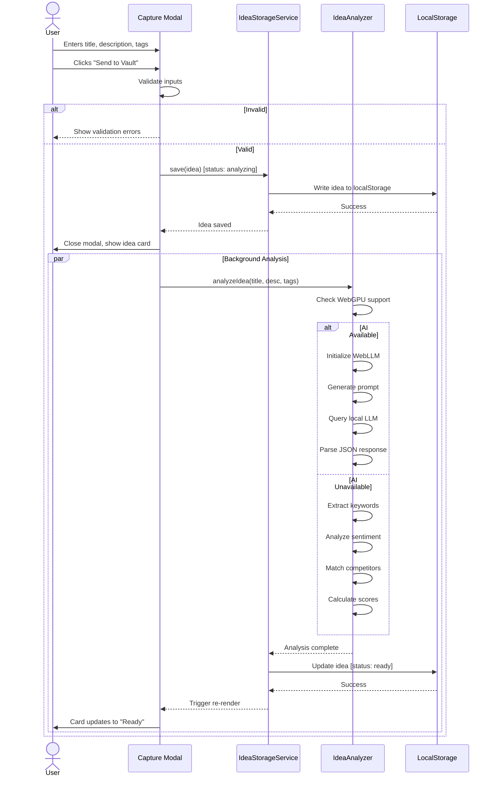
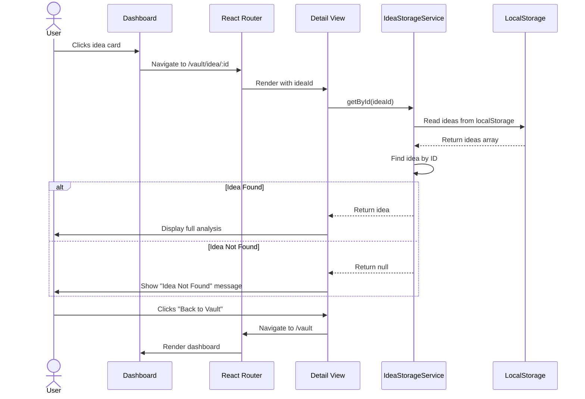
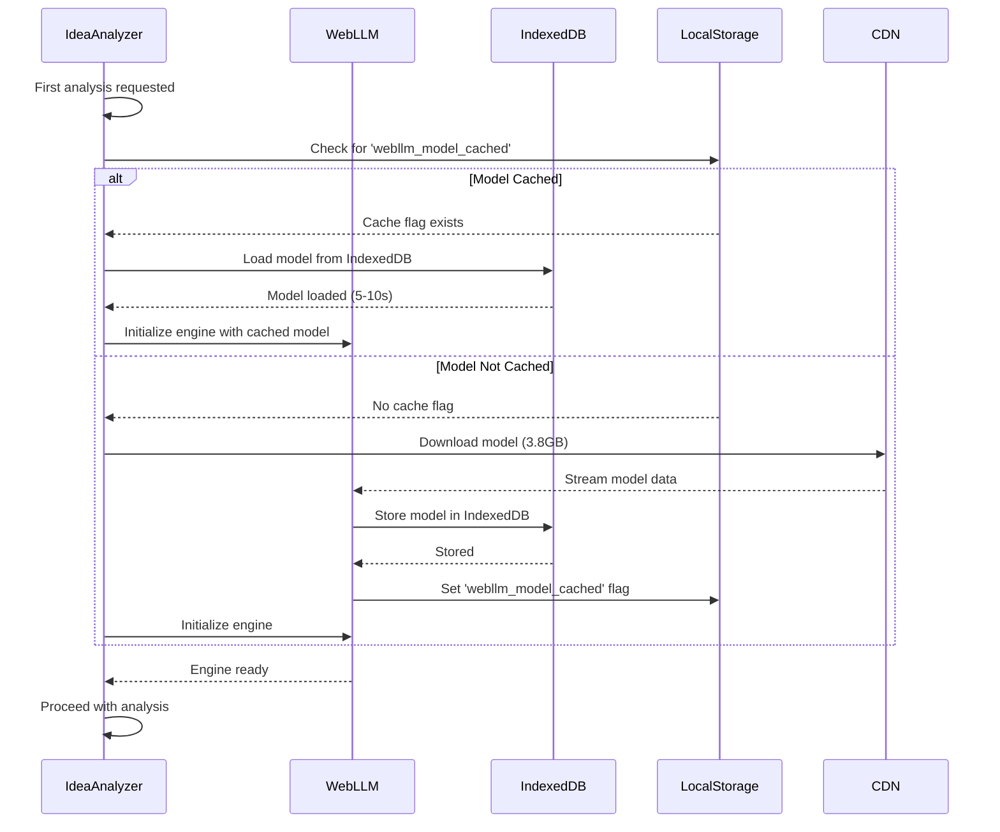
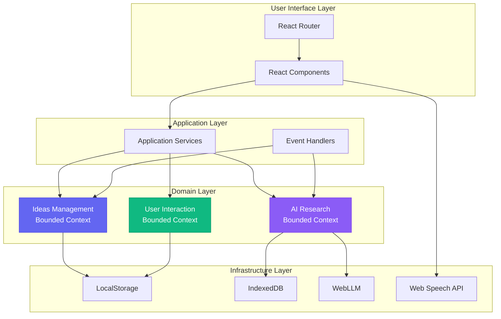
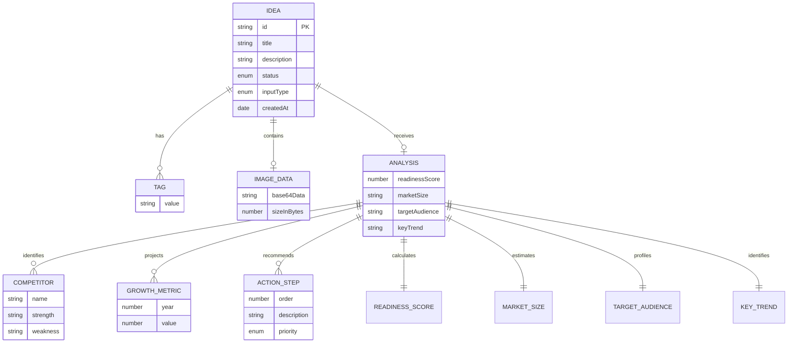
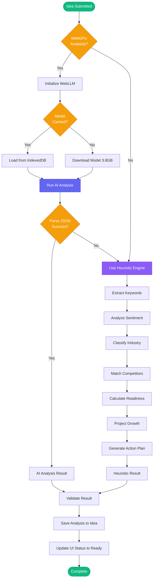

# Ideas Vault - Domain Model (DDD)

## Overview
This document defines the domain model for Ideas Vault using Domain-Driven Design (DDD) principles. It identifies bounded contexts, aggregates, entities, value objects, domain events, and the ubiquitous language used throughout the system.

---

## Bounded Contexts

Ideas Vault is organized into three primary bounded contexts:

### 1. **Ideas Management Context**
**Purpose**: Core domain for capturing, storing, and organizing startup ideas.

**Responsibilities**:
- Idea capture via multiple input modalities
- Idea storage and retrieval
- Idea organization (tags, metadata)
- Idea lifecycle management (draft, analyzing, ready)

**Key Entities**: Idea, Tag
**Key Value Objects**: Title, Description, InputType, IdeaStatus
**Key Services**: IdeaStorageService

---

### 2. **AI Research Context**
**Purpose**: Supporting domain for automated market research and analysis.

**Responsibilities**:
- Market size estimation
- Target audience profiling
- Competitor identification and analysis
- Growth projections and trend analysis
- Readiness score calculation
- Action plan generation

**Key Entities**: Analysis
**Key Value Objects**: ReadinessScore, MarketSize, TargetAudience, Competitor, GrowthMetric, ActionStep
**Key Services**: IdeaAnalyzer (AI Engine), HeuristicAnalyzer

---

### 3. **User Interaction Context**
**Purpose**: Supporting domain for user interface state and interaction flows.

**Responsibilities**:
- Modal state management
- Navigation and routing
- Onboarding flow
- Settings and preferences
- Responsive layout adaptation

**Key Entities**: UserSession
**Key Value Objects**: OnboardingStatus, Theme, ViewMode
**Key Services**: OnboardingService, NavigationService

---

## Context Mapping



**Relationship Types**:
- **Ideas Management → AI Research**: Published Language (Idea submitted → Analysis requested)
- **User Interaction → Ideas Management**: Customer-Supplier (UI consumes Ideas Management API)
- **User Interaction → AI Research**: Conformist (UI displays analysis results as-is)

---

## Core Domain: Ideas Management

### Aggregate: Idea

**Aggregate Root**: Idea

**Invariants**:
1. An Idea must always have a non-empty title (min 3 characters)
2. An Idea must always have a non-empty description (min 10 characters)
3. An Idea can only transition from "analyzing" to "ready" (never backwards)
4. An Idea must have at least one tag (default: "#Uncategorized")
5. A ReadinessScore must be between 0 and 100
6. An Idea's createdAt timestamp is immutable



---

### Entity: Idea

**Properties**:
```typescript
interface Idea {
  // Identity
  id: string;  // UUID or timestamp-based
  
  // Core Attributes
  title: string;  // 3-200 characters
  description: string;  // 10-10000 characters
  tags: string[];  // Array of tag strings
  
  // Metadata
  status: 'ready' | 'analyzing';
  inputType: 'text' | 'voice' | 'image';
  imageData?: string;  // Base64 encoded, optional
  createdAt: Date;  // Immutable timestamp
  
  // Analysis (nullable until ready)
  readinessScore: number;  // 0-100
  marketSize: string;  // e.g., "$2.5B"
  targetAudience: string;
  topCompetitor: string;
  competitorStrength: string;
  keyTrend: string;
  competitors: Competitor[];
  growthMetrics: GrowthMetric[];
  actionPlan: string[];
}
```

**Lifecycle**:
```
Draft (User Input) → Analyzing (AI Processing) → Ready (Analysis Complete)
```

**Business Rules**:
1. When an Idea is submitted, it must be immediately validated for title and description
2. When an Idea is created, it starts in "analyzing" status
3. When an Idea analysis completes, status transitions to "ready"
4. When an Idea is deleted, all associated data is removed permanently
5. An Idea cannot be edited after creation (future: add versioning)

---

### Value Objects

#### Title
**Purpose**: Encapsulates idea title with validation rules.

```typescript
class Title {
  private readonly value: string;
  
  constructor(value: string) {
    if (!value || value.trim().length < 3) {
      throw new Error('Title must be at least 3 characters');
    }
    if (value.length > 200) {
      throw new Error('Title must not exceed 200 characters');
    }
    this.value = value.trim();
  }
  
  getValue(): string {
    return this.value;
  }
}
```

---

#### Description
**Purpose**: Encapsulates idea description with validation rules.

```typescript
class Description {
  private readonly value: string;
  
  constructor(value: string) {
    if (!value || value.trim().length < 10) {
      throw new Error('Description must be at least 10 characters');
    }
    if (value.length > 10000) {
      throw new Error('Description must not exceed 10000 characters');
    }
    this.value = value.trim();
  }
  
  getValue(): string {
    return this.value;
  }
  
  extractKeywords(): string[] {
    // Business logic for keyword extraction
    return [];
  }
}
```

---

#### Tag
**Purpose**: Represents a category or label for an idea.

```typescript
class Tag {
  private readonly value: string;
  
  constructor(value: string) {
    const normalized = value.trim().toLowerCase();
    if (!normalized) {
      throw new Error('Tag cannot be empty');
    }
    // Ensure # prefix
    this.value = normalized.startsWith('#') ? normalized : `#${normalized}`;
  }
  
  getValue(): string {
    return this.value;
  }
  
  equals(other: Tag): boolean {
    return this.value === other.value;
  }
}
```

---

#### ImageData
**Purpose**: Encapsulates uploaded image with size validation.

```typescript
class ImageData {
  private readonly base64Data: string;
  private readonly sizeInBytes: number;
  
  constructor(base64Data: string) {
    // Calculate size (base64 is ~1.37x original)
    const sizeInBytes = Math.ceil((base64Data.length * 3) / 4);
    
    if (sizeInBytes > 5 * 1024 * 1024) {  // 5MB limit
      throw new Error('Image size must not exceed 5MB');
    }
    
    if (!base64Data.startsWith('data:image/')) {
      throw new Error('Invalid image data format');
    }
    
    this.base64Data = base64Data;
    this.sizeInBytes = sizeInBytes;
  }
  
  getValue(): string {
    return this.base64Data;
  }
  
  getSizeInMB(): number {
    return this.sizeInBytes / (1024 * 1024);
  }
}
```

---

## Supporting Domain: AI Research

### Aggregate: Analysis

**Aggregate Root**: Analysis

**Invariants**:
1. An Analysis must always have a ReadinessScore between 0-100
2. An Analysis must have at least 1 Competitor (max 5)
3. An Analysis must have exactly 4 GrowthMetric entries (4-year projection)
4. An Analysis must have 3-5 ActionSteps
5. MarketSize must be a positive dollar amount



---

### Value Objects

#### ReadinessScore
**Purpose**: Encapsulates the calculated viability score (0-100).

```typescript
class ReadinessScore {
  private readonly value: number;
  
  constructor(value: number) {
    if (value < 0 || value > 100) {
      throw new Error('ReadinessScore must be between 0 and 100');
    }
    this.value = Math.round(value);
  }
  
  getValue(): number {
    return this.value;
  }
  
  interpret(): string {
    if (this.value >= 85) return 'Excellent - Ready to execute';
    if (this.value >= 70) return 'Good - Minor refinements needed';
    return 'Fair - Requires more research';
  }
  
  getColor(): string {
    if (this.value >= 85) return 'emerald';
    if (this.value >= 70) return 'yellow';
    return 'red';
  }
}
```

---

#### MarketSize
**Purpose**: Represents total addressable market with formatting.

```typescript
class MarketSize {
  private readonly value: number;  // In billions
  private readonly unit: 'B' | 'M' = 'B';
  
  constructor(value: number) {
    if (value <= 0) {
      throw new Error('MarketSize must be positive');
    }
    this.value = value;
  }
  
  format(): string {
    return `$${this.value.toFixed(1)}${this.unit}`;
  }
  
  toMillions(): number {
    return this.value * 1000;
  }
}
```

---

#### Competitor
**Purpose**: Represents a competing product/company with SWOT summary.

```typescript
class Competitor {
  constructor(
    public readonly name: string,
    public readonly strength: string,
    public readonly weakness: string
  ) {
    if (!name || !strength || !weakness) {
      throw new Error('Competitor must have name, strength, and weakness');
    }
  }
  
  getSWOT(): { strength: string; weakness: string } {
    return {
      strength: this.strength,
      weakness: this.weakness
    };
  }
}
```

---

#### GrowthMetric
**Purpose**: Represents a single year's market size projection.

```typescript
class GrowthMetric {
  constructor(
    public readonly year: number,
    public readonly value: number  // In millions
  ) {
    if (year < 2020 || year > 2100) {
      throw new Error('Invalid year');
    }
    if (value <= 0) {
      throw new Error('Growth metric value must be positive');
    }
  }
  
  format(): string {
    return `$${this.value}M`;
  }
}
```

---

#### ActionStep
**Purpose**: Represents a single action item in the execution plan.

```typescript
class ActionStep {
  constructor(
    public readonly order: number,
    public readonly description: string,
    public readonly priority: 'high' | 'medium' | 'low' = 'medium'
  ) {
    if (order < 1 || order > 10) {
      throw new Error('Action step order must be between 1-10');
    }
    if (!description || description.length < 10) {
      throw new Error('Action step must have meaningful description');
    }
  }
}
```

---

## Domain Services

### IdeaAnalyzer Service
**Purpose**: Orchestrates AI-powered or heuristic idea analysis.

**Responsibilities**:
- Detect WebGPU support
- Initialize WebLLM engine (if supported)
- Route to AI or heuristic analysis
- Generate comprehensive Analysis aggregate

**Methods**:
```typescript
class IdeaAnalyzer {
  async analyzeIdea(
    title: string,
    description: string,
    tags: string[]
  ): Promise<Analysis> {
    // 1. Check AI availability
    if (this.canUseAI()) {
      return await this.analyzeWithAI(title, description, tags);
    }
    
    // 2. Fallback to heuristics
    return await this.analyzeWithHeuristics(title, description, tags);
  }
  
  private async analyzeWithAI(...): Promise<Analysis> {
    // Initialize WebLLM
    // Generate structured prompt
    // Parse JSON response
    // Validate and construct Analysis
  }
  
  private async analyzeWithHeuristics(...): Promise<Analysis> {
    // Extract keywords
    // Analyze sentiment
    // Match competitors from database
    // Calculate readiness score
    // Generate growth projections
    // Construct Analysis
  }
}
```

---

### IdeaStorageService
**Purpose**: Manages persistence of ideas to localStorage.

**Responsibilities**:
- Serialize/deserialize ideas
- CRUD operations on localStorage
- Handle storage quota errors
- Maintain data consistency

**Methods**:
```typescript
class IdeaStorageService {
  private readonly STORAGE_KEY = 'ideasvault_ideas';
  
  getAll(): Idea[] {
    const json = localStorage.getItem(this.STORAGE_KEY);
    if (!json) return [];
    return JSON.parse(json).map(this.deserialize);
  }
  
  save(idea: Idea): void {
    const ideas = this.getAll();
    ideas.unshift(idea);
    this.saveAll(ideas);
  }
  
  update(id: string, updates: Partial<Idea>): void {
    const ideas = this.getAll();
    const index = ideas.findIndex(i => i.id === id);
    if (index !== -1) {
      ideas[index] = { ...ideas[index], ...updates };
      this.saveAll(ideas);
    }
  }
  
  delete(id: string): void {
    const ideas = this.getAll().filter(i => i.id !== id);
    this.saveAll(ideas);
  }
  
  private saveAll(ideas: Idea[]): void {
    try {
      localStorage.setItem(this.STORAGE_KEY, JSON.stringify(ideas));
    } catch (e) {
      if (e.name === 'QuotaExceededError') {
        throw new StorageQuotaExceededError();
      }
      throw e;
    }
  }
  
  private deserialize(json: any): Idea {
    return {
      ...json,
      createdAt: new Date(json.createdAt)
    };
  }
}
```

---

## Domain Events

Domain events represent significant occurrences in the business domain.

### IdeaSubmitted
**When**: User completes idea capture form and clicks submit.

**Payload**:
```typescript
{
  ideaId: string;
  title: string;
  description: string;
  tags: string[];
  inputType: 'text' | 'voice' | 'image';
  imageData?: string;
  submittedAt: Date;
}
```

**Subscribers**:
- IdeaAnalyzer (triggers analysis)
- IdeaStorageService (persists to localStorage)

---

### IdeaAnalysisStarted
**When**: Analysis begins (AI or heuristic).

**Payload**:
```typescript
{
  ideaId: string;
  analysisEngine: 'ai' | 'heuristic';
  startedAt: Date;
}
```

**Subscribers**:
- UI State Manager (updates card to "analyzing")

---

### IdeaAnalysisCompleted
**When**: Analysis finishes successfully.

**Payload**:
```typescript
{
  ideaId: string;
  analysis: Analysis;
  completedAt: Date;
  duration: number;  // milliseconds
}
```

**Subscribers**:
- IdeaStorageService (updates idea with analysis)
- UI State Manager (updates card to "ready")

---

### IdeaAnalysisFailed
**When**: Analysis encounters an error.

**Payload**:
```typescript
{
  ideaId: string;
  error: Error;
  failedAt: Date;
}
```

**Subscribers**:
- IdeaStorageService (marks as ready anyway to unblock user)
- Error Logger (future: send to monitoring service)

---

### IdeaDeleted
**When**: User confirms deletion of an idea.

**Payload**:
```typescript
{
  ideaId: string;
  deletedAt: Date;
}
```

**Subscribers**:
- IdeaStorageService (removes from localStorage)
- Navigation Service (redirects to dashboard)

---

## Domain Flow Diagrams

### Idea Capture Flow



---

### Idea Detail View Flow



---

### AI Model Caching Flow



---

## Ubiquitous Language Glossary

### Core Terms

**Idea**  
A startup concept submitted by a user, containing a title, description, tags, and optional image. Ideas progress through a lifecycle from submission to analysis completion.

**Vault**  
The collection of all ideas stored by a user. Represented as the main dashboard view.

**Capture**  
The act of creating a new idea through one of three modalities: text, voice, or image input.

**Analysis**  
The automated market research process that generates insights about an idea's viability, including market size, competitors, growth projections, and action plans.

**Readiness Score**  
A quantitative 0-100 metric indicating how prepared an idea is for execution. Higher scores suggest more thought-out concepts with clear market opportunities.

**Status**  
The current state of an idea's analysis lifecycle: "analyzing" (in progress) or "ready" (complete).

**Input Type**  
The modality used to capture an idea: "text" (typed), "voice" (transcribed), or "image" (uploaded visual).

**Tag**  
A categorical label applied to ideas for organization, always prefixed with # (e.g., #SaaS, #FinTech).

**Market Size (TAM)**  
Total Addressable Market—the estimated revenue opportunity if 100% market share achieved, expressed in billions (e.g., "$2.5B").

**Target Audience**  
The primary customer segment most likely to adopt the idea, including demographic, firmographic, and psychographic details.

**Competitor**  
A company or product that serves a similar market or solves a similar problem. Includes analysis of their strengths and weaknesses.

**Growth Metric**  
A projected market size for a specific future year, showing expected market expansion.

**Action Plan**  
A prioritized list of 3-5 concrete steps to advance the idea from concept to reality.

**Key Trend**  
A significant market dynamic or macro trend relevant to the idea's success (e.g., "AI adoption grew 67% in 2026").

---

### Technical Terms

**WebLLM**  
A browser-based large language model runtime that executes AI models locally using WebGPU, enabling privacy-preserving AI analysis.

**Heuristic Analysis**  
Rule-based analysis algorithm that estimates market insights using keyword matching, statistical models, and pattern recognition when AI is unavailable.

**LocalStorage**  
Browser API for persistent client-side data storage. Used to store all user ideas without server communication.

**IndexedDB**  
Browser API for large-scale structured data storage. Used by WebLLM to cache the AI model (3.8GB).

**Base64**  
Binary-to-text encoding scheme used to store images as text strings in localStorage.

**Aggregate**  
DDD pattern: a cluster of domain objects treated as a single unit for data changes, with a root entity and consistency boundary.

**Value Object**  
DDD pattern: an immutable object defined by its attributes rather than identity (e.g., ReadinessScore, MarketSize).

**Domain Event**  
A significant occurrence in the domain that other parts of the system may need to react to (e.g., IdeaSubmitted, IdeaAnalysisCompleted).

**Bounded Context**  
A logical boundary within which a particular domain model is defined and applicable, with its own ubiquitous language.

---

### User Actions (Commands)

**Submit Idea**  
User action: Complete idea capture form and trigger creation + analysis.

**View Idea**  
User action: Open full detail view of a specific idea from the dashboard.

**Delete Idea**  
User action: Permanently remove an idea from the vault (with confirmation).

**Load Examples**  
User action: Pre-populate vault with 2 demo ideas during onboarding.

**Skip Onboarding**  
User action: Decline example ideas and start with empty vault.

**Clear Cache**  
User action: Delete cached AI model from IndexedDB (via DevTools).

**Export Data**  
User action: Download all ideas as JSON file (future feature).

---

### Analysis Terms

**Sentiment**  
The emotional tone of an idea's description, measured 0-1 (negative to positive), calculated by counting positive vs. negative keywords.

**Complexity**  
The thoroughness and structure of an idea's description, measured 0-1, calculated by word count, sentence structure, and detail level.

**Keyword**  
Significant non-common word extracted from description (min 4 characters) used for industry classification and competitor matching.

**Industry**  
A market category detected from keywords (e.g., SaaS, FinTech, Healthcare, EdTech).

**Competitor Database**  
Pre-populated collection of 120+ real companies across 18 industries used for competitor analysis.

**Growth Rate**  
Annual percentage increase in market size, randomly generated between 30-60% for projections.

**Action Template**  
Pre-written action step pattern customized with idea-specific details (e.g., industry, readiness, audience).

---

## Domain Model Evolution

### Current State (v1.0)
- Single-user, browser-local storage
- Synchronous analysis (blocking)
- No versioning or history
- Immutable ideas (no editing)

### Future Considerations

**v1.1 - Enhanced Analysis**
- Asynchronous analysis with progress updates
- Multiple analysis engines (GPT-4 option)
- Comparative analysis (idea vs. idea)

**v2.0 - Collaboration**
- Multi-user shared vaults
- Idea commenting and feedback
- Voting and prioritization
- Real-time collaboration

**v3.0 - Advanced Features**
- Idea versioning and history
- Idea editing (create new version)
- Idea linking (related ideas)
- Custom analysis templates

---

## Architecture Principles

### 1. **Domain-Centric Design**
The domain model drives the architecture. All UI and infrastructure concerns adapt to the domain, not vice versa.

### 2. **Persistence Ignorance**
Domain entities don't know about localStorage. IdeaStorageService handles all persistence concerns.

### 3. **Single Responsibility**
Each aggregate, entity, and value object has one clear purpose and encapsulates related behavior.

### 4. **Invariant Enforcement**
Aggregates enforce business rules through validation in constructors and methods—invalid states are impossible.

### 5. **Bounded Context Isolation**
Each context has its own models and language. Cross-context communication uses well-defined interfaces.

---

## Diagrams

### High-Level Domain Architecture



---

### Entity Relationship Diagram



---

### Analysis Calculation Flow



---

*Last Updated: January 12, 2026*
